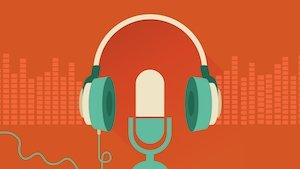

Podcasts are short lived. That's mostly a fact.

I've read that the average life span of a podcast is six episodes. Likely, it's shorter.

But there are many that have a longer run, and then suddenly stop posting altogether.

A good example is Matt Taibbi's "Tarfu Report," which was a perfect extension of his iconoclast, gonzo-style reporting. Though it carried on for a while, it abruptly stopped for personal reasons (apparently Taibbi didn't want to infect his co-host with allegations against him from his time in Russia).

Luckily, he has a new podcast with fellow Rolling Stone writer Katie Halper called "Useful Idiots". It's good so far. Here's the RSS feed.

There are dozens more I have saved on my RSS reader over the years (via the Freedom Controller) that have disappeared, and I think that's a shame.

Of course, I'm not immune. Beginning in 2010, I started a podcast feed for the weekly radio show I was hosting at my college radio station: CJLO 1690AM in Montréal, Québec. It was called "Liberty In Exile," my own version of a media analysis show from a French-Canadian/American immigrant point of view with guests and commentaries.

Once I left the radio station and moved to Vienna and then Florida, I kept it going as a podcast for a good three years. I used Jellycast as my podcast host service, following the example of the Ricky Gervais Show, which at the time, was the most popular podcast out there.

But then, life got in the way. I got a job where I was paid to write, do video, and sometimes podcast, and that took precedence. But I was still always interested in continuing.

Then, in June of 2016, I started a new podcast with my good friend Todor Papic called "The Innocents Abroad," a podcast on life and society abroad. We had a good run, and we've so far published about 27 episodes and always get very good feedback. But we fall behind all the time.

Traveling takes a toll, family, work, and everything else. That's a shame. I'm thinking of still continuing it as an interview show with people I find interesting, but I think that will take some time to commit to. I'm not sure.

In a sense, perhaps this post is a method by which to inspire me to continue. Because I believe in podcasting, in RSS, and in all the great entertainment and informational value it's provided me over the years.

Here's a list of some of my favorites:

No Agenda

The Fifth Column

2 Drink Minimum

The Brendan O'Neill Show

Cato Daily Podcast

Coffee with Scott Adams

Consumer Choice Center Cast

The Daily

The Dale Jr. Download

The Federalist adio Hour

Gold Newsletter Podcast

The Innocents Abroad (duh)

Le retour d'Éric Duhaime

Making Sense with Sam Haris

Mike Ward Sous Écoute

Monocle 24: The Globalist

National Review's Radio Free California Podcast

The Portal

Reply All

Southern Friend Philosophy

Useful Idiots

With Adam Curry
