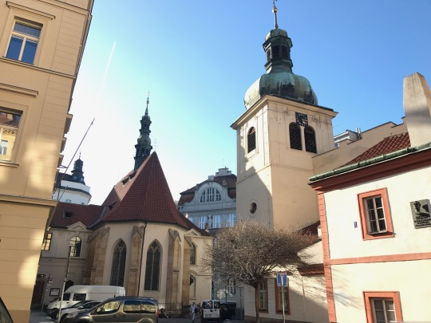

The plates were slammed on the small wooden tables and the smiles keep strict and clean. The waiter had no particular reason to celebrate today, a day like any other. 

As for me, another smudge of Czech beer on the lips brought forth another truth. It was the lifeblood of my Prague café life. Not so different from my Vienna café life. Or café life in general. Hours spent creating an insular reality dominated by words and good humor. Cappuccinos piling up beside local brews and menus lost in the shuffle. 

I could only get work done against the noise of the café society. It was a world I could control. Outside of these café walls, this measure of power is nonexistent. Life carries on in the Czech language and the elites make it certain. The vibrant Central European Republic places itself as a force between Austria and Germany, between Poland and Slovakia, a safe guardian of European culture.

The cobblestoned streets outside are no accident. The jumpsuited men who lay down the 5 by 5 by 5 centimeter cube stones in Old Prague are neatly arranging history. They want to be certain to finish the job in record time –what would Prague be without its ancient streets?

It’s here that I’ve lived on and off for six months. I enjoy my weekends in Vienna, but I crush my week day calendar in Prague. The classes take most of my time, but I still find a café as my refuge from the imposing, grey clouds which loom above. The city is filled at any one time with unsavory characters one would rather not get to know. And I’m sure the local Czechs feel it much more than I do. How could they not, aware that their fair land is a favorite of British beer tourists and European exchange students? They’re only here short-term, they must say. Or hope.

The amount of tourists in this city is astounding on any day in the Old Town. I compete with each one I see, sure I can better recount a quick fact from Czech history if the situation called for it. I have to know more—what more is all that café time if not for researching the particular historical fact that will save me in my hypothetical Czech test? There has to be a reason I sit here and drink. Or that’s what I tell myself. The waiters know it too. Maybe they’re getting ready to test me if I stay any longer. The clock is ticking. Time to change café.
