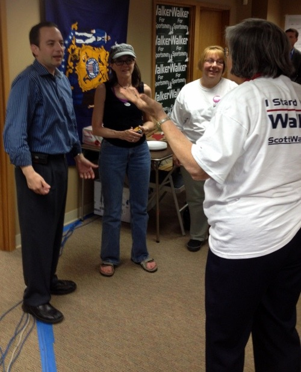

By Yaël Ossowski | Wisconsin Reporter

> WAUWATOSA — After the tea party tidal wave hit the national and state capitols during the mid-term elections in 2010, establishment Republicans seemed uncertain on what this grassroots energy would become once given the reins of governance.
> 
> Less than 20 months later, the battle that initially set its eyes on **Washington**, D.C., has now taken root in the Badger State, where Republican Gov. **Scott Walker**, a tea party sympathizer and conservative stalwart, is vying to keep his seat against the Democratic mayor of**Milwaukee**, **Tom Barrett,** in Wisconsin’s historic recall election.
> 
> What has made the race so dynamic and inspiring for the national audience is the political dichotomy that is playing out across factories, farms, shops and city streets statewide, whether it be the union-supported progressive campaign or the conservative grassrooters who have discovered new-found promise in the state **Republican Party.**
> 
> There is no man who represents that more than current **Republican National** **Committee**chairman, **Reince Preibus**, who was elected to the highest position in the party apparatus following the significant gains in 2010. Priebus has been charged with converting the decentralized energy of the tea party into an effective, consistent brand for a political party.
> 
> “You know, there aren’t many places in this country where the GOP chairman can show up at a tea party rally and be cheered,” Preibus jokingly told supporters of Walker at campaign headquarters in Wauwatosa, not far from the governor’s family home.

Read more: [Wisconsin Reporter](http://www.wisconsinreporter.com/preibus-meets-the-troops-in-wisconsin)
