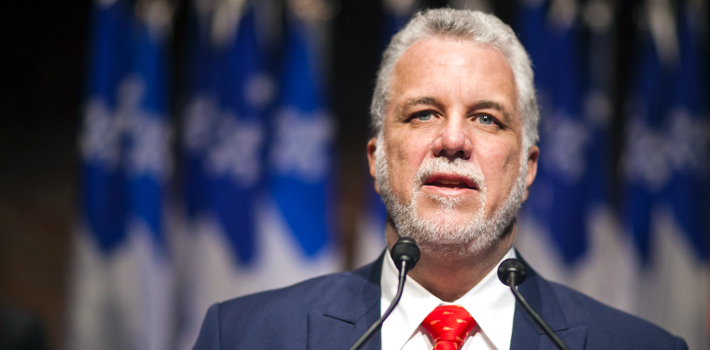

#### Privatization, Government Downsizing Are Talk of the Town in Quebec City

By [Yaël Ossowski](http://panampost.com/author/yael-ossowski/) – 6. May, 2014, [PanAmerican Post](http://panampost.com/yael-ossowski/2014/05/06/quebec-may-just-have-elected-an-austerity-government/)

Unbeknownst to most political observers and voters in Quebec, Phillippe Couillard and his Liberal Party may be the most ambitious band of reformers to get themselves voted into office in the last several decades.

Though their _raison d’être_ during the electoral campaign was countering the separatist Parti Québécois and their [quest for ultimate state secularism](http://panampost.com/yael-ossowski/2014/03/25/the-parti-quebecois-electoral-ploy-of-secularism-will-weaken-quebec/), post-election momentum is now aimed toward reducing Quebec’s massive debt and deficits. Call it the necessity of austerity.

“We have to create wealth in Quebec, by any means possible,” said Couillard in his [first official press conference after the election](https://www.youtube.com/watch?v=zrbyAhbD8XE) on April 7. “I will tell the bureaucracies, the public service, to increase their work in reducing bureaucracy and the weight of the state in Quebec’s economy.”

By announcing a [total hiring freeze for the provincial government,](http://premier.gouv.qc.ca/actualites/communiques/details.asp?idCommunique=2449) Couillard proved how serious his intentions truly are.

> 
> 
> Philippe Couillard, Quebec’s new premier, promises huge budget reforms to get the province back in positive financial standing. Source: [@phcouillard](https://twitter.com/phcouillard/status/450627989210820608).

This approach is not surprising for a new government that aims to discredit its predecessor — but this effort looks different. Quebec’s financial spiral is real and will soon become an active burden for its millions of residents.

That’s the conclusion of the [Godbout Montmarquette report](http://www.mce.gouv.qc.ca/publications/rapport-experts-etat-finances.pdf), an independent analysis of Quebec’s finances by Luc Godbout and Claude Montmarquette, two economists from University of Sherbrooke and University of Montréal. The report was sanctioned by Couillard within days of winning the election, but it steered clear of any partisan sympathies. It offers the bitter truth which may be tough for any party, let alone a Quebec resident, to swallow.

The main revelation? That CAN$1.75 billion deficit — envisioned earlier this year by the Parti Québécois — is actually closer to $3.7 billion. And it’ll only get worse unless huge reforms are made.

In the last 25 years, the GDP of Quebec has grown by only 1.9 percent and interest on the debt now totals the budgets of 14 out of 19 provincial government bureaucracies. In the last 10 years, Godbout and Montmarquette [note](http://www.mce.gouv.qc.ca/publications/rapport-experts-etat-finances.pdf), spending has increased by an average of 5 percent. The best estimates for Quebec’s economy is a maximum growth of 3.5 percent per year, leaving the province habitually over-budget and in debt.

> 
> 
> Annual growth of Quebec’s public spending from 2006 to 2014. Source: Quebec’s Ministry of Finance.

“For the recently-elected government, the crucial goal is to get public spending under control, all the while creating economic growth and jobs,” cites the report.

Unlike European austerity practiced in Greece and Spain, Quebec’s version ought to include lower income taxes on individuals and corporations, as well as a streamlined bureaucracy, if the report is to be taken seriously. Premier Phillipe Couillard seems to have taken the message to heart.

“The moment to make difficult decisions has arrived and these won’t be taken lightly,” said Couillard on April 24, [announcing his first measures](http://premier.gouv.qc.ca/actualites/communiques/details.asp?idCommunique=2449) to reduce the size and burden of the state on the individual.

He’s already proposed slashing $300 million from various ministries, mandating productivity standards and eliminating at least 3 percent of spending from each department. This is in addition to more than $110 million in corporate subsidies to be eliminated by the Liberal government. That would cut both from government offices and government handouts.

Austerity is here in Quebec. And it’s a welcome development.

For far too long, the game of public finances has been political leveraging and vote-buying for the few to the detriment of all.

And the fact that these measures are being pushed by a Liberal government, which was itself [hounded by financial scandals and shady deals](http://www.google.at/url?sa=t&rct=j&q=&esrc=s&source=web&cd=6&cad=rja&uact=8&ved=0CFoQFjAF&url=http%3A%2F%2Fwww.theglobeandmail.com%2Fnews%2Fpolitics%2Fperfect-storm-of-public-anger-rattles-charest-liberals%2Farticle4106949%2F&ei=VcZoU8C-IMbB7AaooIC4DA&usg=AFQjCNFjzUPwCOqCvaMPiIYIrhNWDiMpAw&sig2=olY5YLAD6WvTeZlUu8FHUw) while led by premier Jean Charest for nearly a decade, reveals the extraordinary shift in the collective conscience of Quebec residents.

So what else is to come in the age of Quebec’s austerity government?

An oft-mentioned “taboo” is [privatization of the province’s state-run hydroelectricity and alcohol sectors](http://www.google.at/url?sa=t&rct=j&q=&esrc=s&source=web&cd=2&cad=rja&uact=8&ved=0CDQQFjAB&url=http%3A%2F%2Fwww.ledevoir.com%2Fpolitique%2Fquebec%2F406991%2Fventedactif&ei=VsRoU9CQHIOR7AaCkYG4Dg&usg=AFQjCNE8aNBIQhjPRy6vitUnpnCMAFZ67g&sig2=-PC8soJTxx06M3EFzTXnxA). Hydro-Québec and the [Quebec Alcohol Corporation](http://www.saq.com/content/SAQ/fr.html), the most active and recognizable government entities in Québec, could face a sell-off of at least 10 percent, as recommended in the Godbout Montmarquette report. Couillard is [favourable to privatization](http://www.journaldequebec.com/2014/04/29/philippe-couillard-ne-ferme-pas-la-porte), but promises a “[social dialogue](http://www.lapresse.ca/actualites/politique/politique-quebecoise/201404/29/01-4762021-couillard-promet-un-dialogue-social-avant-de-couper.php)” before cutting too much.

> 
> 
> Privatization of the province’s state-run electricity supplier is an option being analyzed by the Couillard government. Source: [Hydroquebec.com](http://hydroquebec.com).

That such an idea could be rationally introduced and discussed in Quebec politics reveals the extent of the huge structural change needed in Quebec’s financial portfolio. The nationalization of the electricity industry in the 1960s by the Liberal Party [gave way to the modern independence movement](http://panampost.com/yael-ossowski/2014/01/28/rejecting-natural-gas-wealth-quebecs-missed-opportunity/), and has been a source of nationalistic pride for Quebec residents in the decades since.

If privatization of Quebec’s key public-owned industry comes to pass, it could deliver a [serious wake-up call](http://panampost.com/yael-ossowski/2014/04/22/if-not-the-parti-quebecois-who-is-todays-quebec-secessionist/) to the grassroots movement aiming to make Quebec its own nation state. Practically, it would reveal that the dream for Quebec independence has allowed economic bad ideas to fester over many years, transferring the spirit of political independence to ballooning government programs, unchecked for fear of questioning the nationalistic project. This is no longer sustainable.

That’s the reality pushed by Coalition Avenir Québec’s (CAQ) leader Français Legault, himself once a minister for the Parti Québécois government more than a decade ago. His party won [23 percent of the vote](http://www.google.at/url?sa=t&rct=j&q=&esrc=s&source=web&cd=1&cad=rja&uact=8&ved=0CCgQFjAA&url=http%3A%2F%2Fici.radio-canada.ca%2Felections-quebec-2014&ei=dsdoU63nE6-u7Abu0oDYDA&usg=AFQjCNEJHdcXv7r9wVKkuK_hm4Z-Ozo-9A&sig2=wRbAsx2beECQRTOe363wxA) and 22 ministers in the provincial election on April 7.

With a [healthy mix of populism and pro-business rhetoric](http://libertyinexile.com/2012/09/03/de-carre-rouge-a-arc-en-ciel-pourquoi-les-etudiants-doivent-voter-pour-la-caq/), the small party has introduced the notion of “cleaning up” Quebec’s finances before any significant tackling of the “national question” of independence. From here on out, the Liberals may be leaning on this new, small party for intellectual and political support.

In fact, the new Liberal government has directly entertained some of the CAQ’s ideas on managing finances. The finance minister held an [informal meeting](http://www.lapresse.ca/le-soleil/actualites/politique/201405/04/01-4763529-finances-publiques-carlos-leitao-tend-loreille-a-la-caq.php) with CAQ’s key budget official just last week, much to the chagrin of the social-democrats now locked out of power.

With a majority government and promised support of the CAQ for selective austerity, the Liberals will have virtually clear reign over a complete modernization of Quebec’s finances for the next four and a half years. As long as they’re brave enough to weather the storm, they’ll be able to carry through a spirit of austerity that will strengthen and invigorate Quebec for years to come.

Only time will tell.

_This article was published on the [PanAm Post](http://panampost.com/yael-ossowski/2014/05/06/quebec-may-just-have-elected-an-austerity-government/)._
