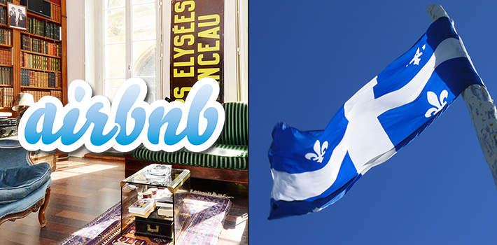

_Despite being popular with travelers and hosts alike, the government of Quebec is doing everything it can to stop AirBnb. (PanAm Post)_

[Español](http://es.panampost.com/yael-ossowski/2014/08/20/quebec-quiere-asfixiar-a-airbnb-con-impuestos-y-regulaciones/)

[By Yaël Ossowski](http://panampost.com/author/yael-ossowski/) – [August 20, 2014](http://panampost.com/yael-ossowski/2014/08/20/quebec-seeks-to-tax-and-regulate-airbnb-out-of-existence/)

During a recent stint back in Montreal, I decided to try the service AirBnb, by now a ritual of my international travel.

I’ve used it in more than a dozen countries in Europe, plenty of cities in North America, and even in Australia and New Zealand.

AirBnb matches individuals who have extra space in their apartments with tourists who need places to stay — much like a friend or acquaintance giving you his room for a small fee. It’s a small, voluntary exchange, and it allows individuals to use AirBnb’s payment infrastructure, along with its terms and conditions to handle disputes.

Using it allows me to experience a city through the eyes of a local, without the need for plain hotel rooms, and exorbitant costs.

> It thrives without any direct government intervention, and that ruffles a lot of people’s feathers.

There are personalized profiles and ranking systems maintained by users of the service, which give a good amount of information to both renters and hosts. It’s successful and revolutionary; it thrives without any direct government intervention, and that ruffles a lot of people’s feathers.

More specifically, that means the hotel industry and local government bureaucrats who have never seen an activity not worth taxing.

In the Canadian province of Quebec, the Ministry of Tourism has warned tourists against seeking “unlicensed” accommodation offered by apartment owners and renters. It has iterated that anyone caught offering lodging to tourists [without a permit](http://www.tourisme.gouv.qc.ca/programmes-services/hebergement/) will face fines up to CAN$2,250. They cite [the law](http://www2.publicationsduquebec.gouv.qc.ca/dynamicSearch/telecharge.php?type=2&file=/E_14_2/E14_2.html) meant for tourist accommodations.

> 
> 
> _The Committee on Illegal Accommodation in Quebec held its first meeting in Jan. 2014 and plans to release a report with its recommendations for taxation and regulation. ([CITQ](http://www.citq.qc.ca/documents/infoCITQ/infoCITQ_mars2014.pdf))_

In a [recent newsletter](http://www.citq.qc.ca/documents/infoCITQ/infoCITQ_mars2014.pdf) to members, the province’s [Tourism Industry Corporation](http://www.citq.qc.ca/) iterated their “battle against illegal accommodation.” They touted their success in getting the former Parti Québécois government to form a special committee on the matter, set to [publish a report](http://www.lapresse.ca/voyage/nouvelles/201406/20/01-4777675-airbnb-soffre-un-lobbyiste-pour-changer-la-loi-sur-lhebergement-touristique.php) on their findings in the next few months.

Apartment owners have [taken to the media](http://www.ctvnews.ca/canada/montreal-landlord-shocked-to-find-airbnb-tenants-in-apartment-1.1949852) to tell their tales of surprise when they found out their tenants were using the service to rent to short-term travelers. They’ve called on the government to put a stop to the madness.

“All Airbnb operations, like hotels and B&Bs, should be responsible for collecting and remitting sales and hotel taxes to governments,” states the _Montreal Gazette_‘s [main editorial](http://www.montrealgazette.com/Editorial+Airbnb+sharing+economy+need/10118636/story.html) on this topic last week. “Just because innovations that disrupt and revolutionize establishment commerce are popular, cool and convenient for consumers doesn’t mean they should sidestep taxation responsibilities.”

The problem with this assessment is that AirBnb hosts do not own hotels. They don’t exist solely for making an income. Hosts agree to share their own apartments with only specific people who have gone through a registration process. In exchange for opening their homes, travelers pay their hosts through the service. Property taxes on apartment dwellings are still paid to the city and the province, and everyone benefits.

Hostility to the housing service AirBnb puts tourism at risk and sets a bad precedent for local tech entrepreneurs hoping to innovate. If the government bans AirBnb and similar services the way they exist, it forces hosts and travelers into the black market, something no one wants.

Rather than argue that every new idea somehow owes a cut to the government, critics of AirBnb and similar sharing services should analyze the long-term benefit compared to the cost of allowing the site to operate.

Along with [Uber](http://panampost.com/tag/uber/), a car-sharing service that faces similar regulatory pressure across the world, AirBnb has created a completely private infrastructure that empowers renters and hosts to trade short stays for payment on their own terms.

If that is itself held illegal, then it holds that all voluntary exchanges between two people must be subject to taxation by the government. This is despite the fact that property owners already pay taxes on their properties and mostly pass the costs on to their renters.

Yes, people make money off of it. But they also live there and have the ability to interact with travelers from all over the world who want to explore their cities as locals. Hosts agree to share their most sacred personal spaces with people whom they can trust because of a service which connects them.

The sought-after crackdown would export our ability to make private contracts to the government. If that’s how the future will play out in Quebec, it will be at odds with the praiseworthy peer-to-peer economy, while businesses will have limited incentive to grow and no incentive to innovate.

Instead, Quebec should be flattered. Tourists are using innovative new ways to explore the province and its residents are giving them great opportunities to live, shop, and spend money like locals. Shouldn’t that be allowed to go on?

_This article was published on [PanAmPost.com](http://panampost.com/yael-ossowski/2014/08/20/quebec-seeks-to-tax-and-regulate-airbnb-out-of-existence/)._
