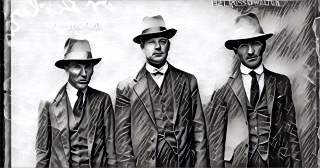
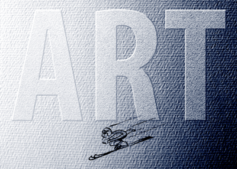

By Yaël Ossowski | [Devolution Review](https://devolutionreview.com/questionable-tastes-and-precarious-friendships-art-reveals-the-complexity-of-post-modern-friendship/)

> Review of ‘Art’, a play by Yasmina Reza.
> 
> Performed at Vienna’s English Language Theatre
> 
> Jan. 15 – Feb. 24, 2018
> 
> Directed by Sean Aita

For any young fool, a hefty portion of their lives is fraught with the pursuit of finding an ideal partner.

There’s a plethora of novels, paintings, magazines, and Tumblr blogs dedicated to the jewel of this search: romantic love. And rightfully so.

Questions on this topic motivate our interests, our mannerisms, our education, our behaviors, place of dwelling, and consign our deepest passions to foremost part of our lizard brains.

Who is a good partner? How do we meet them? How do we maintain a relationship that will last for years and years? Can love fade? Can our partners provide us with all the love necessary to live a happy and fulfilled life?

But as Aristotle outlines in Nicomachean Ethics, friendship is a virtue that as powerful as romantic love, if not necessary. We spend more time seeking friends to share moments with, deriving pleasure and benefit from platonic relationships as we toil and suffer to find our romantic ones. Yet we do not seem to dedicate as much energy and writing space for friendships. And that’s a pity.

**The Painting That Ruined a Friendship**

Performed from Jan. 15–Feb. 24 at [Vienna’s English Theatre](http://www.englishtheatre.at/english/season-201718/art.html), the play ‘Art’ explores this question.  

Centered on the friendships between 3 men living in Paris — Marc, Serge, and Yvan — the play opens up on Serge presenting his long-time friend Marc with his latest acquisition: an off-white painting on a white canvas, purchased from an established artist at the price of 100,000 EUR. It’s  abstract and bold.

To Serge, it represents all that is modern and beautiful, an expression of curiosity and a break from the tired classics imposed from the past. For Marc, it’s an abomination: A blank slate on an even blanker background, nothing more than an overpriced trinket better drawn up on a paper napkin in a pub.

The third friend of the bunch, Yvan, forever the bumbler and ultimate pushover, changes his opinion on the painting at every moment’s convenience and depending on the friend in his company. He’s apt to avoid conflict at all costs rather than articulating anything to upset either Serge and Marc.

As the three men squabble over the painting in Serge’s apartment, the resentment that exists between them slowly breaks down. Judgement, smugness, jealousy, and loneliness are exposed, and each man made vulnerable before his best friends.

For a set of friends, otherwise comfortable in their middle age and confident in their respective fields, we see how delicate these friendships become once they age and begin to change their interests.

George Beach, Howard Nightingall, and Charles Armstrong – playing the respective roles of Marc, Serge, and Yvan – keep the audience suspended with each monologue and shrill argument. Furtive glances to the audience’s fourth wall by Armstrong’s character are especially evocative, as you feel more pity for poor Yvan.

**The Equilibrium that Defines Friendship**

Between men, there is often a friendly exchange of power and influence. The balance of the reciprocity of this arrangement keeps each party in check. One friend may influence the other’s interests, but they will always meet in the middle and influence each other. When this equilibrium fades, the resentment builds.

Marc, an engineer with simple, refined artistic taste thought his influence on Serge shaped him for the better. When he sees Serge straying, Marc feels betrayed.

Serge, a dermatologist with friends in the artistic scene, puts more stock into being “one with the times.” He embraces what high society has signaled to him as success and art.

Yvan, a dopey middle manager in a stationery company, is soon to be married to a woman both Serge and Marc see as too controlling. His wedding plans have chewed away at his confidence and made him a pliable stooge by his fiancée and mother. As the off-white painting hangs over them in Serge’s living room, he breaks down at the thought of losing his two best friends at the precise moment the women in his life have usurped his autonomy. The stresses in his life consume his energy and he literally cries out for help.

All Yvan wants is peace, tranquility, and neutrality. He doesn’t see why the painting even has to come between Serge and Marc in the first place. This wavering is why he’s so weak in the first place, his friends remind him. Doesn’t every friend group have an Yvan?

By questioning their friendships and what they’re built on, the men reveal their deep seeded hatred of their friends’ habits, sense of humour, their romantic partners, and feelings of superiority.

**Growing Apart, But Growing Together**

In truth, each man has developed both dependently and independently of his friends. Sometimes, one of the friends’ influences had an impact on the other. Other times, it had the opposite effect.

But what binds them is their shared experiences, their understanding, and their toleration of each other.

As such, friends remain friends because they provide unconditional empathy and encouragement. And that’s despite the distance, life preoccupations, or social standing that may come between them. Friendship is our ultimate tool to conquer the slings and arrows thrown at us in life’s doldrums.

In the play, the introduction of the painting did more to reveal their mutual insecurities than any ordinary conversation ever could have. Sometimes, we need a catalyst to reveal our fears and reconnect with our friends.

What is revealed in this great interpretation of Yasmina Reza’s play (who, as a female playwright, has a great ability to distill important lessons from male friendships) is the absolute necessity of friendship to living a good and fulfilled life.

Yes, each person maintains a relationship for different reasons, and some friendships may strengthen while others fade.

But if individuals are true to themselves, they can see that friendship is a motivating factor in all our lives. It encourages us to be adventurous, to leave our comfort zone, and to question our decisions all the while facing the worst. It helps us understand the complexity of how we define ourselves.

These, in turn, can make us better people. We can adapt better to the tragic events which may fill our futures, and do so knowing we have friends we can count on to be there to experience it with us.

The play directed by Sean Aita is a great reminder of that, and perhaps even a catalyst of its own. I couldn’t recommend it more highly.

[_Purchase your ticket for ‘Art’ at Vienna’s English Theatre, performed until February 24th, 2018._](http://www.englishtheatre.at/english/season-201718/art.html)

> Props to the cast and crew of ‘Art’:
> 
> Marc – [George Beach](http://www.imdb.com/name/nm1469223/)
> 
> Serge – [Howard Nightingall](http://www.nightingall.co.uk/)
> 
> Yvan – [Charles Armstrong](http://charlesarmstrong.co.uk/)
> 
> Directed by [Sean Aita](https://www.seanaita.com/)
> 
> Designed by [Richard Evans](https://www.r-evans.com/)
