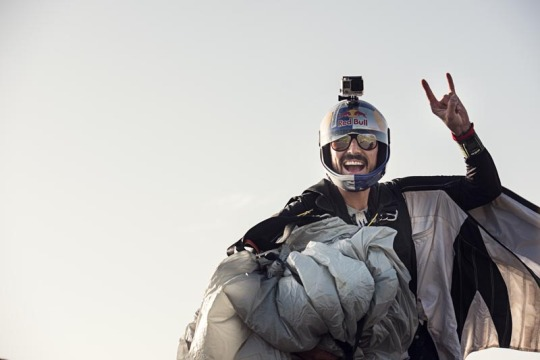
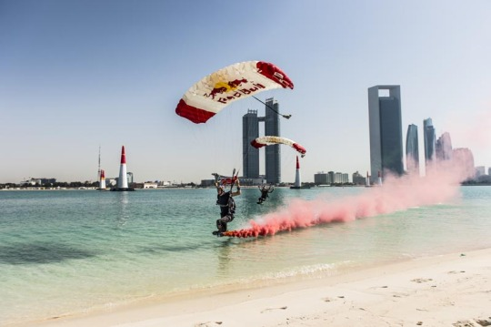
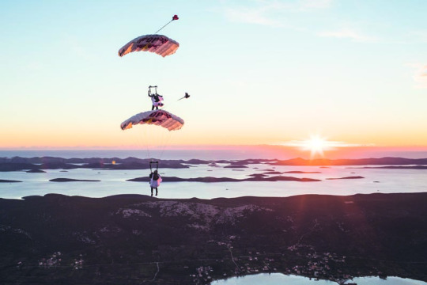

## by [Yaël Ossowski](https://www.metropole.at/author/me/) in May 2017, Sport / 29.4.17 / [Metropole](https://www.metropole.at/sports-skys-no-limit/)  

## **Red Bull gives a fearless troupe wings to become mile-high paragons of their sport**

High above the Austrian Alps, a trio of professional athletes prepare their gear. Helmet? Check. Gloves? Check. Airplane? Check. Red Bull and parachute? Double check.

Young and full of vigor, Marco Waltenspiel, Dominic Roithmair and Marco Fürst are no ordinary sportsmen: They’re professional skydivers, part of the Red Bull Skydive Team based out of Salzburg.

“In the beginning, it’s about getting to know the air and how you feel,” Roithmair told _Metropole_. “After a while, you have confidence, you feel safe, and you want to progress in the sport.”

They’re starting their third season together as airborne acrobats, renowned for their daredevil stunts in Austria and around the world. Their repertoire includes skydiving, windsuiting, base jumping and all types of tricks with their canopies (parachutes).

“If you have a great team like we have, you start to incorporate choreography and more aesthetic aspects of the jump,” explained Roithmair.

Skydiving is considered still a bit on the fringe by more established extreme athletes, but their Red Bull colleague and fellow Austrian, Felix Baumgartner, brought some fame to the sport by completing what was then the highest-ever sky dive in 2012. Jumping from the stratosphere at nearly 40,000 meters, he became the first person to break the sound barrier in free fall, breaking several records in the process. It was watched live by millions around the world and represented a huge win for the Red Bull team. “Felix is definitely a mentor when it comes to realizing projects,” remarked Roithmair.

Like Baumgartner, all team members grew up in the Austrian Alps, looking toward the sky from a young age. “We all grew up on airfields and watched sky divers from down below,” said Waltenspiel. “We’ve been jumping since we’re 14, 15 years old, mostly because our fathers did.”

Unlike their fathers, however, these skydivers get paid for jumping.

**Up in the Air**

Only a handful of people across the planet can claim to make their living parachuting — and this motley crew of Austrians are among the few.

Roithmair is well aware that theirs is a highly-specialized niche profession: “It’s not a mainstream sport, it’s very much a side, thrill sport; there is no federation and no federation money to spend, so we’re really dependent on the sponsors and shows that we do.”

“We have to really keep it up to make sure we can make a living out of it,” Waltenspiel interjected, “We’re very committed to sky diving and we do all the standard sports of mountain boys, but we’re not your typical adrenaline addicts — we’re always on the safe side and have to think responsibly about each jump and stunt.”

Kept airborne by Red Bull and a handful of other sponsors, the three have made a career out of headlining air shows and performing breathtaking exploits caught on high-definition camera and spread online.

Last year, their showstopper was the Mega Swing, which involved hooking up a long swing between two hot air balloons. They took turns jumping out to swing 1,800 meters above the ground, topping it off with a somersault free dive before parachuting down safely.

In another caper, they base jumped off a television tower in Baku, Azerbaijan, landing in the streets among cheering crowds.

**From eaglets to Eagles**

The key is constant practice. “Skydiving is something you never stop learning. My first jump I don’t even remember—it was too much of everything. But then you learn how to handle all the angles and maneuvers. Now, we train a lot more as a team to do precise moves,” said Waltenspiel. “Most of it is learning the technique, whether it’s freefalling or wingsuiting. Then you are able to reduce your canopy and try to land on smaller and more precise landing areas.”

Most of them got their start with the Flying Bulls, the private aviation team of Austrian billionaire and Red Bull co-founder Dietrich Mateschitz. They started there by maintaining the parachute fleet and making jumps for specific aviation shows, spawning the idea of a dedicated Red Bull Skydive Team.

But just because they’ve shunned the 9-to-5 life of a cubicle jockey doesn’t mean it’s all play and no work.

**Winging it**

In fact, all members of the Red Bull Skydive Team are very much sports entrepreneurs in their own right, inking their own apparel and equipment sponsorship deals and planning all aspects of their jumps without middlemen or managers.

“We’re always planning projects, developing them, trying to figure out the best way to realize them,” Waltenspiel pointed out. They receive full support from Red Bull for their jumps, but planning, executing and marketing them from beginning to end is their responsibility. They maintain social media pages, edit photos and videos, organize transportation and try to engage their audience as much as possible.

For the Red Bull Skydive Team, the next step is to try to build on their stunts and encourage a new generation to follow in their high-flying footsteps.

To better promote their sponsor – and sky diving as a sport – members of the team can often be spotted at Windobona in Vienna’s Prater, the indoor skydiving experience that fully mimics the sensation of free fall.  Waltenspiel is bullish on that prospect: “The team is the highest priority and we’re on a good path. We can build it up and maybe go in different directions in the sport. But it’d be great to have more young jumpers join us and continue to grow what we’ve built.”

_[redbullskydiveteam.com](http://redbullskydiveteam.com)_
