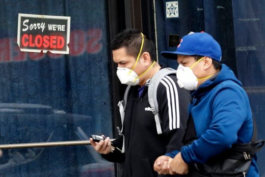

As customers slowly trickle back into stores and workers punch back in at reopened businesses, there’s one thought on all our minds: caution.

Protective plastic shields and screens, face masks and gloves are a new reality, and it is a small price to pay for coming out of state-mandated lockdowns.

But months into the all-encompassing coronavirus pandemic, there is another cost many entrepreneurs and administrators fear: future legal bills. 

While voluntary precautions will be plentiful in every situation where a customer, student or worker is getting back out in the world, the nature of the virus means it is almost certain that someone, somewhere, will catch the virus. That means huge potential legal ramifications if a person wants to hold an institution or business liable.

There is already a demonstrable lawsuit epidemic. Between March and May of this year, more than [2,400 COVID-related lawsuits](https://www.floridatrend.com/article/29442/coronavirus-lawsuits-in-florida) have been filed in federal and state courts. These cases are likely to blow up our legal system as we know it, elevating accusations of blame and clogging every level of our courts that will keep judges and lawyers busy for some time.

That is why the idea of a liability shield for schools, businesses and organizations has taken up steam.

In a recent letter to congressional leaders, [21 governors](https://drive.google.com/file/d/1DlaKgPXYBXAdI734RDALTiTJcvmvOoME/view), all Republicans, called on both houses of Congress to include liability protections in the next round of coronavirus relief.

“To accelerate reopening our economies as quickly and as safely as possible, we must allow citizens to get back to their livelihoods and make a living for their families without the threat of frivolous lawsuits,” the governors wrote.

While a liability shield will not give cover to institutions that are negligent or reckless, and reasonably so, it would ensure that blatantly frivolous or unfounded lawsuits are not allowed to go forward.

For the average entrepreneur or school administrator, that would help alleviate some of the worries that are keeping many of these institutions closed or severely restricted.

No one wants customers or workers catching the virus in these environments, but creating 100% COVID-free zones would be next to impossible, a fact many scientists are ready to [acknowledge](https://www.cidrap.umn.edu/news-perspective/2020/05/indoor-spread-covid-19-can-be-lessened-experts-say). That’s why state governors, lawmakers and business leaders want to ensure that our states can open back up, but be cognizant of the risk. 

There is still plenty of uncertainty related to the transmission of the virus, as the Centers for Disease Control and Prevention has [pointed out](https://www.cdc.gov/coronavirus/2019-ncov/hcp/planning-scenarios.html), and that is why a liability shield — at least for those who follow health and safety recommendations — makes sense. Businesses and schools that willfully endanger citizens through negligence though, should rightfully be held liable.

This is the idea currently being debated in the nation’s capital, as Senate Republicans have stated they want a [liability shield](https://www.wsj.com/articles/liability-shield-is-next-coronavirus-aid-battle-11588589100) to avoid a lawsuit contagion.

Unfortunately, the idea is likely to be mired in a toxic partisan death spiral. Senate Minority Leader Chuck Schumer of New York decries such a plan as “legal immunity for big corporations” and reporting on the topic has resembled such. 

But these protections would most benefit small businesses and schools that follow health recommendations and still find themselves the subject of lawsuits. 

It is no secret that many attorneys see a potential payday in the wake of the pandemic. There are already many law firms pitching “[coronavirus lawyers](https://www.thegomezfirm.com/practice-areas/coronavirus-attorney/)” and many have reassigned [entire teams](https://www.abajournal.com/web/article/lawyers-and-law-firms-say-they-are-inundated-with-coronavirus-related-queries) and departments to focus on providing legal advice and counsel for COVID-19 cases. 

And much like in consumer fraud cases before the pandemic, a favorite tool of coronavirus tort lawyers will be large class-action lawsuits that seek huge payouts. These are the cases that usually end up lining the pockets of legal firms instead of legitimately harmed plaintiffs, as a recent [Jones Day](https://www.jonesday.com/en/insights/2020/04/empirical-analysis-consumer-fraud-class-action) report finds. And that does not even speak to whether or not these cases have merit or not.

In debating the next level of pandemic relief for Americans, including a liability shield would be a great measure of confidence for responsible and cautious businesses and institutions in our country. 

Whether it is the local community college or bakery, we must all recognize that assigning blame for virus contraction will be a frequent topic of concern. But those accusations must be founded, and be the result of outright harmful and negligent behavior, not just because students are back in class or customers are once again buying cakes.

A liability shield for the responsible citizens of our country is not only a good idea but necessary.

_Yael Ossowski is deputy director of the Consumer Choice Center. He wrote this for InsideSources.com._

_This article was published on [Detroit News](https://www.detroitnews.com/story/opinion/2020/07/28/opinion-responsible-businesses-need-covid-19-liability-shields-coronavirus-customers-legal/5518911002/)._
