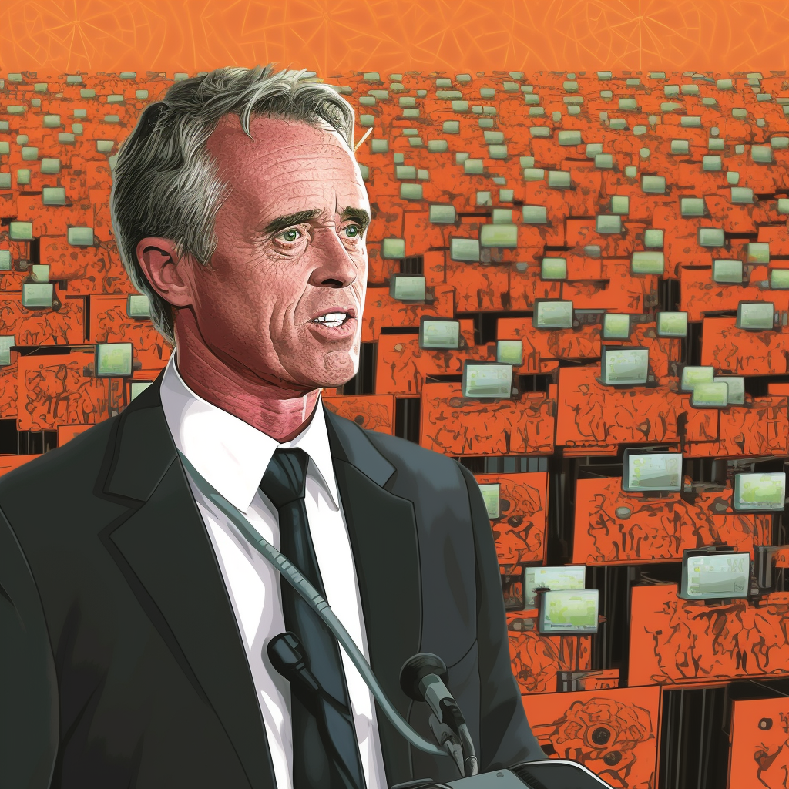

## **The modern Kennedy has some pretty whacko authoritarian anti-prosperity ideas, but he somehow gets why Bitcoin matters.**

Historically, we all know cypherpunk Bitcoin, nerd Bitcoin, lambo Bitcoin, and finance Bitcoin. Now, we’re in the age of political Bitcoin.

At this early juncture in the 2024 US Presidential campaign, we’ve already had three candidates explicitly mention support for Bitcoin in their campaign.

Florida Governor Ron DeSantis, when he [announced](https://twitter.com/iLoveJaneAdams/status/1661538616324112387?s=20) his run for president on Twitter this week, said he wants to protect the ability for people to “do Bitcoin”.

The most prominent endorsement [happened last week](https://www.youtube.com/watch?v=fz7FPl065II) at Bitcoin 2023 in Miami, when **Robert F. Kennedy, Jr**., running for the Democratic presidential nomination against Joe Biden, outlined Bitcoin-specific policy proposals to defend owning Bitcoin, running a node, mining it, and ensuring government doesn’t put its hands on it.

"We are now living in this age of turnkey totalitarianism," he said of the rising power of technology and government control. Bitcoin, he argued, is a powerful tool against that tide because of its decentralization and freedom from countries or corporations.

As he laid into his points, an OpenNode QR code appeared on the screen behind his massive Kennedy head, inviting _Followers of the Orange Coin_ to donate to his presidential aspirations via lighting or on-chain.

That was enough to make many Bitcoiners swoon.

And while RFK Jr. may have a clue about Bitcoin and its power, and how to cater to a Bitcoin audience, it doesn’t erase the fact **that he’s pretty batshit insane**.

As the nephew of a former president and the son of an aspirant one, he’s been in the public eye his entire life, so it’s not hard to find examples of whacko and loony ideas that were conveniently left out of his Bitcoin _coming out_ speech.

RFK Jr., we should note, is a rabid environmentalist.

Not your casual cotton bag-toting type at the overpriced grocery store, but a guy who has called for the _[jailing](https://web.archive.org/web/20170404102453/http:/www.ecowatch.com/jailing-climate-deniers-1881958645.html)_ [of energy company executives](https://web.archive.org/web/20170404102453/http:/www.ecowatch.com/jailing-climate-deniers-1881958645.html) and think tanks or groups that they may support for “contributing to climate change”.

**Here are a few other select mentions:**

- Called for anyone who has a contradictory opinion of how to deal with climate change to be charged with treason

- Served as a co-counsel in major extractive lawsuits against Monsanto and Dupont

- Successfully advocated for a ban on fracking in New York state

- Successfully advocated for a shutdown of the Indian Point nuclear reactor in New York state

- Successfully advocated for a ban on windfarms in Massachussetts

- Sued to stop hydroelectricity production in Quebec

- Sued to stop the Dakota Access pipeline

- Protested against the Keystone XL pipeline

- Claimed Bush stole the 2014 election

- Praised Hugo Chavez and Fidel Castro not just personally, but for their anti-human socialist policies

Apart from calling for the arrest of people who have a different view of the government’s role in climate change and his anti-nuclear, anti-wind farm, anti-natural gas, anti-oil, anti-innovation in agriculture, anti-capitalism stances and actions, _he’s a totally normal guy who just wants to stack sats like the rest of us_.

OK buddy.

Note I didn’t mention anything about his vaccine campaigns or his stance against COVID policies. In select circumstances, these are nuanced and sometimes appropriate views, but it’s very much a case-by-case basis.

On COVID especially, he’s served as a great ally on countering government incompetence and malfeasance. Matt Welch of _Reason_ has a good summary [here](https://reason.com/2023/04/28/the-very-strange-new-respect-for-authoritarian-democrat-robert-f-kennedy-jr/).

But working to actively shut down energy industries while praising socialist dictators usually isn’t my cup of tea.

Regardless, just because he’s said interesting things about Bitcoin — at a totally opportune time when he’s running for president — doesn’t mean he should be anyone’s political hero (note: slay your heroes).

He says he began paying attention to Bitcoin in the midst of the Canadian Freedom convoy, which I don’t doubt.

But after a nearly 70-year career advocating quasi-authoritarian and anti-prosperity policies, does his **Orange Conversion** negate everything else he’d be likely to implement as a president? No way, José.

I’d be interested in seeing how he’ll counter environmental attacks on Bitcoin mining, for example, or how’d he’d square his fairly leftist economic views against the more anarcho-capitalist philosophy that informs much of Bitcoin’s origin story.

Would he advocate to throw Bitcoin miners who use fossil fuels in jail like my friends who work at the Cato Institute or other think tanks like he’s proposed? Or Bitcoiners who’ve escaped socialist hellholes like Venezuela and Cuba that he seems to want to emulate?

Whoever his Bitcoin advisor is (and I hope you’re subscribed to _Fix The Money_), I say “chapeau!”. You have done an excellent job prepping your candidate. And it is helpful to have voices from across different segments of society making the case for Bitcoin.

But let’s not forget that politicians can virtue signal all they want on Bitcoin, but we can’t ever really know if they’re sincere. It is election time, you know. And when push comes to shove, the _Bitcoin electorate_ will always be tiny compared to every other interest group with sway in politics.

In the meantime, keep your skeptic goggles on. There’s a lot at stake.

Best,

Yaël

_Published on [Fix The Money](https://www.fixthemoney.net/p/rfk-jr-is-batshit-insane-but-happens)._
