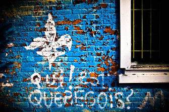
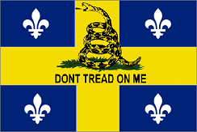
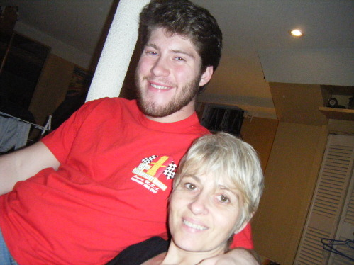
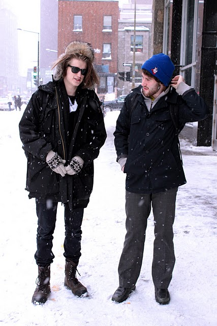

De Gatineau jusqu'en Gaspésie, il y a sans doute de milliers de québécois qui se préparent pour proprement fêter la Saint-Jean Baptiste, connue dans la belle province comme la « fête nationale ».

> 

Alors, pour ceux et celles qui se trouvent présentement au sein du territoire québécois, l'esprit de la célébration est ubique, même omniprésente, et l'impulsion de la fierté coulent sans cesse à travers les veines du corps humain.

Mais que signifie-t-elle pour les porteurs de la fleur de lys en dehors des frontières québécoises, ou même ceux qui se sont faits expatriés à un jeune âge à une autre culture, langue et nation ?

Voilà mon dilemme.

De toutes mes vingt-quatre années, le Québec ne m'a hébergé que huit. La majorité de mon enfance, éducation et apprentissage a eu lieu aux États-Unis, une existence fermement attachée avec l'étiquette « immigrant du Canada ».

> 

Parfois connu comme le « canadien », je soupçonnais très tôt dans ma nouvelle vie culturelle et linguistique que je ne méritais pas ce statut ni nom.

Franchement, j'avais peu de relation avec le Canada sauf quelques voyages de deux jours à la petite ville ontarienne où mon grand-père habitait—deux heures de route de Montréal. Je voyais le drapeau canadien qui flottait aux douanes et qui décorait l'intérieur de Tim Horton’s.

L'effet d'avoir un fier allemand comme grand-père n'aidait pas mon manque de nationalisme canadien, car nos visites chez lui se remplissaient des histoires de sa jeunesse prussienne, interrompue et volée par les méchants soviets qui ont envahi sa ville natale. Il a aussi connu le Québec brièvement, mais les gains politiques des souverainistes et l'imposition du français lui ont assez fait peur qu'il ait quitté pour la province voisine.

Quant à moi, l'idée de la nation québécoise n'était qu'un sentiment formé avec la langue française, dont je parlais à peine le même niveau qu'un enfant de cinq ans.

Malgré la réalité linguistique du Sud américain, ma mère continuait de nous parler dans sa langue maternelle, même si ça me gênait autant devant mes amis unilingues.

Certes, mon éducation a été monopolisée par la langue anglaise à la socialisation américaine, mais c'est ma mère qui nous a ancré cette tradition à la patrie québécoise. C'est elle qui m'a poussé à travailler à Saint Damase pendant les étés, aller à l'université à Montréal et découvrir mes racines culturelles qu'elle ne me pouvait qu'introduire compendieusement pendant ma jeunesse aux États.

À cet égard, c'est sa fidélité qui me convainquait du fait que mon cœur appartenait ailleurs qu'à la bannière étoilée. C'est ma mère que je dois remercier.

> 

Par là même, je n'étais jamais un québécois parfait. La langue française n'a été qu'un mélange d'images et sons dans ma tête, toujours liée aux jeux d'enfants et soupers de famille à Saint-Hyacinthe. Jusqu'à dix-huit ans, je ne pouvais lire ni écrire le français et mon accent ballottait entre le joual et l'hybride d'un australien-parisien.

Bref, l'apprentissage de ma langue maternelle a pris lieu dans mes vingtaines durant trois ans à Montréal comme étudiant et associé aux ventes chez Home Depot.

C'est à la deuxième que j'ai appris les leçons et valeurs les plus importantes à la citoyenneté québécoise. Je m'introduisais à l'histoire du Québec écrite par Léandre Bergeron et Mathieu Bock-Côté dans la salle de repos et faisait le tour des rangées du magasin en jouant dans mes oreilles les chansons de Les Colocs et Jean Leloup. Je me sentais chez moi.

À l'occasion festive, soit la Saint-Jean Baptiste ou soit la journée des Patriotes, j'avais pu comprendre l'importance et la signifiance. J'avais appris l'hymne national et j'ai enfin découvert le sens d'être un « québécois de souche ». J'avais compris que la plaque d'immatriculation gravée avec la phrase « je me souviens » n'était pas une parole imaginée, mais plutôt un grief contre la majorité anglophone du Canada.

> 

Depuis ce temps-là, je suis installé au cœur du monde germanophone à Vienne. À la capitale autrichienne, j'apprends une autre langue et je m'assimile à une autre culture, mais je porte toujours la fleur de lys et mon esprit québécois. Je voyage, j'apprends et je découvre, mais je n'oublierai jamais ma langue et ma patrie maternelle.

Comme chaque expatrié perdu à l'étranger, j'essaie de me faire prendre pour un citoyen du monde. J'oublie le nationalisme et je me méfie aux allégeances gouvernementales. Malgré ma crainte de l'étatisme, c'est la langue commune et la culture base qui me gardent québécois.

Celles m'indiquent qu'au sein de mon cœur mes racines québécoises me tiendront toujours. Je suis donc un québécois sans pays et fier de l'être.

Bonne Saint-Jean à tous.
