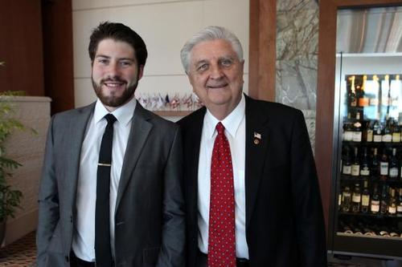

Here I am with my good friend **[Dr. Richard Swier](https://twitter.com/drrichswier)**, a passionate political activist, talented writer, and retired Army Lt. Colonel who is working to change the system and refute the myths currently hampering freedom and liberty in the state of Florida.

He invited me along to give a [post-election 2012 analysis](http://www.yourobserver.com/news/longboat-key/Key-Life/1109201222933/PHOTO-GALLERY-Longboat-Key-Republican-Club) at the **Sarasota Yacht Club** on November 9th.

If you’re interested in powerpoints, check out our [joint presentation](https://docs.google.com/a/watchdog.org/open?id=0B_3PRomzdplDSFZONlltQmNHdzQ).

Follow him on [Twitter](https://twitter.com/drrichswier) and check out his articles on **[Watchdog Wire](http://www.watchdogwire.com/Florida)**.
