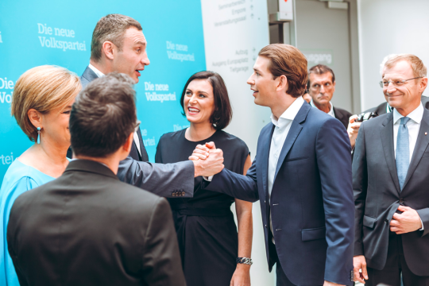

By Yaël Ossowski 

Last Saturday, in a muted and highly uncontested leadership election in Linz, Austria, 30-year-old Sebastian Kurz secured 98.7 percent of the vote to head the Austrian People’s Party (ÖVP) before October’s elections.

Well-dressed and soft-spoken in a posh Viennese accent, the young Minister of Foreign Affairs and Integration unveiled his platform and strategy for earning the conservatives a majority in the Parliament and their first chance at the top spot in nearly ten years.

The fall election came as a surprise to many, sparked by the May collapse of the “grand coalition” between the People’s Party and Social Democratic Party of Austria (SPÖ), the ubiquitous power-sharing arrangement that has for the most part governed the Republic of Austria since the end of the Second World War.

Austrians have grown tired of the red-black compromise, pushing both parties to begin thinking out of the box if they wish to secure democratic legitimacy at October’s polls.

Because he has swept away any hope at reviving the grand coalition, Kurz’s only chance to win a majority and effectively wrestle away the chancellor position from the social democrats will be to embrace the far-right Austrian Freedom Party (FPÖ) in coalition. That may not be enough to stem the influence of the far-right across Europe, but it will be enough to pigeonhole them in Austria. Behind closed doors, all indications point to the social democrats floating the same idea.

Last time such a coalition was put together in 2000, [international sanctions and condemnations](http://uk.reuters.com/article/uk-austria-politics-alliance-idUKKBN1781QX) from the EU flooded Austria. Neighboring countries tried to cut off the nation from participating in international summits and accords, protesting the government now holding hands with a xenophobic party founded by ex-SS officers.

But the party’s shaky record and un-kept promises soon kept it away from the controls, leading to major losses in the 2002 elections. Ever since, the grand coalition has managed to keep the Freedom Party from power, but Kurz’s soft embrace may change that tide.

His bona fides in the midst of the migrant crisis speak precisely to many card-carrying members of the Freedom Party, scared by the huge influx of foreigners in a country of only 8 million.

“The success of integration efforts depends strongly on the number of integrations to be integrated,” he said in June. “Therefore, migration to Austria must be restricted.”

Kurz’s ascension to power was all but evident over the course of this crisis, and made all the more immediate after the resignation of longtime party leader Reinhold Mitterlehner in May. That’s when Kurz’s long-term plans could finally take root and the “New People’s Party” could emerge.

Born just three years before the fall of the Berlin Wall, Kurz is already a veteran of international politics, having served as Foreign Minister since 2013, played host to the Iranian nuclear negotiations, and been one of the loudest voices in resolving Europe’s migrant crisis.

Appointed at just 27 years old, he easily claimed the title of youngest Foreign Minister in European history. But lest that keep his agenda short-lived, he’s managed to plot himself on the world stage through a multitude of summits and statements, from the Ukrainian crisis to the role of radical Islam in European societies.

It’s this fresh, bold approach which has made his perspective so desired by Austrians across the spectrum. Even [leftist magazine Falter](https://www.falter.at/archiv/wp/kronprinz-kurz) dubbed him “Crown Prince Kurz,” calling attention to his radical approach but “princely” nature. This, for a country that even divides its unions, clubs, and associations by party membership is new for Austria.

In order to march forward, he’ll be taking a page from the book of French President Emmanuel Macron’s literal En Marche movement, leading a slate of candidates under the “Sebastian Kurz List” rather than brandishing the traditional colors. The party color, once conservative black, has now been changed to the colorful cyan, matching the graphics and design found on Kurz’s social media accounts for the last several years.

But Kurz’s path to power as an Austrian politician aiming for the chancellery will be unconventional: he won’t bank on the grand coalition between the conservatives and the social democrats (SPÖ) that have kept Austria together since the end of the Second World War.

Rather, he’s expected to rally the far-right FPÖ as a coalition partner, hitherto a verboten act in the small Alpine Republic. The thrice-attempted Austrian Presidential election in 2016 worried international commentators as Freedom Party candidate Norbert Hofer came within a whisker of winning, albeit for a symbolic position without much executive authority.

Nonetheless, the attacks from Anglosphere press [were united](http://4liberty.eu/austria-leagues-beyond-its-past-so-stop-invoking-it/) in warning of the reawakening of Austria’s Nazi past, seemingly just a ballot box away. It may just take someone like Kurz moderating power to assuage those fears.

He’s had a penchant of being able to say the right thing at the right time, mostly without controversy. When Turkey exported its presidential campaign to Turkish citizens living in the EU, and tried to host rallies and events in the Netherlands, Germany, and other countries, Kurz was chief among EU diplomats to rebuke Erdogan and company. He’s been more accommodating to Russia and skeptical of increased involvement in Ukraine. He’s been vociferous in opposing kindergartens which are based on an Islamic curriculum and insistent on the need to have migrants integrate and speak German.

The parchment of an Austrian chancellor, however, affords this luxury. Unlike Germany and France, Austria is not a member of NATO and is permanently affixed as a neutral nation per its constitution of 1955. The economies and populations of those countries dwarf Austria’s. Kurz’s role, if successful, will be more of a conductor than a statesman with any real authority on the European stage.

If there is anyone who can tame the furthest fledges of the far-right, Kurz, with his own agenda and politics, may the one to do so. Whether the people of Austria will agree come October is dependent on time and whether any unforeseen crisis pops up to upend the careful and calculated political agenda.

_Yaël Ossowski is a Canadian journalist living in Vienna_
