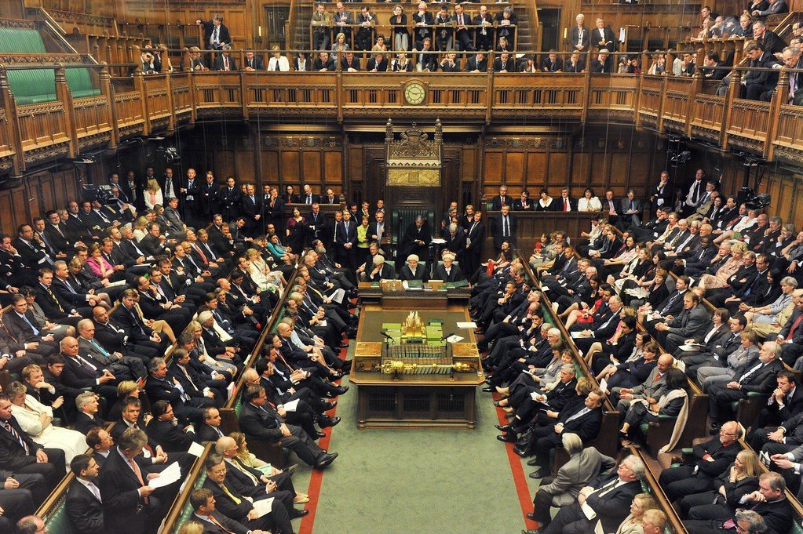

There have been some important debates and actions in various parliamentary democracies lately.

Canada held its 43rd general election on Monday, Austria’s legislative elections were three weeks ago, and the UK Parliament is in the midst of the Brexit deal debate.

With its first-past-the-post parliamentary system, Canada’s election won current Prime Minister Justin Trudeau a minority government, as his party won the most number of total seats (157 out of 338) though they only won 33% of the national vote total (what we’d call the popular vote), the lowest level for a government in Canadian history.

Austria, where I live, has a party-list proportional system, and last election saw the triumph of the Austrian People’s Party led by Sebastian Kurz, which won 32% of the vote but with 71 seats in the 183 _Nationalat_, or National Council. He’s still currently involved in coalition negotiations to form government, with either the Green Party of the Freedom Party of Austria [lining up](https://www.washingtonpost.com/politics/2019/10/04/four-things-we-just-learned-austrias-elections/) to be the prettiest princesses at the ball. The Social Democrats, which the People’s Party partnered with for basically all of Austria’s history, are a non-starter for the young conservative. Unfortunately, the liberal party, NEOS, doesn’t have enough seats to make an impact.

Trudeau, because he won enough seats to govern without a coalition partner, has a minority government. If the remaining 4 political parties with Members of Parliament join forces, they could technically bring down the government. But considering the other parties (Conservative, New Democratic Party, Bloc Québécois, and Greens) have relatively little in common, that’s pretty unlikely. You’d need the equivalent of [five Blackface scandals](https://www.ft.com/content/3347d820-e4a8-11e9-9743-db5a370481bc) to turn everyone against the Boy Wonder Prime Minister.

Meanwhile, in Great Britain, Prime Minister Boris Johnson’s last-ditch efforts to cobble together a Brexit deal have found even members of his [own party](https://www.ft.com/content/82d70d98-f4cf-11e9-a79c-bc9acae3b654) voting against him. The UK Parliament at least voted in favor of the Withdrawal Agreement, but it seems the deadline will move from Halloween to January 31. Oy vey.

All this is interesting in the context of the ongoing 2020 Presidential Election in the United States.

Unlike the countries mentioned, the U.S. has a presidential republican system, in which a Congress is elected to write and pass bills much like in a parliament, but only the President, elected themselves and head of the Executive Branch, can sign them into law. Whereas parliamentary systems combine the executive and legislative branches, the American system leaves them separate.

Added to that, each of the above countries has a bicameral legislature, with an Upper and Lower chamber, but only the U.S. Senate directly elects its members. Austria’s Upper Chamber, the _Bundesrat_, or Federal Council, appoints its members according to the proportional vote totals in the state parliaments. This is similar to how the U.S. ran the show until it adopted the Seventh Amendment in 1913 ([that’s a whole other debate](https://www.cato.org/publications/commentary/repeal-17th-amendment)).

**As a thought experiment, what would happen if the U.S. had a parliamentary system?**

**PARTIES**

In a sense, one could foresee a situation where Congress would be made up of many more parties. Whichever party would command a majority would be able to head up the government’s legislative and executive functions. Likely the Republicans and Democrats would get battered by competition – one can hope! You could even see the rise of regional parties again, something like the California Party (god forbid) or the Southern Party. Maybe even a Mormon Party with a huge base in Utah, Idaho, and all those other states I’ve never visited, or a much more robust Green Party based in Vermont or Massachusetts. Maybe even the Libertarian Party could elevate some of its sane members to representative positions.

And that would also trickle down to the states, which have mini versions of the presidential (gubernatorial) republican systems. At the moment, there are only [69 independent or third-party state legislators](https://ballotpedia.org/Partisan_composition_of_state_legislatures) _out of over 7,000!_ It’s rather insane that state legislatures elect only Democrats or Republicans when states are so diverse and culturally different. A parliamentary system down at the state level as well would certainly boost more diverse parties that would better represent citizens. Unless you thank the Ds and the Rs are doing such a great job!

**WEAK OR STRONG HEAD OF GOVERNMENT**

Because the head of government in this imaginary U.S. parliamentary system would be a prime minister or first citizen (or a much cooler name), they would elected as any other member of Congress. They would have a home constituency, and would need to win their riding or district with every election. The cabinet would be made up of fellow congresspeople rather than buddies, pals, or so-called _experts_. 

In a way, this could either dilute or boost the power of the head of government. Because they would be the leader of the party, be elected as a congress person themselves, and sit in the same legislative building, they would be seen as a “first among equals”. That  would make passing laws much easier, but would also come at the expense of presidential independence and autonomy (just think of President Kirkman in [Designated Survivor](https://designated-survivor.fandom.com/wiki/Tom_Kirkman)). Indeed, a president today has control over the entire Executive branch, something like [4 million employees](https://www.whitehouse.gov/about-the-white-house/the-executive-branch/) who are responsible for allocating nearly $4 trillion of the federal budget.

A president today can directly claim authority by the millions of Americans who specifically vote for them, something prime ministers in other countries cannot claim. That strengthens the president’s hand and makes certain that their agenda is top of mind for the hundreds of elected congressmen. At the same time, it means congressmen can hoot and holler on the floor of Congress and rage against an entire different branch of government

A parliamentary system would much more easily get rid of a figure like Donald Trump, probably in a confidence vote, but that would mean that we’d have to have many more elections or leadership changes within a single mandate, like in the UK. That wouldn’t be good for stability and it certainly a trade-off.

At the same time, Congress wouldn’t be so keen to entertain bombastic speeches and pointless hearings based on the virtue signal of the day.

**MORE POWER TO THE STATES**

With a federal parliamentary system, one could foresee the situation when many of the functions allocated to the federal government in the Constitution would be limited to just that. There wouldn’t need to be a U.S. Department of Health and Human Services or Department of Education, because these are functions of state governments. That’s likely wishful thinking, but perhaps those departments would just be much smaller, like in Canada.

Oddly enough, even though Canada was initially set up as a strong central government in reaction to the U.S. Civil War and the fractions that led up to that, Canada’s modern system is much more [decentralized](https://panampost.com/yael-ossowski/2013/11/05/canada-the-true-north-american-experiment-in-decentralization/?cn-reloaded=1) than the U.S.

Provinces have much more authority than U.S. states, even though the Constitution mandates the opposite. That’s more a philosophical discussion for another time.

But with a parliamentary system, we could once again see state legislatures become actual negotiating powers with the federal government, rather than just testing grounds for ambitious politicians who want to get into Congress.

**MONEY**

Let’s be frank, there would be a lot of cost savings. With a single legislative and executive branch, we wouldn’t need the bloated federal bureaucracy that exists today. Unelected department heads who run personal fiefdoms would be history, as each of these individuals would be themselves elected congresspeople with more defined and limited mandates. Career bureaucrats would still exist, but there wouldn’t be such a permanent class of civil servants who retire with outrageous pensions.

The presidency is very expensive to maintain, and it seems like there’s a lot that could be trimmed there. We don’t have a Queen, so that’d at least be a major plus.

**NO MORE LAWYERS**

At last, a parliamentary system would perhaps rid us of the absolute majority of legislators who are lawyers. We’d have more diverse representatives from different educational and occupational backgrounds who have better understandings of the fields of regulation that Congress considers. No doubt, lawyers still reign supreme in Canada and the UK, but with more parties and fewer barriers to entry, a parliamentary system in the U.S. could make it easier for the non-Harvard Law graduates to actually serve and represent their districts. But maybe that’s wishful thinking.

**A U.S. PARLIAMENT?**

Overall, I don’t see the path to a parliamentary system in the United States. The history and convention are too ingrained in the minds of average voters and politicians who want to keep greasing the wheels in their favor. But we should remind ourselves that the American Revolution wasn’t fought over independence from a parliament, per se, but the King and the Parliament _over there_.

I’m sure much more intelligent thinkers and writers will have thoughts on this. But I think it’s at least worth it to think about it. The purpose of government is to defend our liberty, our rights, and our property, not to uphold the status quo. We should always be thinking about what we should do better.

If we wanted to update Government to Version 2.0, maybe a parliamentary system would be worth a crack.
