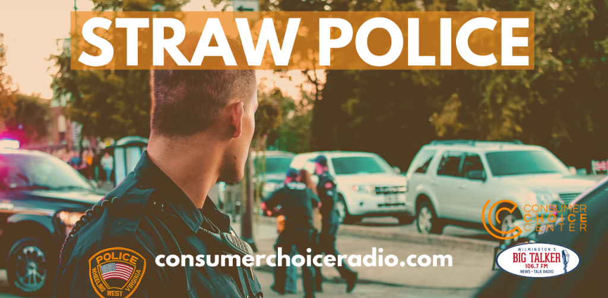

<figure>

<figcaption>

Consumer Choice Radio: Ep. 7

</figcaption>

</figure>

https://youtu.be/EFBF3I5uN2k

Consumer Choice Radio, hosted by Yaël Ossowski (@YaelOss) & David Clement (@ClementLiberty).

- Mayor "Big Gulp" Bloomberg gets railroaded at the Democratic debate
- A rail blockade brings Canada to its knees
- The Straw Police are real...and they're here
- DEBATE: Should you recline your seat in economy class?
- Awesome Consumer Choice Center hits around the world: European Railways Index

Shownotes: [https://consumerchoicecenter.org/radio/ep7](https://consumerchoicecenter.org/radio/ep1/)

Broadcast on The Big Talker 106.7 WFBT FM on 22. Feb. 2020.

[consumerchoiceradio.com](http://consumerchoiceradio.com)
