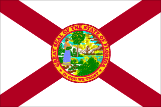

By Yaël Ossowski | Florida Watchdog

> TAMPA — **Florida**‘s political season is ready to move full steam ahead.
> 
> With the statewide primary for the Democratic and Republican parties set for Aug 14, voters in the**Sunshine State** have been presented with a slate of 120 candidates for27 House congressional seats and 11 for the U.S. Senate.
> 
> Of those seeking office in the **U.S. House of Representatives**, 53 filed as Republicans and 36 as Democrats, according to the [Florida Division of Elections](http://election.dos.state.fl.us/candidate/CanList.asp).
> 
> The one Libertarian, 19 independent and 11 write-in candidates will be eligible only for the general election in November.
> 
> **Senate**
> 
> The six Republicans competing for the seat held by Democratic U.S. Sen. **[Bill Nelson](http://nelsonforsenate.com/splash)**, are:
> 
> - U.S. Rep. [Connie Mack](http://conniemack.com/), of District 14;
> - Former U.S. Sen. [George LeMieux](http://www.georgeforflorida.com/), R-Fla.;
> - [Deon Long,](http://ballotpedia.org/wiki/index.php/Deon_Long) of Winter Park;
> - Col. [Mike McCalister,](http://mikemccalisterforsenate.com/) of Plant City;
> - Catholic blogger [Marielena Stuart,](http://marielenastuartforussenate2012.com/) of Naples;
> - and former U.S. Rep. [Dave Weldon](http://www.daveweldonforsenate.com/), of District 15.
> 
> Nelson will be challenged in the Democratic primary by health entrepreneur [Glenn Burkett,](http://www.gb1com.com/) of Naples.
> 
> Former Army Lt. [Chris Borgia](http://www.chrisborgia.com/), of Davie, businessman [Bill Gaylor](http://www.floridaforbill.com/), of Melbourne, and businessman [Ron McNeil](http://mcneil2012.com/), of Melbourne, will be on the Senate ballot as independents.

Read more: [Florida Watchdog](http://watchdog.org/20448/fl-meet-your-candidates-for-federal-office/)
