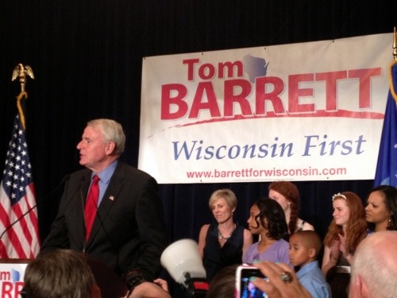

By Yaël Ossowski | Wisconsin Reporter

> MILWAUKEE— The crowd downtown was mum by 9 p.m. at the election night rally for supporters of Democratic gubernatorial hopeful Tom Barrett.
> 
> Eyes were glued to the large plasma screen television in the corner, where MSNBC host Rachel Maddow was breaking the news that projections from her own news organization called a win for Barrett’s opponent, Republican Gov. Scott Walker.
> 
> The loud cheers and jubilant smiles that once were shared among the crowd were now expressed only on the television, in a live shot of the opposing Republican rally where the more numerous supporters of embattled governor Walker celebrated the projected victory.
> 
> The Rev. Jesse Jackson, a prominent civil rights activist who campaigned actively for Barrett, stared blankly at the live results feeding in and calmly shared words with his staff.

Read more: [Wisconsin Reporter](http://www.wisconsinreporter.com/supporters-vow-to-fight-on-after-barrett-concedes)
