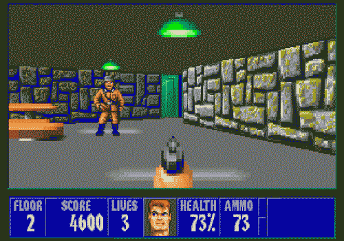

_We're more likely to accept the dogma of Google, Apple, or Microsoft in order to satisfy our daily desire to be connected and loved by the bits, ones, and zeros. Who would have thought that the great decentralized interconnected nature of the millions of computers on the Internet would lend itself to a centralization of user experience?_

My debut fiddling with computers was about 20 years ago, in 1996. My dad bought us a Compaq Presario running DOS. My brothers and I were able to learn a few pivotal lines of code, allowing us to boot from the disk and play games like The Incredible Machine, Wolfenstein 3D, and Duke Nukem.

After a few months, we were able to secure a CD-ROM of Windows 95 -- eureka! The difference was remarkable. The environment was so much smoother and allowed us to use the mouse. Plus, there were more games! What fun we had. Click click, tap tap, technology is beautiful.

The biggest upgrade came with my dad's discovery of NetZero sometime in 1998. It was a free service that came on a CD-ROM, gave you a username and password, and instructed you to plug a phone line into your computer. It gave us access to a dial-up connection, opening the world of the Internet for the first time. Of course one couldn't use the phone at the same time as one "cruised the net," so we had to be strategic.

In those days, the beginning of each connection was ritualized by that loud dial-up noise, the pinging and bopping of infrastructure turning and burning somewhere off in the distance.

**The World Wide Web**

It was on that World Wide Web that I began tinkering with websites and software, moving from Netscape Navigator to bigger projects. I remember creating a Geocities fanpage chronicling the 27th season of Saturday Night Live, something like snl247.geocities.com. I had every cast member's bio categorized, and each sketch tagged with a line about why it was so funny. It was a hoot and I even had an audience.

That launched me into blogging on the platform Xanga, where eventually I was joined by dozens of friends. I still have an archive saved on my servers.

My journey, I presume, was similar to thousands of 20-somethings who came up with the Internet.

I was no hacker, just a consumer and fiddler. I tell this story because I thought this was a pretty universal experience for today's youth. That curiosity reigned and we would become not just users but proponents for technology.

Alas, however, that isn't the case.

**The Technological Illiterates**

I'm so severely disappointed with my generation when it comes to overall technological literacy.

Oh sure, we're technological adopters, not we're not necessarily technological literates. There's a marked difference, and I'm seeing that more and more.

The technological experience is becoming more and more blackboxed, or that "scientific and technical work is made invisible by its own success," as stated by French science philosopher Bruno Latour.

Young people are the first ones to try out Twitter, Instagram, Snapchat, or YikYak, there's no doubt.

But how many young people today know how to set up a PGP key for their email? Or start an email account apart from Gmail? Let alone talk about hosting their own website on a server they control or using RSS to follow their favorite websites.

I was confronted by this realization in the launching of a side project called the CEVRO Café Club in Prague, Czech Republic. The idea was to offer access to a high-quality espresso machine to graduate students based on the idea of a monthly membership. In order to make it more special, we decided to require that all memberships be paid only in Bitcoin, the decentralized digital currency.

Knowledge of the currency was absolute, but understanding or merely a practiced hand was scarcely found. And that's disappointing. I've seen the same in the many dozens of events I've attended across the world which has had speeches and sessions on the uses and implications of a currency like Bitcoin. There's not likely to be a single unit of the currency found in the smartphones of the crowd.

There are so many fervent ideological supporters of alternative currencies among classical liberals, yet only a handful who seem to know how to acquire any or trade it.

The same is applied to TOR and the backbone of the "Darknet". But one mustn't be Ross Ulbrich or the U.S. federal government in order to be familiar with the Deep Web. It literally takes two seconds: Download TOR and use it. Poke around. Fiddle. That's what technology is all about.

But perhaps that's a stretch for the youth of my generation.

We're more concerned with the number of "likes" or "shares" on a post than the algorithm that brings it to the top of our feed and manipulates what's trending.

We're more likely to accept the dogma of Google, Apple, or Microsoft in order to satisfy our daily desire to be connected and loved by the bits, ones, and zeros. Who would have thought that the great decentralized interconnected nature of the millions of computers on the Internet would lend itself to a centralization of user experience?

We'll hence be forever opting into the visions of technological giants rather than creating our own.

Yes, perhaps technological literacy is doomed. Or maybe it only needs a reboot. Either way, we won't know all at once. Maybe it's come to us in the form of a red notification in our Gmail.

_This article was published in [Huffington Post](https://www.huffingtonpost.ca/yael-ossowski/technological-literacy-is-doomed_b_12669440.html)._
