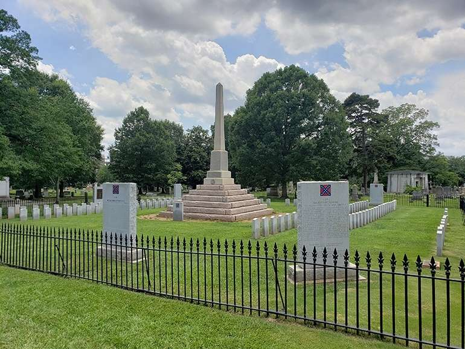

## A 'New South' needs new symbology

As a French-Canadian immigrant to North Carolina in my youth, seeing the Confederate flag sitting atop poles and donned on t-shirts and bumper stickers was a normal, albeit strange sight.

In school, we learned the Confederacy was defeated in a bloody civil war. In the end, the slaves were freed from bondage and the South was put through Reconstruction and occupied by Union troops. The Confederate States of America was a failed and immoral experiment that was put down as quickly as it sprung up, but its symbols — especially the flag and statues of generals — live on. This is true even in the 21st century. Why is that?

The general theory I have developed over the years is that it comes down to culture and pride. Culturally, Southerners view themselves as different from their fellow Americans north of the Mason-Dixon Line — those Yankees up there. Southerners are rebels and many have formed an identity around that theme.

Some cling to the battle flag of the Army of Northern Virginia (what we today call the Confederate flag) as a representation of Southern culture without consciously thinking of the “peculiar institution” of slavery we now know as immoral and wrong. But they should.

For African-Americans in our country, the flag represents slavery and barbarism. Memorials to Confederate generals evoke the same feeling; they represent a past when their ancestors were considered property instead of human beings.

<figure>

<figcaption>

Most of Mecklenburg’s Confederate monuments have been gathered together and put aside ashamedly in a portion of the Elmwood Cemetery. (Photo by Ryan Pitkin)

</figcaption>

</figure>

Most people I’ve met in my years in the Carolinas are not fans of the Confederacy and its ideals per se, but do have an affinity to a certain Southern exceptionalism: The best barbecue, sports teams, territory, and the phrase “Southern by the grace of God”. Southerners are genuinely proud of the region of their birth, and that cannot be denied.

It is lost on many people today that regionalism was such an important factor in the growth and expansion of the United States. Folks of Appalachia are proud of where they come from, as are Southerners and West Coasters and others. In the South especially, that sense of identity is particularly strong.

But representing that pride by the Confederate flag is wrong and ahistorical, which is why we need new symbols and statues that represent Southern pride. We should be celebrating the traditions and way of life that make our area of the country worth celebrating. And in the New South, there is plenty to be prideful about, both in our past and present.

It was North Carolina that birthed Warren C. Coleman of Concord, the richest African-American at the turn of the century who started the first black-owned and operated textile mill in the country. It was in our state that the Wright Brothers began the century of flight. James Brown, the Godfather of Soul, hailed from Barnwell, South Carolina, while Eunice Waymon, aka [Nina Simone, was born in a small three-room house in Tryon](https://qcnerve.com/vanessa-ferguson-pays-tribute-to-a-north-carolina-icon/), North Carolina. Both influenced generations of musicians.

Thinking of our evolution, the South now is richer, more populous, and more diverse than other parts of the country.

Eleven out of the [15 fastest-growing cities](https://wallethub.com/edu/fastest-growing-cities/7010/) in the country are in the South. Since 2010, the [population of Southern states has grown by more than 10.7 million](https://www.census.gov/popclock/data_tables.php?component=growth) thanks to emigration from the Midwest and immigration from abroad. Southern states such as Texas, Georgia, and North Carolina [rank highly in terms of racial integration](https://wallethub.com/edu/states-with-the-most-and-least-racial-progress/18428/#rankings-integration) and racial harmony, outranking all states in the heavily-populated northeast.

Rising economic prospects have attracted large car manufactures such as BMW, Mercedes-Benz, Toyota, and Kia to the South and helped boost our overall GDP. Tech firms are decamping from California and New York to enjoy the business-friendly climate our Southern states provide, as well as the well-trained and educated workforce to staff them.

The cities of Charlotte, Atlanta, Charleston, Raleigh, Nashville, and more are consistently ranked as the [best cities in the country](https://www.southernliving.com/souths-best/cities) to both visit and live in.

The data is beginning to show what many of us in the South already know: Our part of the country is stronger and more defined by progress than it ever has been.

These are markers of pride for the New South, and we should rejoice in them. Perhaps it is not a flag nor a founding myth, but it means our best days are ahead of us.

_[Yaël Ossowski](https://twitter.com/YaelOss) is from Charlotte, though currently living in Vienna, Austria, until the travel bans are lifted and he can return home. He is a journalist, writer, and deputy director at the Consumer Choice Center._

_Published on [Queen City Nerve.](https://qcnerve.com/letter-to-the-editor-the-confederate-flag-is-not-a-symbol-of-the-south/)_
