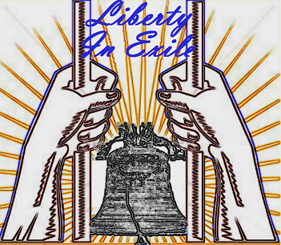
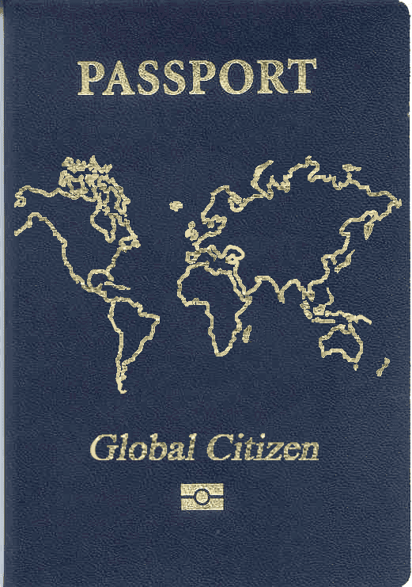

##### _Younger Generations Are Moving Beyond the Myths of National Obligations_

_By Ya__ël Ossowski | [The Stateless Man](http://thestatelessman.com)_

After suffering through years of government education and socialization, a fair amount of sympathy for nationalism is predictable.

From early on, teachers pass on patriotic myths to elementary school children in songs glorifying war and fairy tales presented as history, wherein government actions account for all success, wealth, and peace.

In the United States, students express obedience to the nation through the Pledge of Allegiance, [unquestionably recited from memory at the beginning of each school day,](http://www.youtube.com/watch?v=Q2BfqDUPL1I)while facing the American flag found hanging in every classroom.

Later in life, sports games, athletic competitions, and military functions renew this sense of collective nationalism by obliging renditions of the Star Spangled Banner, reminding Americans that they are unique in belonging to the “land of the free and home of the brave.”

Young individuals learn they are culturally and socially exceptional, far beyond any other civilization, and thus have little reason to engage and understand societies which differ from their own.

This nationalism demands loyalty and devotion in return for a solid cultural identity. But for a growing number of young people, this traditional concept of nationalism is increasingly obsolete.

##### _Culture Shift_

Compared to their parents and grandparents, today’s generation are much less nationalistic and much more open to ethnic diversity and world cultures. This also leads them to be much more optimistic about the future.

According to a Pew Research Center [study](http://www.people-press.org/2011/11/03/section-4-views-of-the-nation/) from Nov. 2011 in the United States, young adults from 18 to 30 years old—known as Millennials—are generally less likely to classify themselves as “very patriotic.” Less than 46 percent say religious and cultural values tied to the nation are “very important,” and just 32 percent believe the United States is the “greatest country in the world.”

In fact, while most other age groups have a generally pessimistic view of the nation’s cultural future, Millennials are more likely to believe that “life in the U.S. is getting better,” owing to the fact that there is “more ethnic integration, more immigration, and more equality between the sexes,” according to the study.

“Today’s Millennials are more open-minded towards variations in skin color, religious faith, and sexual orientation than previous generations,” says Scott Beale, a social demographer and creator of [MillennialPolitics.com](http://millennialpolitics.com/). Similarly, a [2010 Yankelovich Monitor study](http://gourmetculinaryinstituteandsingles.wikispaces.com/file/view/MONITOR+Minute+-060710-+Millennials-Cultural.pdf) found that more than 71 percent of Millennials “appreciate the influence other cultures are having on the American way of life,” while less than 58 percent of the older generations feel the same way.

On the “[Us versus Them](http://libertyinexile.com/2012/08/21/us-versus-them/)” episode of [Liberty In Exile](http://libertyinexile.com/2012/08/21/us-versus-them/), the Stateless Man himself, Fergus Hodgson, and I discussed changing attitudes toward immigration in the U.S., specifically the embrace of the economic rationale for open borders and increased cultural exchange ([86 minutes](http://libertyinexile.jellycast.com/files/audio/LibertyInExile21August2012.mp3)).

One can explain this embrace of cultural diversity by younger Americans with several social factors, but greater exposure to different nations and customs is at least one cause. Younger generations are also more inclined to travel and explore abroad in groups, embracing different cultures and ways of life in order to gather new knowledge and frame their own views of the world. In the last decade alone, for example, the number of American college students [opting to study abroad](http://www.iie.org/Research-and-Publications/Open-Doors/Data/US-Study-Abroad/Student-Profile/2000-11) has nearly doubled.

According to the travel firm PGAV Destinations, nearly [six out of 10](http://www.pgavdestinations.com/images/insights/Meet_the_Millennials.pdf) Millennials say they “travel for leisure with friends,” nearly 20 percent more than older generations. Additionally, more than 78 percent are “interested in learning something new” when they travel to foreign nations, such as customs, languages, and history.

It is this impassioned desire for travel, diversity, and cultural acceptance that sets this generation apart from others, leaving them less reliant on patriotic myths in order to explain the world around them. They’re looking beyond borders and national obligations in order to define their true identity and sense of community.

##### _Technology Makes You Free_

Young people are more culturally curious and aware, and less prone to turn to nationalism, but how exactly have they achieved this?

The growth of mobile phones, the Internet, and social media have eliminated the need for people to be in proximity to each other in order to have instantaneous and meaningful communication.

Across the globe, virtual communities have sprung up in voluntary fashions never thought imaginable, bringing together like-minded individuals with similar passions, goals, and ideas, without the threat of coercive subjugation and state indoctrination. Such networks brings people closer together despite national and cultural differences and create a new type of civil society.

Online projects such as [CouchSurfing](https://www.couchsurfing.org/) and [Airbnb](https://www.airbnb.com/) allow individuals to lodge with private homeowners and renters as an experience rather than a plain service, defined by a shared love of travel and social interaction. The Stateless Man discussed the virtues of CouchSurfing on Feb. 01, 2012 with guest Christoph Süess, a Swiss traveler who used the service to travel throughout the U.S., sparking friendships and world connections which continue until this day ([20 minutes](http://thestatelessman.com/wp-content/uploads/2012/11/The-Stateless-Man-CouchSurfing-Chris.mp3)).  

I personally used CouchSurfing while traveling in England and Hungary, bunking up and sharing laughs with fellow travelers from Canada, Poland and the Czech Republic. We all found out we were much more alike than our governments and national myths once had us believe.

Another growing social website is [Meetup.com](http://www.meetup.com/), which brings together impassioned individuals to discuss ideas from various walks of life. I have been part of various group meetups organized through the site to discuss economics, history, and politics in Montréal, Philadelphia, Vienna, and Tampa, and the site has received mention several times as a great resource on [The Stateless Man](http://thestatelessman.com/2013/01/07/passion/).

##### _No Need for Government_

This new paradigm of a technologically advanced, border-less world serves as a direct challenge to nationalism. It moves younger generations away from a national identity and toward a new “[cosmopolitianism](http://en.wikipedia.org/wiki/Cosmopolitanism),” an ideology based on shared morality across all cultural groups, without obedience to a particular nation. This ideological shift breaks down traditional power and authority and offers greater control to individuals.

“The internet enables much more narrowly targeted divisions so that we are not divided anymore into less than 200 national territories or three or four major religions, but into thousands or even millions of subgroups,” said global IT consultant Fernando Botelho in a [Pew Research Center survey](http://pewinternet.org/~/media/Files/Reports/2012/PIP_Future_of_Internet_2012_Young_brains_PDF.pdf) about Internet use among Millennials.

His research demonstrates that the millions of communities which exist on the blogosphere, forums, and social networking platforms like [Reddit](http://thestatelessman.com/2013/01/03/reddit/), Twitter, and Facebook, bridge divides which have existed for hundreds, if not thousands, of years.

Botelho recognizes that the spread of technology encourages autonomy and endangers the idea of a traditional nation state with citizens who pay taxes and obey arbitrary laws. This ultimately threatens the elite class of social planners who use the state as a mechanism of control.

He notes that these new divisions “challenge us to avoid the tragedy of the commons at a global level,” making top-down authority virtually impossible to enforce. Recent examples include the Arab Spring uprisings across the Middle East and northern African countries, in which technological tools and networks helped activists organize and protest authoritarian regimes (aided by [more-than-generous grants from the U.S. State Department)](http://stuartbramhall.aegauthorblogs.com/2011/09/10/smoking-gun-us-role-in-arab-spring/).

“These are the networks that are passing a cascading message of fatigue with authoritarian rule across the region,” [writes Philip Howard](http://www.huffingtonpost.com/philip-n-howard/state-department-arab-spring_b_820458.html), sociologist and author of _[The Digital Origins of Dictatorship and Democracy: Information Technology and Political Islam](http://www.amazon.com/Digital-Origins-Dictatorship-Democracy-Information/dp/0199736421)_.

“There is a strong trend towards increasing civic use of social networking software and digital applications that are not controlled by political elites,” he states. “These are the networks that have pulled out such large numbers into Tahrir Square.”

These revolts demonstrated the sheer power of technological advances and what can happen to traditional national governments when citizens organize to reclaim their freedom.

##### _Conclusion_

More autonomous individuals no longer need the state to define their culture, control their fate, or indoctrinate them into the national myth. They’re more tolerant and accepting toward societies once deemed foreign and mysterious. They embrace change and autonomy in a plethora of new ways, thanks to greater relationships and experiences on the infrastructure of the Internet.

More individuals than ever before are intrigued by ideas, cultures, and values other than their own. They understand intrinsic values which unite instead of divide them and retire aged notions of inherent superiority based upon place of birth.

This leads to less reliance on traditional state structures for socialization and formulating a world view. It also bridges populations separated by time and space, with every means available to shatter traditional barriers which keep nationalism fervent and alive.

And one day, they’ll make the final move beyond arbitrary borders, oppressive governments, and myths of national obligations to become truly stateless people in a global world.

**[READ MORE](http://thestatelessman.com/2013/01/21/nationalism/)**
