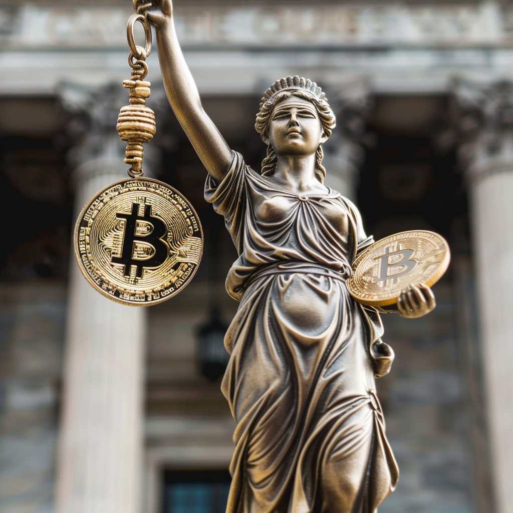

Should regulations aimed at halting the financial activity of alleged criminals and terrorists be vastly expanded to include cryptocurrencies and firms that use them? Could this potentially harm entrepreneurial spirit and consumer freedom to deal in digital assets?

Those were the questions asked this week in Washington as officials from the Treasury Department seek new tools to regulate and track Bitcoin and cryptocurrencies that would impact the [estimated](https://www.coinbase.com/blog/new-national-survey-of-2-000-american-adults-suggests-20-of-americans-own) 50 million Americans who use them.

On Tuesday, the Senate Banking Committee held an [oversight hearing](https://www.youtube.com/live/wukublOoaN8?si=NOmQzZEtA3gSvh9L) with Treasury Deputy Secretary Wally Adeyemo, who offered a series of rule changes to more strictly regulate the crypto activities of alleged criminals.

The [three main proposals](https://www.banking.senate.gov/imo/media/doc/adeyemo_testimony_4-9-243.pdf) sought by the treasury would be to develop a sanctions protocol for foreign digital asset providers through the Office of Foreign Assets Control, expand existing money laundering rules that apply to U.S. crypto exchanges, and somehow gain authority to apply those same restrictions to foreign crypto exchanges beyond America’s shores.

Government officials justify these new powers by pointing to the reported cryptocurrency activities of groups like Hamas, which [we reported](https://www.theblaze.com/return/how-politicians-are-using-fake-news-to-crack-down-on-digital-currency) were vastly overblown and technically inaccurate, and also several operations tied to gift cards and crypto exchange operations used by people sympathetic to Al Qaeda and the Islamic Revolutionary Guard.

These [latter examples](https://news.yahoo.com/us-prosecutors-attempt-seize-bitcoin-154312105.html?guccounter=1) were successfully thwarted and stopped by the FBI and the Department of Homeland Security using existing law, and the on-chain activities of these groups and the [alleged money launderers](https://www.voanews.com/a/usa_us-announces-disruption-3-terror-groups-cyber-financing-campaigns/6194388.html) who operated in Turkey were enough to secure criminal indictments.

While there is no question that our governments should pursue terrorist activity and financing, there is little evidence that vastly expanded powers against crypto providers would increase enforcement or catch more bad actors. Especially when the vast majority of illicit financing of criminal activities still uses the traditional financial system and U.S. dollars, as the treasury [admitted](https://www.banking.senate.gov/imo/media/doc/adeyemo_testimony_4-9-243.pdf) itself.

In response to the Treasury Department’s requests, a new bill called the ENFORCE Act is being floated to expand existing money laundering rules into the crypto sector even more harshly than it is applied to traditional fiat currencies.

It would apply to cryptocurrency custodians, money transmitters, and exchanges but would thankfully exempt any services that provide only non-custodial and peer-to-peer services.

The [proposed draft](https://www.tillis.senate.gov/services/files/C3AB25E8-5E04-455A-BE1B-A6611C6B375E), authored by Sens. Thom Tillis (R-NC) and Bill Hagerty (R-TN), would require digital asset institutions to maintain robust anti-money laundering programs to ensure compliance with security measures and verify all customer information.

It would also require filing Suspicious Activity Reports with the Financial Crimes Enforcement Network for any “suspicious transaction that it believes is relevant to the possible violation of any law or regulation,” beginning at $2,000. This overly broad definition extends to any crypto transactions that “serve no business or apparent lawful purpose” as determined by any crypto exchange, and they would be legally required to withhold information of this report from the customer.

While this bill is much less harsh than [similar proposals](https://www.congress.gov/bill/117th-congress/senate-bill/5267) from anti-crypto firebrand Sen. Elizabeth Warren, it would provide stricter rules and procedures for crypto companies than the traditional banking sector.

For the average American consumer and user of cryptocurrencies on custodial services, that means there would be more scrutiny and surveillance at a smaller threshold on Coinbase than Bank of America.

Rather than embracing the permissionless innovation that Bitcoin and its cryptocurrency offspring provide, these rules would force yet more financial surveillance and regulatory compliance on the next iteration of digital money, artificially choking the growth of this industry.

It would also cause even more Americans to be caught up in the dragnet of “de-banking” for crypto, as institutions would rather cut off customers’ access to their services rather than comply with the unreasonable requirement of Suspicious Activity Reports for transactions above a small threshold, as we already see in the traditional banking system.

Because these reports have no inherent justification or process, except for the broad situational processes outlined in the Bank Secrecy Act and the Anti-Money Laundering Act, many bank customers have had their [accounts closed or suspended](https://www.barrons.com/articles/debanking-hurts-everyone-51610145010) without due process. Many are likely to be minorities, the underbanked, and [politically active or religious](https://www.businessinsider.com/republican-states-accuse-jpmorgan-closing-accounts-religious-political-beliefs-2023-5?op=1) groups.

This measure, applied to cryptocurrencies at a laughable limit of $2,000 — which [exceeds the average rent paid](https://worldpopulationreview.com/state-rankings/average-rent-by-state) in several states — demonstrates the government’s willingness to restrict crypto activity for law-abiding citizens not suspected of any formal crime.

Along with the mounting financial regulations that compel institutions to restrict access to Americans both at home and internationally, this bill means that citizens who wish to participate in the crypto sector risk being denied actively.

In pursuit of criminals and terrorists, legislators are expanding definitions to empower government action against everyday American citizens using their self-endowed natural rights to use new-age digital assets like Bitcoin and its crypto offspring.

Whatever this bill or future legislation requires, it is clear that non-custodial solutions and peer-to-peer transactions without any intermediary will have to remain the focus for scaling the adoption of Bitcoin and other cryptocurrencies.

This will empower those who can hold their own private keys, generate addresses, and safeguard their wealth, but it will likely deprive millions of Americans who aren’t technically able to use these tools and choke the future innovation of entrepreneurs who would like to provide those solutions.

Regulatory frameworks for digital assets will be vital going forward, but they should not come at the expense of neutering the very reason these technologies were invented: the separation of money and state.

_Yaël Ossowski is the deputy director at the Consumer Choice Center and a visiting fellow at the Bitcoin Policy Institute._

Originally published in [TheBlaze](https://www.theblaze.com/return/the-feds-are-trying-to-stifle-bitcoin-and-crypto-with-draconian-new-regulations) ([archive link](https://archive.ph/pR04k)).
