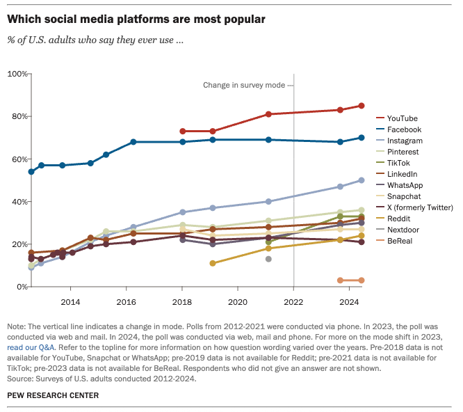

In Washington, D.C. this week, government lawyers [wrapped up](https://www.ftc.gov/legal-library/browse/cases-proceedings/191-0134-facebook-inc-ftc-v-ftc-v-meta-platforms-inc) their antitrust lawsuit arguing that Instagram should be broken off from its parent company. The same for WhatsApp.

The company Meta, formerly Facebook, has been in a long protracted legal battle over its decade-old acquisitions of the photo sharing app Instagram and messaging app WhatsApp.

While those acquisitions were largely panned at the time – if not outright ridiculed as risky bets – the fact that the investments paid off and the apps have grown in popularity has done nothing to keep the government’s trustbusters at bay.

The Federal Trade Commission, leading the lawsuit to break up the company’s assets, claims that Meta’s ownership of these apps amounts to an illegal monopoly of “personal social networking services” and seeks to have those deals unwound to allow smaller competitors a shot at challenging Meta.

As I’ve written [before](https://www.yahoo.com/news/ftc-v-meta-politics-not-092606665.html), it’s less about antitrust law and more about politics.

In building its case, the Federal Trade Commission has laid out a specific market definition crafted for the sole purpose of rendering Meta and its various apps to specific scrutiny. By making Instagram a “personal social networking service” rather than a photo and video sharing app, it has created a narrow category from which to argue that it maintains a dominant (illegal) position.

The evidence used by the government’s lawyers include some of the marketing language surrounding Facebook and statements from its own executives. In 2006, years before Instagram and WhatsApp were on the radar, Facebook CEO [posted a blog](https://www.nytimes.com/2025/05/09/technology/meta-antitrust-trial-competitors.html) on the company’s website state that “Facebook is about real connections to actual friends.”

As was [revealed](https://www.ftc.gov/system/files/ftc_gov/pdf/1910134ftcopeningstatementslides.pdf) in court the past few weeks, this statement was the crux of the government’s case against Meta, arguing that it held a unique position in the social media economy to the exclusion of every other company.

It’s an obvious shall game being played by the FTC.

If you grab any person off the street and ask them generally about their social media handles or accounts, they would easily be able to list off a few: Instagram, TikTok, Twitter/X, Snapchat. If the demographic skews younger, they’d tell you about YouTube. An older crowd might share their LinkedIn details.

According to Pew Research, a [crushing majority](https://www.pewresearch.org/internet/fact-sheet/social-media/) of adults under 40 years old have had at least one social media account, and they range in popularity.

While YouTube is by far the most popular app overall, Facebook and Instagram come in second and third place, followed by Pinterest and TikTok.

Each of these apps are used for different reasons, but some have content that is repurposed and used over again. It is not surprising to see TikTok watermarks on videos that happen to go viral on TikTok, and vice versa.

Modern use of social media is by no means a singular experience, precisely because Internet users have so many different options for being social online. Videos, photos, text, memes, and funny content populate and are shared in various fora that millions of online creators are attempting to master and conquer each and everyday. The influencer economy has evolved from precisely this competitive factor.

The choices are diverse because the content is diverse. And so is every person’s reason for using them.

Even here at the Consumer Choice Center, we use all types of different social media services and apps for sharing our branded content, and we have different reasons for using them. We cross-post, share, reformat, and repurpose for another platform to reach a different audience. Every person who posts or consumes content is making these micro-decisions at all times. Live and die by the number of views and reposts.

However, is this enough to make a claim that Meta, which owns Facebook, Instagram, and WhatsApp, holds a specific monopoly? Especially when so many other options exist, that seem much more influential and popular, and which allow cross-posting of endless content, this all seems frivolous and like a massive overreach.

The FTC, in this case, has creatively superimposed its definition of “personal social media networking” on Facebook and Instagram while claiming that YouTube, TikTok, and even Snapchat are not close to being competitors in the same category.

The superficial market definition is enough to build a case in competition law, but ordinary social media users would be astonished if they could read the claims made in court by the government attorneys seeking to break up Meta’s apps.

Unlike many other antitrust cases that measure impact on consumers due to price hikes or deterioration of services, that is next to impossible to judge in this case.

For one, no one pays to have an Instagram, Facebook, or WhatsApp account. Advertisers pay to reach people on some of these platforms, but there is no classic price chart that can be mapped over time that can demonstrate consumer harm.

And while the government can claim that these acquisitions have had some invisible harm on users, the facts tend to point toward the opposite. Hundreds of millions of users have flocked to Instagram over time and close to [3 billion](https://backlinko.com/whatsapp-users) use WhatsApp globally, though the vast majority are outside the United States. Rather than these services failing consumers, consumers have been happy to continue logging on and using these platforms, very likely because of the investments made by Meta in the first place.

What makes the government’s case more complicated, as well, is that so much hinges on Meta’s acquisitions of what the government has deemed clear competitors, and the facts surrounding those acquisitions at the time.

The acquisitions of Instagram in 2012 and WhatsApp in 2014 were risky bets that had the real potential of being duds. However, the record has shown that those decade-old bets were worth it, and fairly profitable. Should Meta be penalized for taking the risk of billions of dollars and succeeding?

Though the merits of the case will seem fairly laughable to any social media users, it remains true that there are dedicated trustbusters who would like to see nothing more than Meta broken up and sold for parts. Perhaps those aims are motivated truly by concerns about market concentration. Or perhaps it’s about a politically motivated hostility for social media firms in general, or Meta itself.

Regardless of these facts, the Justice Department and the FTC are only just beginning in their pursuits of the largest American technology companies.

Google still has two cases on search and advertising that seek to carve up its various properties. Amazon has an active case brought by the FTC, and Apple has the DOJ clipping at their heels.

While artificial intelligence technology disrupts the traditional search, retail, and social media markets, often dethroning the traditional mainstays, our justice system is dedicated to litigating old battles to choose the winners and losers rather than have consumers do the same.

Rather than shell games, creative definitions, and haughty legal theories that have no bearing on actual consumer welfare, what if America allowed its innovators to compete on the field rather than having to wage proxy battles in the courtrooms?

Perhaps then, we can return to a competitive marketplace where consumers choose the apps and services they want, rather than have the government limit and dictate their choices.

_Yaël Ossowski is deputy director of the [Consumer Choice Center](https://consumerchoicecenter.org/the-ftcs-shell-game-on-social-media-monopolies/)._
