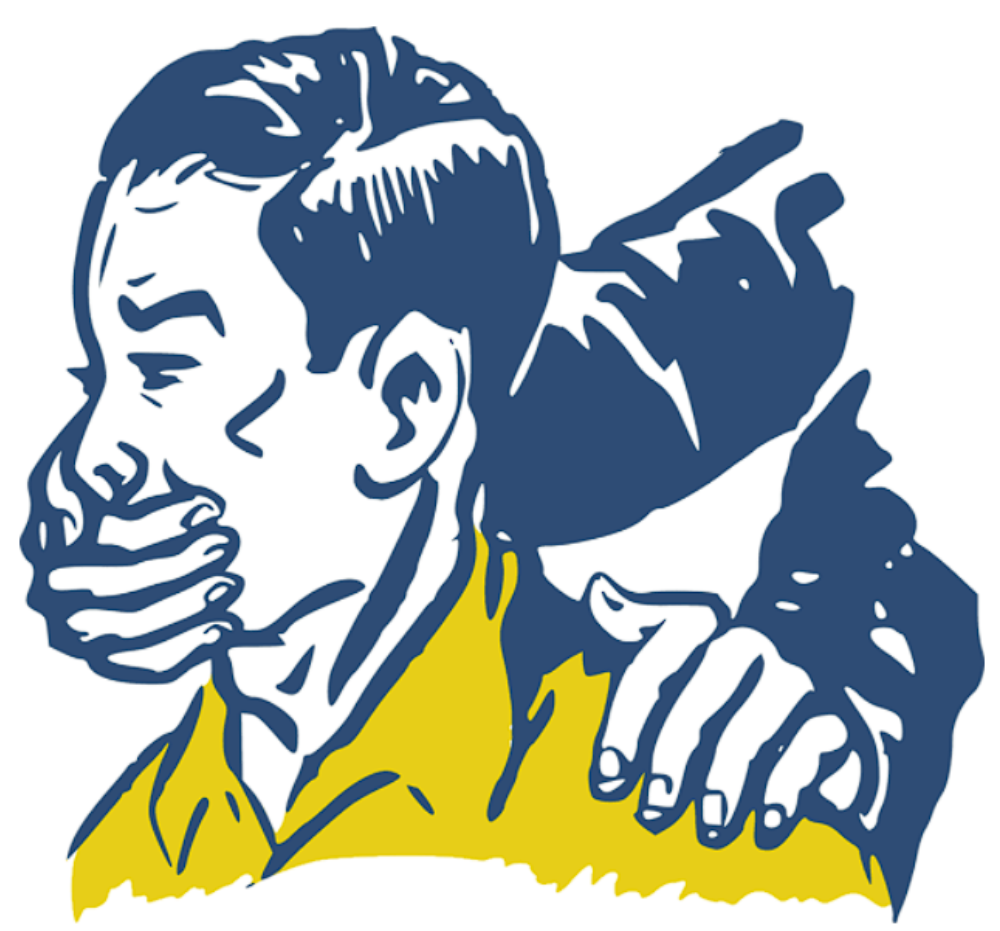

On December 16, 2016, Berlin residents and tourists were sipping mulled wine, chowing down sausages, and marveling at the glowing Christmas trees that filled the Breitscheidplatz in the German capital. Moments later, disaster struck: a semi-truck with Polish license plates plowed through the crowds of holiday shoppers, destroying vendor stands, and sending debris flying across the square. It was the worst terrorist attack Germany had ever experienced, resulting in the deaths of 12 people and injuring 56 more.

It later turned out that the attacker had long been [tailed](https://www.dw.com/en/police-memo-on-berlin-truck-attacker-published-in-german-media/a-37141902) by German intelligence, and after his documents and fingerprints were found in the cab of the truck, he was tracked down to a train station in Milan. He died there in a police shootout, and was later identified as a Tunisian who had [pledged](https://www.politico.eu/article/berlin-attacker-anis-amri-was-part-of-german-isil-network-cnn/) allegiance to the Islamic State of Iraq and the Levant (ISIL).

Beginning in 2004 with the [Madrid train bombings](https://edition.cnn.com/2013/11/04/world/europe/spain-train-bombings-fast-facts/index.html) and the [assassination](https://www.youtube.com/watch?v=nnhO1R3A1ns) of Dutch filmmaker Theo van Gogh, the attacks of Islamic extremists on innocent civilians began to become far too common in Western Europe. Whether in Denmark, France, Germany, or the United Kingdom, each year saw new sprees of targeted violence linked to the radical Islamic ideology, posing a new type of threat in otherwise peaceful societies. Alert was heightened, police took on new powers, and the issue of Jihadi violence became a grave new threat for populations to consider.

## **A change in priorities?**

After years of chasing Islamic extremists, however, Western governments and their intelligence services, as well as the mainstream media, today seem to have broadened the scope of what they mean by “extremism” to encompass all ideologies, philosophies, and political movements that are somehow deemed “too dangerous” to exist. And these, according to them, are increasingly found on the Right. 

The liberal intelligentsia across Europe and the West have cheered such efforts. Political authorities have even passed new measures aimed at limiting political speech and freedom of association for those on the Right. They have recast ideological differences in starker terms, and have targeted anyone expressing worries about crime, immigration, and Islam as ‘misanthropes’ who have been misled or who are simply delusional.

A [joint communication](https://www.consilium.europa.eu/en/press/press-releases/2020/11/13/joint-statement-by-the-eu-home-affairs-ministers-on-the-recent-terrorist-attacks-in-europe/) issued by EU internal affairs ministers in November 2020 highlighted their new approach to the problem of extremism. Authorities have chosen to identify _both_ Islamic extremism and domestic right-wing terrorism as dangerous threats, and recommended the removal of “illegal online content.” To do this, they have defined “hate speech” in broad, loose terms and have used this to prosecute people for alleged “hate crimes”—scaling down or limiting digital encryption, and more readily sharing intelligence between countries.

## **Those who cause us worry**

For the West’s cultural and political elites, the new approach is to merge the threat of neo-Nazis, racialists, ‘QAnon’ conspiracy theorists with populists, immigration critics, and ‘far-right’ political movements, resulting in one broad category of “extremism” that needs extinguishing. Groups such as [Generation Identity](https://www.euronews.com/2021/03/03/french-government-dissolves-far-right-group-generation-identity), who put together [flashy stunts](https://www.vice.com/en/article/5dbj98/the-rise-and-fall-of-europes-hipster-fascists) that bemoan mass immigration to Europe, have been officially outlawed in France and Germany, and its members have been investigated across the continent.

In the United States, the focus has been on those who [breached](https://www.usnews.com/news/best-countries/articles/2021-02-18/far-right-extremism-growing-across-europe-survey-finds) and ransacked the U.S. Capitol, demanding Congress not accept the results of the 2020 presidential election. Labeled an “insurrection by domestic extremists” by many political and media elites, the subsequent investigations and growth in police powers are igniting a new “War on Terror” that is actively eroding civil liberties, [according](https://greenwald.substack.com/p/the-new-domestic-war-on-terror-has) to writer Glenn Greenwald.

In Europe, the 2021 [_State of Hate_](https://www.amadeu-antonio-stiftung.de/wp-content/uploads/2021/02/ESOH-LOCKED-FINAL.pdf) report, produced by a coalition of civil society groups, cites public polls on political attitudes as a reason to fear the new “extremism” from the Right. Pollsters asked respondents about immigration, for example, and whether, in their opinion, the political system was “broken.” Respondents who believed governments botched the refugee crisis of 2015, for example, are cast as “far-right.”

Similarly, because over half of the populations of France, Hungary, Italy, Poland, and the United Kingdom believe the political system is either “completely” or “somewhat” broken, the report warns that this could be fertile ground for a ‘far-right’ political movement to emerge. “The negative attitudes towards minorities,” the report reads, “coupled with the widespread pessimism and distrust at their political systems, shows that there remains strong potential for far-right support once political normality returns.”

But that is not all that is propelling this new proposed extremist contingent. The authors of the study cite key narratives used by identified far-right groups such as freedom of speech, Euroscepticism, and Islamophobia. Following this logic, the fear of far-right influence, therefore, justifies various measures to limit such expressions and the thoughts behind them—not just in public but on the Internet as well.

## **Social media crackdown**

[Social media platforms](https://www.atlanticcouncil.org/content-series/fastthinking/fast-thinking-will-facebooks-anti-extremism-efforts-actually-work/) have also been encouraged to control more ruthlessly which speech is allowed and to suspend accounts found to violate “community standards.” In 2016, Germany asked Facebook to [censor comments](https://sociable.co/social-media/facebook-bows-to-germany-censors-anti-migrant-speech-in-europe/) that criticized refugees. In 2021, this censorship extended to anyone [posting](https://nypost.com/2021/05/25/facebook-trying-to-censor-covid-19-vaccine-skeptics-report/) skeptical views about the COVID-19 pandemic, with moderators blocking accounts and suspending users for merely questioning the effectiveness of vaccines or raising questions about the Wuhan lab leak hypothesis.

There’s no question that violence linked to ‘far-right’ elements has at times been deadly. But whether all people who are skeptical of government institutions, mass migration, or the communications from public health bodies should be grouped into such a category—and then be subjected to surveillance and repression—is a separate matter.

For the sake of perspective, however, let us recall that a 2020 [report](https://www.csis.org/analysis/right-wing-terrorism-threat-europe) from the Center for Strategic and International Studies found that of the 2,200 terrorist incidents in Europe between 2009 and 2020, “69.3 percent of fatalities were from jihadists, compared to only 21.8 percent from right-wing individuals or networks, 6.9 percent from ethno-nationalists, and 2.0 percent from left-wing actors.”

That said, there is a strong and palpable appetite for a narrative pointing to the existence of a vast underground of right-wing “extremists.” And oftentimes, the demand is much greater than the supply—so efforts must be made to meet that demand. As such, investigative journalists and news outlets have dedicated countless resources to highlighting and elevating the threat from the Right.

A 2021 _New York Times_ [podcast](https://www.nytimes.com/column/day-x) called _Day X_ is one such attempt. It purports to uncover hatched plots, alleged networks of encrypted messaging groups, and domestic extremism within the German military, intelligence, and police services. The podcast centers on Franco A., a former German military officer who [successfully](https://www.dailysabah.com/world/europe/right-wing-soldier-tells-german-court-how-he-posed-as-refugee) duped authorities into being granted asylum using forged Syrian documents and was later [accused](https://www.nytimes.com/2021/05/20/world/europe/german-officer-trial-far-right-terrorism.html) of a plot to bring down the government. 

This led to a [wide scale](https://ctc.usma.edu/the-insider-threat-far-right-extremism-in-the-german-military-and-police/) investigation, which pressured the German military to investigate “extremism” within its ranks. Soon after, a network of chat groups made up of police officers and soldiers critical of Germany’s immigration policies was uncovered. But distinguishing those who harbored negative views on immigration and those who were ready to carry out plots proved [impossible](https://www.bbc.com/news/world-europe-57184527).

## **The impulse to ban noxious ideas**

So, are we really facing a thriving underworld of secret plots, hateful ideology, and motivated attackers? Or are we instead seeing attempts to chase and outlaw political views that are somehow found unfavorable?

In the liberal democracies of the West, we know far too well that there are many people with strange and sometimes even dangerous views. But unless those thoughts rise to incitement or action, most of us are willing to tolerate such diversity of opinion. And while it sometimes may be tempting to shift the “Overton Window” of acceptable political views in one direction or another—especially when certain views become _too_ noxious—this can easily become ‘weaponized’ by those in power. The impulse to ban that with which we disagree is simply too great. 

In fact, it can easily be used against even _moderate_ views. For example, the Kremlin has [labeled](https://www.reuters.com/world/europe/russian-court-rejects-appeal-against-extremist-label-navalny-groups-lawyers-2021-08-04/) jailed dissident Alexei Navalny and his pro-democracy foundation as “extremists.” In Cuba, meanwhile, protesters who marched in the streets against communist repression this summer were promptly [arrested](https://www.voanews.com/americas/59-cuban-protesters-prosecuted-so-far-hundreds-were-arrested) for violating “public order” and—just as in the democratic West—[branded](https://www.cbsnews.com/news/cuba-government-rallies-backers-following-big-protests/) as “terrorists.”

If we aim to confront “extremism” and the dark undercurrents that propel it, we must ask ourselves: should we begin by censoring _all_ unsavory opinions and thoughts? Or will the suppression of such views eventually drive them underground—and make them stronger and perhaps more resilient? More importantly, who is even authorized to classify what is or is not “extremist”? What should or should not be deemed disagreeable or dangerous in political debate? If our societies begin to root out simple disagreements and criminalize heterodox opinions, it will not be long before more nefarious forces use that _same_ power to their own advantage. The sword is double-edged and the pendulum _always_ swings back.

_This article was published in the [European Conservative](https://europeanconservative.com/articles/commentary/the-ghosts-of-extremism/) magazine._
