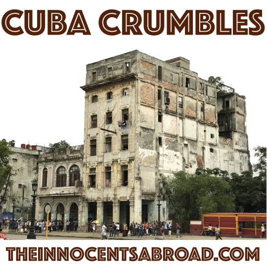

  

Is it important to visit a place and see it with your own eyes? On this episode, we get tales of Cuba from Yaël. The streets, the socialism, and the sad faces. What is really happening underneath? Todor fills us in on the juxtaposing beauties of the Republic of Georgia, a post-communist country that has radically evolved to be a must-visit country that is already hard to leave.

7\. May 2018

[theinnocentsabroad.com](https://exit.sc/?url=http%3A%2F%2Ftheinnocentsabroad.com "http://theinnocentsabroad.com")
