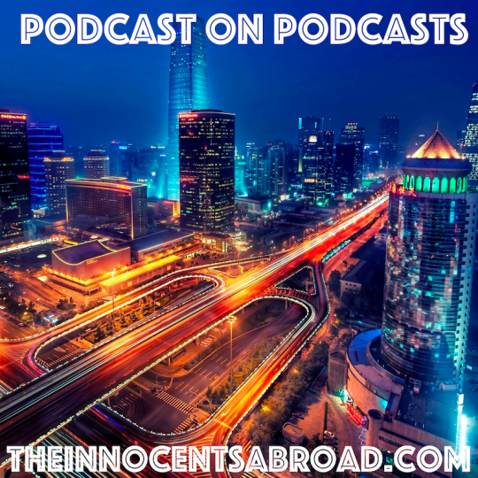

  

For this episode, Todor and Yaël explore some of their top podcasts they’d recommend. Some frank breakdowns of some, and too much praise for others. Enjoy!

08\. April 2017

The Art of Manliness

[http://www.artofmanliness.com/podcast/](http://www.artofmanliness.com/podcast/)

No Agenda Show

[http://noagendashow.com](http://noagendashow.com)

The Gold Newsletter Podcast

[http://goldnewsletter.com/podcast/](http://goldnewsletter.com/podcast/)

The Fifth Column

[http://www.wethefifth.com/](http://www.wethefifth.com/)

Monocle 24: The Globalist

[https://monocle.com/radio/shows/the-globalist/](https://monocle.com/radio/shows/the-globalist/)

The Rubin Report

[http://www.rubinreport.com/](http://www.rubinreport.com/)

The spiked podcast

[https://spikedonlinepodcasts.podbean.com/](https://spikedonlinepodcasts.podbean.com/)

Waking Up with Sam Harris

[https://www.samharris.org/podcast](https://www.samharris.org/podcast)

On the Media

[http://www.wnyc.org/series/media-podcast](http://www.wnyc.org/series/media-podcast)

Planet Money

[http://www.npr.org/sections/money/](http://www.npr.org/sections/money/)

Free Speech – Gavin McInnes

[https://soundcloud.com/free-speech](https://soundcloud.com/free-speech)

Aerostat

[http://aerostat.podfm.ru/aerostat/](http://aerostat.podfm.ru/aerostat/)

Free to Brew

[https://soundcloud.com/freetobrew](https://soundcloud.com/freetobrew)

The Yellow Duck Podcast

[https://soundcloud.com/theyellowduckpodcast](https://soundcloud.com/theyellowduckpodcast)

And most importantly,

The Innocents Abroad

[http://theinnocentsabroad.com](http://theinnocentsabroad.com)
