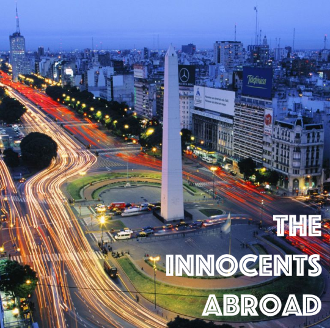

Todor is off hunting for a place to stay in the hills of South Africa. He’ll be back next time. 

This week, Yaël talks to longtime friend and fellow expat, writer, and adventurer Fergus Hodgson. He’s far from his homeland of New Zealand, having lived in the U.S., Canada, and all over Latin America over the course of the last decade. He gives us the latest spill on living in Argentina, how to live like an international in the digital age, integrating into new cultures, the false romance of Latin America, and the scoop on leaving New Zealand for fairer shores.

**SHOWNOTES:**

[http://twitter.com/ferghodgson](http://twitter.com/ferghodgson)  
[http://thestatelessman.com](http://thestatelessman.com)

Music: [Rufus Wainwright –Montauk](https://www.youtube.com/watch?v=pAIzPbjpYUk)

[http://theinnocentsabroad.com](http://theinnocentsabroad.com)
