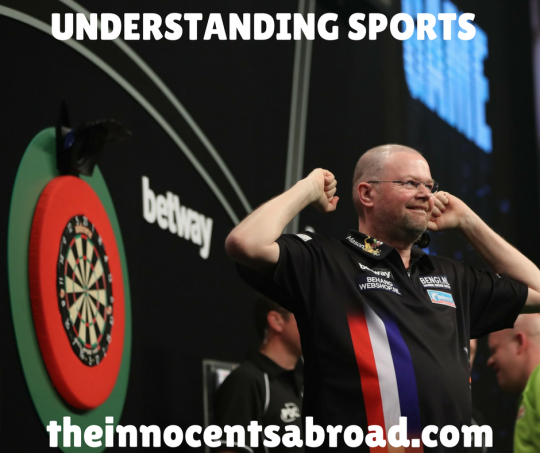

  

What qualifies as a sport, and why do people enjoy them? Some thoughts on understanding sports and the philosophy behind them. Bonus: Yaël explains NASCAR, Todor hates on dart players, and somewhat of an agreement is reached on whether golf is an elite sport.

[theinnocentsabroad.com](https://exit.sc/?url=http%3A%2F%2Ftheinnocentsabroad.com "http://theinnocentsabroad.com")
