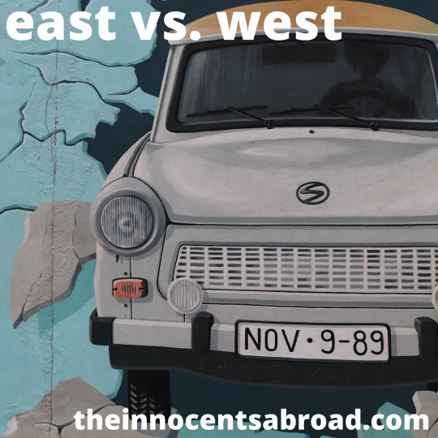

  

East versus West. What constitutes a western country, and what’s an eastern country? Is it cultural? Reflective of how societies are organized? What about art and expression?

Todor and Yaël debate the notion and recount their recent trip to Odessa, Ukraine, where they were confronted with the debate, and also put the final touches on the first printed edition of the Devolution Review magazine.

[theinnocentsabroad.com](https://exit.sc/?url=http%3A%2F%2Ftheinnocentsabroad.com "http://theinnocentsabroad.com")  
[devolutionreview.com](https://exit.sc/?url=http%3A%2F%2Fdevolutionreview.com "http://devolutionreview.com")
