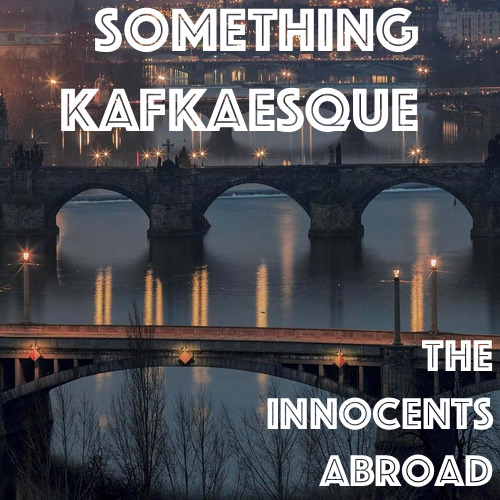

  

In yet another instance of changing location, Yaël has moved to Prague, Czech Republic. He shares his experiences in Czechia and Todor is already insanely jealous. From there, it’s all about great literature, Pan-Europeanism, bureaucracy, the legacy of great authors, abortion protests in Poland, and why you should never read Paulo Coelho. And a lot of absurdism.

Recommendations:

Stefan Zweig – The World of Yesterday, Beware of Pity, Fear  

Albert Camus – The Stranger, The Plague, The Myth of Sisyphus

Franz Kafka – The Trial, Metamorphosis

James Joyce – The Dubliners, A Portrait of the Artist as a Young Man

Jonathan Safran Foer – Everything is Illuminated, Extremely Loud and Incredibly Close

Paulo Coelho – No.

Music: Daft Punk - Digital Love  
Photo: [http://TheVoyagette.com](http://TheVoyagette.com)

[http://theinnocentsabroad.com/](http://theinnocentsabroad.com/)
