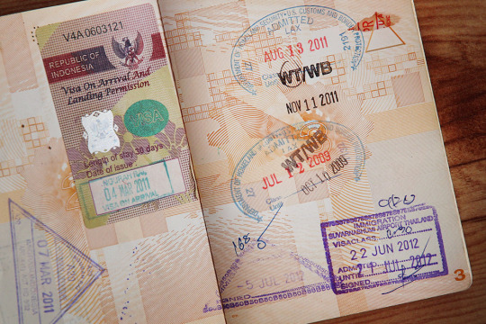

By Yaël Ossowski | [Devolution Review](http://devolutionreview.com/the-expatriate-conundrum/)

There exists a great conundrum among expatriates – those who made the decision to live outside their native country.

Was the prime motivation for their move exogenous or endogenous? Were they pushed out by the situation in a particular country, or was it purely an individual decision? If certain factors were different, would they have stayed put? Was it a merely a cost-benefit calculation with opportunity as the deciding metric? What about the total opportunity costs of moving away versus remaining in the same place? Can we judge this move by our job, our life, a career, a relationship?

I was reminded of this during the recording of an interview with my friend and musician Shane Ó Fearghail, an Irishman in Vienna.

Though he had a [successful career](http://shaneofearghail.com/) as a singer/songwriter in Dublin, he chose to uproot himself and make the move to the Austrian capital. As in my situation, it was indeed motivated by a relationship. I would guess this applies to at least 60 percent of the expatriates in Vienna. Likely the same in other large European capitals.

During our interview, along with activist Mark Long, we described our prime motivations for moving to Vienna. We touched on the idea of sacrifice for expatriates.

Can it be said that an expatriate has sacrificed in order to be where they are?

Though each of us moved primarily for a relationship with a domestic partner, we completely changed our lives in order to do so. Relationships are indeed important, but they are only part of what makes us individuals and how we define ourselves.

There’s language, a career, friendships, traditions, and connections to family. All of these are at least somewhat sacrificed when one becomes an expat.

**The economic rationale**

At least economically speaking, an individual who lives his life abroad is forgoing any opportunities of living in their native land. That includes a local job, a local support network, close proximity to family and friends, and familiarly with the local culture. There are practically no transaction costs to integrating into the local community. You’re already a part of it. This isn’t the whole sum of what one needs in order to consider themselves successful or happy, but it’s at least a large part of it.

Granted, familiarity with a community or culture does not reduce the need for skills or give any large advantage for economic opportunities, but it does indeed help.

In suburban North Carolina, where I grew up, there was a large population of Hispanic immigrants who had recently arrived from Latin America. Most had little to no English language skills nor familiarly with the American way of life. Yet thousands were able to find jobs, send their kids to school, and contribute to the economy and local community. Local Mexican restaurants and tiendas became hotspots for the entire community, and are some of the most profitable businesses in the region today.

This entire example may be evidence of the uniqueness of the American system and creed, which rewards entrepreneurship and incentivizes people to integrate via economic contributions with reserved judgment for cultural heritage (at least Judeo-Christian values). But it’s at least a point to be made.

I have [written elsewhere](https://panampost.com/yael-ossowski/2015/03/26/the-difference-between-expats-and-immigrants-its-passports-not-race/) about the debate about who is an expatriate and who is an immigrant (whether it’s about race or origin), and it is an area of high interest. Indeed, it’s one of my most viewed and cited articles.

At least for the purpose of this article, I will assume expatriates and immigrants to hold the same motivation to move abroad. The debate can continue elsewhere.

**The prism of opportunity**

Regardless of the definition, immigrants and expats are motivated by opportunity. They believe wholeheartedly that their current situation will be improved by living outside their native country.

That was the decision my parents made some two decades ago.

My parents made a conscious decision to move from Quebec, Canada to a city outside of Charlotte, North Carolina. Two decades after that, their son did the same, but headed for Vienna, Austria.

For my parents, the economic rationale was a prime motivation. For my father’s industry, that of auto racing, there was no better place to live and work than in North Carolina, the heart of NASCAR. Generally, people make more money in the United States than Canada, and education is generally good, though not better than in Canada. Many generalities.

Regardless of the economic calculation, our move came at a huge cost. For one, we were moving to an English-majority country. At home, we spoke French. My mother was proud French Canadian. My father had the benefit of a German father and a bilingual mother – they spoke English at home but he was educated in French.

My mother, not more than 33 years old, had to learn a new language, make new friends, and try to raise her sons and daughter in a country that wasn’t her own. She had to adapt the skills she learned in school in Montreal to her new life in North Carolina, away from her closest family. The United States was an enigma to her. But she thrived, and she continues to. Her spirit inspires me everyday to be a better version of myself, through all the adversity.

No doubt for me, this was sacrifice. And I wouldn’t be where I am today without the tenacity of my parents. We weren’t able visit our grandmother and cousins whenever we wanted. We didn’t go to French school, and we didn’t grow up with all the pure customs of other québécois. Despite that, we had a great childhood, an even better education, and untold opportunities give to us because of the move my parents made.

**Sacrifice in the 21st century**

Today, however, it is difficult to make a direct comparison.

Travel is indeed cheaper today than it was even five years ago. That makes visits more frequent and less costly. The Internet has expanded our opportunities for staying in touch with loved ones and making a living without being tied to a single location. These changes make it difficult to ascertain whether present-day expatriates make the same level of sacrifice. I know for a fact I travel to visit family and friends halfway around the globe more than those who live not more than 30 minutes away.

The facts above suggest that even a definition of residency needs revision in the 21st century, but one should state that not everyone takes these opportunities. That’s a subject for a future article.

To the heart of the question, the sacrifice of leaving one’s native country is still the same. Just with less disconnectedness and more chances of reuniting with loved ones.

But the toll of being away from close circles of friends and family, as well as being away from one’s native language, is still very severe. These aren’t constant in an expat’s life, but the foreignness of the land where they live is.

Many in the expatriate community deal with this by forming circles with other expats. They organize events, create Facebook groups, and aim to replace the connections from home with those in their new country. The brave among us integrate themselves fully. Kudos to them. Sehr gute Arbeit, I say.

For those who still struggle with being in an environment not familiar to their youth, this question is severe. Indeed, there is no objective way to measure sacrifice and I’m quite certain each person has sacrificed a great deal in their lives to be where they are today, regardless of where they live. But as to whether those who live in a country that isn’t their own have sacrificed, the answer is clearly yes. And the costs were worth it.
