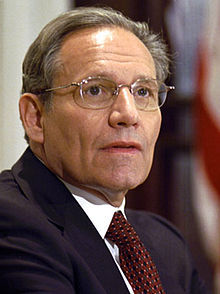
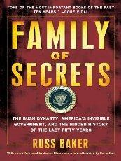

By accommodating to Central European Time, I’ve been lucky enough to place myself well ahead of the news cycle in the New World.

I say lucky because it means I can be more productive while amalgamating into the European context with the help of Viennese smiles and kisses abound, all while avoiding the ludicrous news events which make headlines in the U.S.

As a newly landed European visitor, I don’t have to be subjected to the constant lame propaganda stream which my American friends and former colleagues are unfortunately in the business of following and attempting to counter in their observations and work.

> 

My 6 hour advance on the news cycle allows me to better scrutinize some of these idiotic pieces of packaged information which make their way into the news and twitter feeds of influential journalists and friends of mine, simultaneously replicated by tens of thousands of malleable minds.

By only skimming stories and headlines in my [RSS river](http://news.freeyael.com/rivers/admin/index.html), it’s rather easy to see how the game plays out.

The main press corps are off replicating and following each other while the power brokers wield their sticks and carrots and create bogus narratives the rest of the news media is bound to repeat.

This then influences the local papers, TV stations, national bloggers, and small news sites to pick up on the same issues, debating the merits or advantages of something which has been subtly introduced into the mainstream consciousnesses by vested interests.

> 

To summarize the meta pattern for those who are too plugged in to realize, it goes like this:

> Group A with agenda X puts out story Y.

> Groups B, C, D, and E scramble to report Y as quickly as they can in order to pull in as many eyeballs and clicks as possible in order to justify the cash they receive from advertisers.

> This allows agenda X to float through the news cycle as a legitimate piece of information, despite its connection to Group A who originally produced story Y and then fed it the mouths of Groups B-E.

> Groups B-E and affiliated self-anointed public “intellectuals" will then debate virtues of story Y without acknowledging agenda X, framing it into 2 convenient partisan angles that everyone else is basically forced to accept unless they go back and question the motives of Group A and agenda X.

This entire process rarely is illuminated by any true measure of reality, being that every conflict is always planned and concocted by the vested interests in power capitals, whether they be politicians, business people, or the public relations industry which have flooded the profession of journalism.

A good example of this could probably be this latest bogus story about Bob Woodward and the White House.

From what I gather by reading headlines and Twitter links, Bob Woodward of Watergate-fame has been "threatened” by the White House because he keeps talking about how the sequester was originally President Obama’s idea.

He wrote about it in an e-book last year and reiterated his point in a Washington Post op-ed about Obama “[moving the goal posts](http://www.washingtonpost.com/opinions/bob-woodward-obamas-sequester-deal-changer/2013/02/22/c0b65b5e-7ce1-11e2-9a75-dab0201670da_story_1.html)” on sequestration, as it were.

These triggered cuts totaling $50 billion a year for the next decade are seen as so catastrophic that practically everyone wearing a tie in Washington, D.C. is trying to stop them.  

Apparently $50 billion out of $3 trillion, the annual budget, is close to national suicide.

Again, I’m outside the North American news cycle, so I’m rather lucky enough to not pay attention to the arcane details of whatever is the big deal.

What is, significant, however, is the role of Bob Woodward in the public discourse.

> 

Here is a fellow who made his name grilling Richard Nixon’s alleged involvement in the Watergate scandal, and has since been the eyes and ears for the powerful in practically every administration since.

And it’s not without accident.

At least that’s the claim of author and investigative journalist **Russ Baker**.

In the book **[Family of Secrets](http://www.familyofsecrets.com/)**, Baker writes extensively on the secret power of the Bush dynasty, including their grip on selected journalists and public officials who became propagandists for the Texas oil family.

Baker devotes an entire chapter to exposing Woodward as an alleged pawn of the military and intelligence establishments, beginning with his convenient placement at the Washington Post in the 1970s after years in Navy intelligence. He lands this job while remaining in the military and relatively close to the dozens of power government figures he later writes about despite having no writing experience.

> 

After his work in Watergate, Baker claims, Woodward became the chief framing strategist and apologist for some of the most heinous actions of American governments over the past few decades, including those of the Bush family, using his personal and narrative-based writing to mystify government figures and muddy the water for true evidence-based criticisms.

Baker says Woodward creates a popular version of events that plays perfectly into the hand of those in power, deflecting responsibility and underscoring the “complex” nature of national security and war issues.

To that point, Woodward spent a lot of his time during the 2000s painting a sympathetic view of George W. Bush, even during the deranged Iraq invasion and successive expansion of the American Empire.

In the age of Obama, Woodward had unprecedented access to military strategies and personal anecdotes from White House staffers that were used in his book [**Obama’s Wars**](http://www.amazon.com/Obamas-Wars-Bob-Woodward/dp/B005Q5QXZU), seemingly with decadent approval from the president’s administration.

That would make one wonder, therefore, why is this entire event being amplified to such an extent? Why does it then make its way through the news channels, spread to groups B-E, and split up as a partisan event that enrages Republicans and leaves Democrats defending the government?

As Baker sees it, this entire event is undermined by Woodward’s deep connections to the power establishment.

In the eyes of Baker, Woodward is, at best, a big fan of the military-industrial complex and outright necon, and, at worst, an intelligence agent himself. Maybe even a CIA stooge doing the bidding for the agency or even a spook for some other agency.

And it’s hard to discount the evidence Baker brings up.

Read him yourself on the latest “pretend-spat” with [Obama and the Democratic administration](http://www.huffingtonpost.com/russ-baker/obamas-wars-the-real-stor_b_745865.html). It’s truly fascinating.

To that end, this is the type of information that gets lost in the truly neglectful American news cycle.

Instead of questioning basic facts and doing real reporting, millions of people are led to believe by line-towing mainstream journalists that what they should be concerned about is that the administration in Washington is “threatening” Woodward because of the “framing of the conception of the sequester.”

One must ask the question: while all this is being written about, regurgitated, and eaten up by the public, what is going on that isn’t receiving any scrutiny?

That’s the real question that should be asked.
