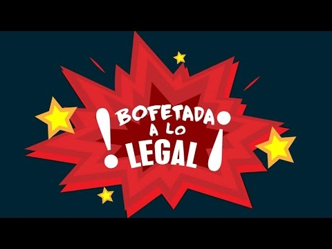

#### Provincial Leader Debate Shows PQ’s Turn to Irreverent Populism

By Yaël Ossowski | [PanAm Post](http://panampost.com/yael-ossowski/2014/03/25/the-parti-quebecois-electoral-ploy-of-secularism-will-weaken-quebec/)

In 1995, Quebec premier and [Parti Québécois](http://pq.org/) (PQ) leader Jacques Parizeau declared in his speech following the province’s failed referendum on secession that the battle was lost due to the “ethnic vote.”

Almost 20 years later, his party has taken that message to heart, crafting their entire [2014 electoral campaign](http://blog.panampost.com/pierre-guy-veer/2014/03/12/election-2014-in-quebec-parties-expose-their-empty-slogans/)on the promise to secularize provincial institutions and eradicate the wearing and displaying of religious symbols on those in public life.

While the proposed Charter of Quebec Values (_Charte des Valeurs Québécoises_) is branded as secular and neutral, it is without question targeted at Muslim women wearing traditional veils and outfits, who make up less than 2 percent of the entire population and mostly reside in immigrant boroughs of Montreal.

“In this election, we are to select a government who will lead Quebec with integrity, and vision that will create jobs, and will also adopt a charter of secularism,” said Pauline Marois, Quebec’s current prime minister and PQ leader in the [2-hour long party leader debate](http://ici.radio-canada.ca/elections-quebec-2014/debat) on Radio Canada last Thursday.

“We all know the Parti Québécois has used the Charter as an electoral ploy, that’s not in question,” said Québec Solidaire leader Françoise David at the debate.

On the question of how the Charter would be implemented, the province’s first female prime minister was clear.

“Whether it’s in the hospitals or the schools, there will be a time of transition for all of the women in question,” she said, not even cloaking the law’s focus on women of Islamic faith.

This statement reveals what everyone in Quebec preparing for the April 7 provincial election has already known, that this election has been triggered by the PQ when its troops are most mobilized. At the exact moment when the rifts in Quebec society are at their highest, bringing Islam and cultural diversity into the crosshairs offers a surefire method of seducing the population to grab a majority of seats in the National Assembly.

Such a win would clear parliamentary obstacles hitherto too large to overcome by the minority government of Pauline Marois. At last, her party will be able to seduce the population into demanding a yet another national referendum on secession, likely to be lost at the present moment.

This divide and conquer strategy is certain to be the long-term downfall of the PQ, though, not least because it is opposed by over two-thirds of the population. This retreat to populism has led to a complete neglect of the founding vision of the Quebec sovereignty movement decades ago.

The party best representing the separatist ideal has become a nativist and interventionist party instead of one advancing common goals in order to build a free, prosperous society.

Its ultimate goal was to unite Quebec sovereignists in the 1970s, but in the 21st century, it has turned to alienating the minority anglophone population and sidelining the business-oriented people calling for economic reforms.

The [most recent stories](http://www.google.com/url?q=http%3A%2F%2Fwww.ledevoir.com%2Fpolitique%2Fquebec%2F403476%2FEtudiantsnonquebecoissurlalisteelectorale-le-pq-s-inquiete-pour-rien-dit-le-dge&sa=D&sntz=1&usg=AFQjCNGOLdLZBPepbcnos9M0ZlCSCoNktg) of the PQ stoking the flames of “mass electoral fraud” because so many anglophone students in Montreal seek to vote in the next election only solidifies PQ angst against minority English speakers in the province. This attitude against linguistic minorities is apparent and has been for some time, but the rising sentiment against ethnic and religious minorities is unsettling.

In this sense, the modern Parti Québécois is looking to Europe for its political lessons instead of its own historical figures. It’s taking political cues from Marine Le Pen of France and Geert Wilders of the Netherlands, both nativist politicians surging because of populist rhetoric and ethnic tensions, instead of its founder René Lévesque, a romantic and fervent supporter of a broad-based Québécois society.

At least one former PQ member of parliament saw the writing on the wall and left the party to start his own political movement.

Jean-Martin Aussant, the shadow economic minister, was unsatisfied with the level of political maneuvering he saw in the party, and left to start Option Nationale in 2011. The party would focus on independence as the ultimate goal instead of aiming to govern and slowly bring citizens around to the idea of giving Quebec ultimate autonomy.

His idea was that rational arguments, instead of petty social issues, would coax electors into another referendum, leaving them more informed and more ready to accept the idea of an independent nation of Quebec.

It’s safe to say the PQ is following the complete opposite strategy, and to the province’s detriment.

In stead of discussing the huge amount of bureaucracy in the health and education sectors of the government, the ordinary population is discussing hijabs and whether they’re appropriate for daycare workers and teachers. Instead of focusing on the exploding debt and the enormous pressures facing taxed employees, they’re focused on what kind of clothing welfare workers will wear during their hours on the job.

Is this the Quebec so many people want to see independent? Is this what fellow Quebec citizens want to see as the flagship issue which ultimately will separate the province from Canada after more than 147 years of a common union? Let us hope not.
