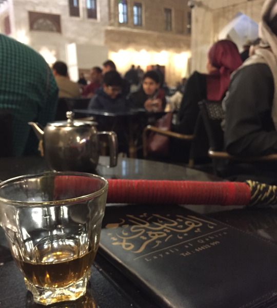

The ringleader in traditional garb speaks in short, concise shouts of Arabic. He holds the floor. Another blows the smoke from the hookah pipe into his face and he easily retaliates. No shame there.

His deputy to his left motions to a group of western women and their flowing hair who’ve made an entrance. They stare longingly. The Ray Ban designer eyeglasses on the deputy fog up at just the right moment, thoughts of hair invading his mind the same moment a thick puff of smoke wafts toward his face.

It’s my third çay and second hour in the State of Qatar. And much more awaits.

