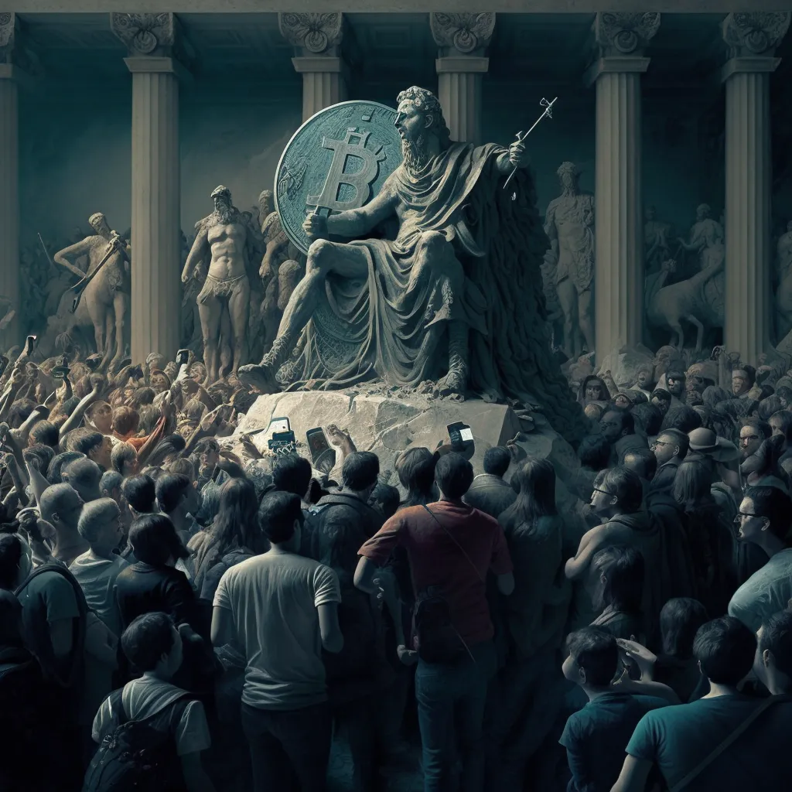

One of the most powerful books I’ve read in the past decade is likely not well-known by Bitcoiners, but it should be. Rather than yet another tome on monetary economics, timechain basics, or the history of seashells or rocks as money, this book is about control and authority.

More specifically, it’s about the governing class — what some may call political and financial elites — losing control and authority in an age of rapidly spreading information.

_The Revolt of the Public and the Crisis of Authority in the New Millennium_, by former CIA analyst Martin Gurri, is a [unique narrative work](https://a.co/d/bQtDjkz) that uses contemporary examples to formulate a thesis about the public rising back against elite institutions.

Gurri’s writing makes for entertaining fodder for any amateur geopolitical analyst or student of media and history, but it provides many lessons for those who have turned to Bitcoin as the open protocol to separate money from state.

To anyone reading in the hypernormalized 2023, the references will seem somewhat dated. The book begins by charting the course of the Arab Spring from December 2010 onwards, beginning in Tunisia and leading to the ouster of Hosni Mubarak in Eghypt by February 2011, over a decade ago.

He mentions faded movements like _Occupy Wall Street_ and the _Tea Party_, but also predicts the propaganda war of Russia and China.

To sum it up, the digital platforms used by billions today have made the top-down model of organizing humanity practically obsolete. Rather than setting grand public agendas, political and financial elite are stuck in a reactionary dream, responding and reacting to the whims and desires of a public that now seeks greater power and voice.

What makes Gurri’s book so compelling through a Bitcoin lens, even if he doesn’t mention it directly, is that Bitcoin provides a manner of decentralized order to power through the chaos unfolding in practically every state.

The illusion of “competent control” by central bankers and financial institutions has been shattered by Satoshi’s innovation, leading to a true “crisis of authority” among those that monopolize the issuance of money and its inflationary effects.

It’s why CEO bankers like JP Morgan Chase's Jamie Dimon of Bank of America’s Brian Moynihan, financial planners like Treasury Secretary Janet Yellen, Fed chair Jerome Powell, and entire departments of the European Central Bank seem to [never stop talking](https://fixthemoney.substack.com/p/european-central-bankers-are-truly) about Bitcoin.

For Gurri, the moment of the scientist-bureaucrats who control the narrative of our time — in a geopolitical or financial sense — has been extirpated. This also reflects the _hypernormalization_ thesis of BBC documentarian Adam Curtis, which holds that the reams of data and information available to us all have stripped power the usual public authorities.

Citizens rallying in town centers thanks to Facebook events, WhatsApp groups, and Twitter trends are no longer just _passive witnesses_ to power, but their revolt drives the irrational and haphazard attempts by elites to exercise authority.

We saw it with the Candian trucker protest, COVID lockdown protests, the global energy crisis, spiralling inflation, collapse of ESG-imposed economies in the developing world, and with the migration crisis still hobbling population-starved European states.

[Share](https://www.fixthemoney.net/p/the-revolt-of-the-bitcoin-public?utm_source=substack&utm_medium=email&utm_content=share&action=share&token=eyJ1c2VyX2lkIjoxMDUxOTU3LCJwb3N0X2lkIjo3ODA0MDgzNiwiaWF0IjoxNjc3NTgwNDkyLCJleHAiOjE2ODAxNzI0OTIsImlzcyI6InB1Yi04MzQ2MTUiLCJzdWIiOiJwb3N0LXJlYWN0aW9uIn0.FiFNij4Fd8YZefhIeVWGS69fAgM8w0SUAynolvDjR2I)

It’s as clear as day in the recent US government actions [quietly cracking down](https://www.piratewires.com/p/crypto-choke-point) on any and all financial institutions tied to Bitcoin and cryptocurrencies, at the same time European politicians formalize their CBDCs to ensure future fiat currency is not only centrallly controlled and surveilled, but also _subject to limitations_ on its [use and saving](https://www.bloomberg.com/news/articles/2023-02-07/uk-plans-20-000-limit-for-individual-holdings-of-digital-pounds).

Despite all this, those who have been orange pilled, who run their own full node, hold their own keys, and have true sovereignty of their own money, are leading a revolt of their own.

The Internet empowered a generation to be connected and exchange information across borders. Bitcoin, itself an evolution of the Internet, is on the path to do the same for value across time, space, and place.

It’s a hell of a journey, and it’s only beginning. Let’s Fix the Money.

\-Yaël

_Originally published on [Fix The Money](https://www.fixthemoney.net/p/the-revolt-of-the-bitcoin-public) ([archive link](https://archive.ph/7w1EC))._

* * *

##### _This post is **sponsored** by…_

#### **[21bitcoin](https://21bitcoin.app.link/invite/?code=FIXTHEMONEY) - The easy way to buy, sell, save and send Bitcoin.**

**21bitcoin** is a Bitcoin-only app, not an exchange. No distractions, individual savings plan, very low fees, first-class personal support, and a German bank account. Based in the Austrian Alps, available throughout Europe. **[Download now](https://21bitcoin.app.link/invite/?code=FIXTHEMONEY)**.

**Use code “FIXTHEMONEY” to get up to 20% off your fees :)**

[Check out 21bitcoin](https://21bitcoin.app.link/invite/?code=FIXTHEMONEY)

* * *

**Not your keys, not your coins!** You need a hardware wallet. Check out the **[Bitbox02](https://shiftcrypto.ch/fixthemoney)** - Swiss-made, secure, beautiful, open source, Tor support, _Bitcoin only_ and all-around awesome!

**Use code “FIXTHEMONEY” to get 5% off :)**

[Show me the Bitbox02](https://shiftcrypto.ch/fixthemoney)

