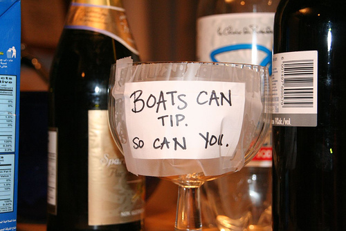

The practice of tipping extra for service is an established doctrine in North America, but it is well-known to be absent from any dominant European tradition or custom. This is mostly due to service charges and value-added taxes, which are included in the final price of most products and services across the European continent, as well as the higher minimum wage the government requires. The United States of America, instead, has produced a system where certain employees especially depend on extra contributions from patrons. This is perpetuated by the standing Federal and State [legislation on minimum wage](http://www.dol.gov/whd/state/tipped.htm#foot1), requiring tipped employees be paid $2.13/hour plus tips, further requiring the employer credit any hourly wage that does not meet the Federal minimum of $7.25/hour (tipped employees are meant to mean any individual who makes more than [$30 a month](http://www.dol.gov/whd/state/tipped.htm) in tipped income).

The study and mention of this subject has tended to focus on the psychology of tipping in general (as well as [tipping etiquette](http://business.blogs.cnn.com/2011/06/07/tipping-traps-in-the-u-s/)), mostly pioneered by professor of consumer behavior at Cornell University, [Michael Lynn](http://www.news.cornell.edu/Chronicle/00/8.17.00/Lynn-tipping.html). Drawing from his own experience as a tipped employee of the restaurant industry throughout his youth, [Lynn’s research](http://www.sciencedirect.com/science?_ob=MImg&_imagekey=B6W5H-40PRGTY-6-1&_cdi=6571&_user=464575&_pii=S1053535700000627&_origin=na&_coverDate=12%2F31%2F2000&_sk=999709997&view=c&wchp=dGLbVlW-zSkWB&md5=d8b4fb54fe8cc2c64c895ec4b23f8c30&ie=/sdarticle.pdf) has focused on exactly why customers tip certain employees, and how dependent this relationship is upon the quality of service.

As explored by the latest [Planet Money](http://www.npr.org/blogs/money/2011/06/17/137255535/the-friday-podcast-why-do-we-tip) podcast on NPR, many different perspectives can be honored as to the history, purpose, and justification for tipping in the modern American service industry, and Lynn’s research brings many different ideas to the fold. This is a subject I find not only personally interesting, grace to my own experience as a server, but also from the economic viewpoint, which presents an entirely different angle on the always-uncertain custom in American restaurants and hotels.

After years of research and analysis, Michael Lynn has concluded that

> _tippers are concerned about equitable economic relationships with servers, but that equity_  
> _effects may be too weak for tip size to serve as a valid measure of server performance or for_  
> _tipping to serve as an effective incentive for delivering good service._ 

In language more understandable to the layperson, he means to state that a person will most likely tip based upon how they sympathize with the waiter, and not based upon the quality of the service. In the words of the Financial Times of London, it “therefore makes little sense for a waiter to work harder in [order to obtain a tip](http://www.ft.com/intl/cms/s/0/be390fbe-a893-11d9-87a9-00000e2511c8.html#axzz1PpKtBoSU)“, a view embraced by several economists and foodies, including [Tyler Cowen](http://marginalrevolution.com/marginalrevolution/2005/04/what_do_we_know.html) and food critic [Steven A. Shaw](http://forums.egullet.org/index.php?app=core&module=search&do=active). Michael Conlin and Ted O’Donoghue, teaming with Lynn, further concluded that people tip based upon a norm “enforced by internalized feelings of guilt and shame“, providing even more evidence that the amount of tips received have very little to do with the overall quality of service.

To explain this small point, a study of the syntax of foreign language is required. Anthropologist George Foster explains that the tip has historical and cultural roots in envy. Foster brought forth the idea that food has been a “scarce” and “much-desired” commodity throughout human history, allowing elaborate meals to become more commonplace among affluent individuals. Because the service staff was there solely to please the patrons, Foster believes that that the patrons began to give them additional money so as to enable the servers to have drinks on their own, and to reduce any chance of envy. “[Clearly, \[a tip\] is money given to a waiter to buy off his possible envy, to equalize the relationship between server and served”](http://web.econ.unito.it/gma/massimo/sdt/sdt/foster74.pdf). This hypothesis is supported by the different meanings of ‘tip’ in different languages, all having to do with providing money for consuming alcohol or drink:

> **French**: pourboire, from pour ‘ for ‘+ boire ‘to drink ‘
> 
> **German**: Trinkgeld, from trinken’ to drink ‘+ Geld ‘money’
> 
> **Spanish**: propina, from propinar ‘to give a drink to, to treat’
> 
> **Portuguese**: gorgeta  ‘drink money’ ; also ‘dar gorgeta’ to give money for drink’
> 
> **Polish**: napiwek , from na ‘for ‘+ piwo ‘beer ‘
> 
> **Swedish**: dricks, from dricka ‘to drink ‘
> 
> **Finnish**: juomarahaa, from juoma ‘drink, + rahaa ‘money’
> 
> **Icelandic**: drykk jupeningar , from drykkju ‘drink’ +peningar ‘money (gold)’
> 
> **Russian**: chaeuye = ‘tea \[money\] ‘ ; also dcit’nachdy ‘ to give for tea’
> 
> **Croatian**: Napojnica ‘to give to get a drink’ ; from napiti ‘to fill oneself with drink’

Such findings and analyses bring many questions to mind on the present standards of the hospitality industry. In the [New York Times](http://www.nytimes.com/2005/08/10/opinion/10shaw.html?ex=1281326400&en=fce94190f5ff2faa&ei=5090&partner=rssuserland&emc=rss), Shaw tells the tale of Thomas Keller, one of  America’s most prominent chefs, who decided to scrap the service-tip system in favor of a service-charge system, and just how that transition will ultimately prove the better for the industry, the consumer, and the employee.

> _Tipping is hardly the essence of capitalism. Actually, it would seem to have little to do with capitalism at all: it is – supply and demand be damned – a gift, a gratuity decided on after the fact._

It is a certain fact that, as a social science, economics comes next to last in attracting a significant fan base. In this case, however, the common adoption of economics theory to the science of tipping may well promote a service-charge model of restaurant gratuity as compared to a service-tip model, to the benefit of the consumers, restaurateurs, and employees. While the service-tip model has been continued so as to promote “incentives” to employees, the academic literature undoubtedly finds that tipping is not dependent on service, leading any fair-minded economic thinker to question the common practice which takes precedence in North America and so-construes the incentive model that the free-enterprise system is supposed to produce.

There are many views on this matter. The Adam Smith Institute, which has actually strayed from “free-market” doctrine on the issue of drug policy and health, has [opined in the Christian Science Monitor](http://www.csmonitor.com/Business/The-Adam-Smith-Institute-Blog/2011/0218/Scrap-minimum-wage-for-young-people) for a scrapping of the minimum wage for youth, a view espoused by the late Milton Friedman and somewhat adopted in the UK (where under 18-aged individuals receive a lower minimum wage). Their idea, focused primarily on the youth, reasons that higher minimum wage requirements cause employers to be reluctant to hire younger workers, barring them access to work experience which will be needed to increase their wages later in life. Record levels of youth unemployment across Europe and the U.S. ([43% in Spain](http://www.bbc.co.uk/news/world-europe-13833093), [36% in Greece](http://www.telegraph.co.uk/finance/jobs/8564500/Interactive-graphic-Youth-unemployment-in-Europe.html), [24.2% in the U.S.A](http://www.theepochtimes.com/n2/united-states/high-youth-unemployment-rates-and-high-profits-for-colleges-57889.html)., and [20.5% in the UK](http://www.bbc.co.uk/news/business-12482018)). The discussion of this issue would require another article, but the matter is equally applicable to the question of service gratuities, especially considering how government regulation has sustained the service-tip model at the behest of a service charge model.

Should there be a tip-service model which is proven to be based more upon a societal shame or avoidance of envy? Or should there be a charge-service model which removes individual incentives for servers and other tipped employees and shifts burdens away from consumers to employers? How should government regulation mandate wages in specific industries, or should they at all? The jury is out.

### **References:**

Anderson, John E., Bodvarsson Orn B., 2005. Do higher tipped minimum wages boost server pay?.

<[http://digitalcommons.unl.edu/cgi/viewcontent.cgi?article=1032&context=econfacpub](http://digitalcommons.unl.edu/cgi/viewcontent.cgi?article=1032&context=econfacpub)\>

Conlin, Michael, Michael Lynn, and Ted O’Donoghue., 2003. The Norm of Restaurant Tipping.

<[http://tippingresearch.com/uploads/Norm.pdf](http://tippingresearch.com/uploads/Norm.pdf)\>

Foster, George M.(1972). The Anatomy of Envy: A Study in Symbolic Behavior. Current Anthropology, 165 – 202.

         <[http://escholarship.org/uc/item/60h425cx](http://escholarship.org/uc/item/60h425cx)\>

Lynn, Michael, McCall, Michael.,2000. Gratitude and Gratuity: A Meta-Analysis of Research on the Service-Tipping

 Relationship. <[http://www.sciencedirect.com/tippingscience.pdf](http://www.sciencedirect.com/science?_ob=MImg&_imagekey=B6W5H-40PRGTY-6-1&_cdi=6571&_user=464575&_pii=S1053535700000627&_origin=na&_coverDate=12%2F31%2F2000&_sk=999709997&view=c&wchp=dGLbVlW-zSkWB&md5=d8b4fb54fe8cc2c64c895ec4b23f8c30&ie=/sdarticle.pdf)\>
