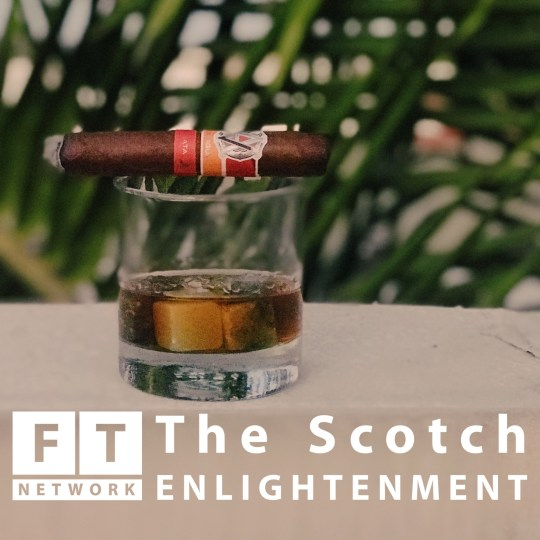

Last week I was a guest on the [Scotch Enlightenment](http://journal.ftn.media/series/the-scotch-enlightenment/) podcast.

I had a [great conversation](http://journal.ftn.media/podcast/alexa-order-me-some-cocaine/) with Daniel and Bill, and I recommend you give a listen!

–––

In our first regular episode of The Scotch Enlightenment, Yaël Ossowski ([@yaeloss](https://twitter.com/YaelOss)) joins us for an hour full of society, economics and technology.

Our topics in this podcast include:

- Why no one should trust a German solution for fake news.
- Who is responsible if you order illegal drugs through your smart speaker?
- If Bitcoin goes to pieces, it won’t really matter

Yaël is a well traveled cosmopolitan journalist based in Vienna. Check out his activities here:

- [His Blog yael.ca](http://yael.ca/)
- [The Innocents Abroad](http://theinnocentsabroad.com/) – A weekly podcast on life and society abroad with Yaël Ossowski and Todor Papić.
- [Devolution Review](https://devolutionreview.com/) — A quarterly literary journal that features book reviews, short stories, nonfiction, poetry, personal narratives, interviews, and more. Its mission is to tell the stories of modern cosmopolitanism through the written word.
- [The Consumer Choice Center](https://www.consumerchoicecenter.org/) — The CCC empowers consumers to raise their voice in media, the Internet, and on the streets and facilitates activism towards a more empowered consumer.

Your hosts are Bill Wirtz ([@wirtzbill](https://twitter.com/wirtzbill)) and Daniel Fallenstein ([@deltafoxtrot](https://twitter.com/deltafoxtrot)) and the Scotch of this Episode is [The Dalmore 12](http://www.thedalmore.com/the-collections/the-principal-collection/the-12).
