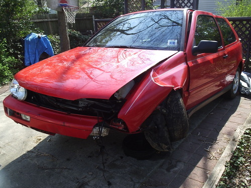
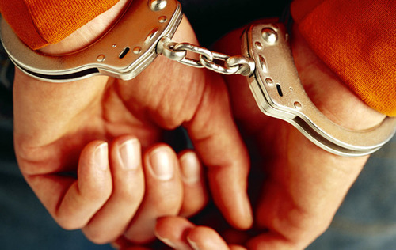

In order to move to a new country and start a new life, one needs permission from governments.

It’s a sad fact of our immigrant-rich societies in the West, especially since we once celebrated the arrival of different cultures and peoples and enjoyed so much growth, ingenuity, and diversity in successive generations because of open borders and free immigration.

In those golden days, only a health check was required to get into the country and start a new life.

But in today’s brave new world, where people are tracked, taxed, scanned, and bar-coded like subjects, showing up on a plot of land without some written authority could spell danger for one’s rights, liberties, and freedoms in a new place.

In my own attempt to emigrate out of the United States and immigrate over to the European continent, I’ve had to ask permission of both governments to make the move.

This requires that paperwork be filed, documents be assembled, and translations be stamped, notarized, and patched with an **Apostille** from the Secretary of State of the local jurisdiction in order to comply with [international treaty obligations](http://en.wikipedia.org/wiki/Apostille_convention).

In my own case, I’ve had to ask for a criminal background check from the state of North Carolina.

Apart from paying $25, which is egregious on its own, I came to learn that the state of North Carolina considers me a criminal.

Instead of coming back with a clean bill of health, my criminal check showed charges stemming from a car accident I was involved in over 5 years ago.

I was by myself, dozed off at the wheel, hit a ditch, totaled the car, got bruised up, and did it without damaging anyone or anything else.

> 
> 
> No alcohol, no drugs, just some Frank Sinatra tunes and good heat.

I even called the tow truck myself to pick up the car and bring it to the closest salvage yard.

But the tow company informed me this wasn’t possible. They could only pick up a wrecked car after the police filed an official report.

So I called the Highway Patrol. And rather than having an officer who “protects and serves,” I was lucky enough to be blessed with an officer who decided to “serve” me with infractions that would warrant paying fees to the government.

Rather than checking up on my health and helping me arrange a tow truck, he immediately charged me with a “driving left of the center” because my car criminally crossed the white line.

Obviously an action like that cannot be tolerated in a law-abiding society. It would be anarchy.

Now, instead of just having to deal with a completely totaled car worth thousands of dollars, I was going to have to show up in court and pay fees for my abuse against the “People of North Carolina.”

I was a criminal.

> 

I was forced to show up in court on a Monday alongside men accused of beating their wives, people who had stolen cars, robbed stores, and driven under the influence of alcohol.

I crossed that fine white line separating the road from the ditch.

Once my case came up, the assistant district attorney laughed it off immediately, dismissing it without even hearing my story.

But that wouldn’t erase the stupid charge from my record and it wouldn’t get back the $200 in court fees I was forced to pay because I had the pleasure of watching adults play dress-up for 3 hours.

And now, five years later, as I’m asking permission from the state of North Carolina to escape the control of the wretches in power, I’m reminded again that I’m a “criminal.”

The charge still stands on my criminal background check to remind inquiring entities that I’m a lawless person, a “corrupted” subject of the empire.

Will my new country reject me based on the premise that my former government found it fitting to charge me with a crime, the crime of “driving left of center”?

Here’s to hoping the new government doesn’t follow the lead of the old government, and we stop criminalizing things that should be left completely out of the justice system.
