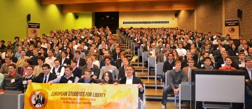

### _By Ya__ël_ _Ossowski | [The Stateless Man](http://thestatelessman.com/2013/03/12/esfl/)_

#### _Students Gather on Continent Which Gave Birth to Liberty to Rekindle Ideas, Spirits_

> 

Less than 30 kilometers from Brussels, the political capital of the European Union, a young generation converged to partake in lectures, sessions, and enlightened discussions on how to increase freedom on the continent once ruled exclusively by monarchy.

> 

More than 350 young people from across Europe and beyond attended the 2nd annual [**European Students For Liberty Conference**](http://studentsforliberty.org/europe/) in Leuven, Belgium, representing 44 countries and 5 continents.

The conference took place from March 8 to 10 at the **Katholieke Universiteit Leuven**, the Flemish spin-off of Belgium’s oldest university first founded in 1425.

The goal of the weekend was to bring together like-minded students, passionate about the ideas of limited government and personal liberty, and to enable a translation of those ideas into activism on college campuses across the continent.

It is a goal the student organizers are very confident they have met.

“This is an organization run for students, by students, and with no government money!” exclaimed ESFL chairman **Wolf von Laer** in his opening speech. The organization prides itself on receiving only private fundraising in order to educate, organize, and connect student liberty groups in 27 European nations.

The entire weekend event featured inspirational speeches from entrepreneurs, academics, journalists, political organizers, and digital freedom fighters, and they shared their insights and personal battles to keep the torch of liberty alive in their own careers and nations.

These messages were well received by the European students, especially considering record unemployment, billions in bank bailouts, and [imposed technocratic governments](http://blogs.lse.ac.uk/europpblog/2012/04/24/technocrats-democracy-southern-europe/) now taking hold on the continent and the dubious—along with the many statist policies most commonly introduced to alleviate them.

Once lectures concluded and they were let free, students met to debate the importance of sound money to maintaining freedom, the vital goal of preserving civil liberties, and the ideal of economic freedom to spark prosperity and alleviate the masses from poverty.  

> 

Tom Palmer, the executive vice president at the **Atlas Economic Research Foundation**, used his opening salvo to underscore why these ideas must remain active on the continent of their birth and first recognition.

“The protection of human liberty must be our primal goal if we want to share these ideas with others,” he told the crowd. “There is nothing else on the whole that can be considered more important if you are not free in your own life.”

Freedomworks CEO **Matt Kibbe** relayed his experience in grassroots organizing, aiming to engender the same type of passion and drive in Europe which sparked the tea party movement in the United States.

For readers and listeners of The Stateless Man, one of the most inspirational speakers was **Daniel Model**, a Swiss captain of industry who has championed the cause of personal secession.

His journey began in 2006, when he declared his own “meta-state” called Avalon, a nonphysical place where only the peaceful and cooperative could reside.

> 

It began as Model’s own thought experiment, but eventually grew to have its own money based on pure silver and thousands of hopeful citizens from around the world.

Today, Avalon is a [castle in the Swiss countryside](http://www.nzz.ch/aktuell/schweiz/neue-heimat-avalon-1.17134405), a quasi-academy and opera for those who want to think beyond current government systems which remain hostile to personal liberty.

In that same regard, the entire conference was a breath of fresh air for the students fixated on spreading liberty on campuses in their home countries.

It was a weekend of inspiration which will undoubtedly make an impact to lead the intellectual revolution for the next several years, all in the hopes of preserving and protecting the fundamental aspects of personal and economic liberty.

_Yaël Ossowski will be on The Stateless Man show next Monday, March 18, to discuss the conference and the hopes and desires for liberty going forward on the European continent._

[READ ENTIRE ARTICLE](http://thestatelessman.com/2013/03/12/esfl/)
