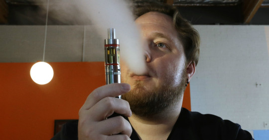

After more than two years of study, the U.S. Surgeon General Vivek Murthy is set to release a report on e-cigarette use among young people that will purport to show that vaping is a “major public health concern.”

The Wall Street Journal [says the report will recommend](http://www.wsj.com/articles/e-cigarettes-pose-majorrisks-surgeon-generals-report-warns-1481173262?mg=id-wsj) “higher taxes, raising the minimum age to 21, incorporating e-cigarettes into smoke-free laws, and restricting marketing that encourages use among youth and young adults.”

This is a grave mistake.

Reducing smoking is a noble goal, and something public health authorities have been busy regulating with various schemes of taxes, warning labels, plain packaging, bans on advertising, and more. But it hasn’t worked.

Nothing has proven more effective in reducing the harmful effects of smoking tobacco than smokeless alternatives such as e-cigarettes and vaporizers.

But it seems American health authorities are not willing to hear this message.

In August, the Food and Drug Administration [took regulatory control of e-cigarettes and vaping](http://www.fda.gov/TobaccoProducts/Labeling/ProductsIngredientsComponents/ucm456610.htm), putting in place strict rules on independent vape shops. Many owners have protested the [“crippling” rules](http://www.inquisitr.com/3384546/fda-vaping-regulations-new-rules-could-cripple-the-industry/).

In the U.S. and Canada, thousands of mom-and-pop vape shops are popping up around urban centers, and there’s reason to think these devices could be more effective  than legislation in getting smokers to quit.

A [2014 article](https://www.ncbi.nlm.nih.gov/pmc/articles/PMC4110871/) in the journal Therapeutic Advances in Drug Safety points to e-cigarettes as a useful combatant in the fight against smoking.

“Currently available evidence indicates that electronic cigarettes are by far a less harmful alternative to smoking and significant health benefits are expected in smokers who switch from tobacco to electronic cigarettes,” the authors claim. “There is no tobacco and no combustion involved in EC use; therefore, regular vapers may avoid several harmful toxic chemicals that are typically present in the smoke of tobacco cigarettes.”

Even more, health experts in the United Kingdom have even taken an opposite approach than their American colleagues.

Related: [You haven’t seen someone so pumped to watch someone vape as this cool guy](http://rare.us/story/you-havent-seen-someone-so-pumped-to-watch-someone-vape-as-this-cool-guy/)

In April of this year, the Royal College of Physicians adopted a clear recommendation on vamping  as told by U.K. Center for Tobacco and Alcohol Studies Director John Britton to the [the New York Times](http://www.nytimes.com/2016/04/28/health/e-cigarettes-vaping-quitting-smoking-royal-college-of-physicians.html?_r=0): “This is the first genuinely new way of helping people stop smoking that has come along in decades.”.

Without any evidence to justify their anti-vaping bias, it’s time for the government gets out of the way consumer choice. The market has spoken and has provided an alternative that could get young people to stop smoking altogether. Why would we want to stop that?

_Yaël Ossowski is a [Young Voices Advocate](http://youngvoicesadvocates.com/) and senior development officer at [Students For Liberty](http://studentsforliberty.org/)._
