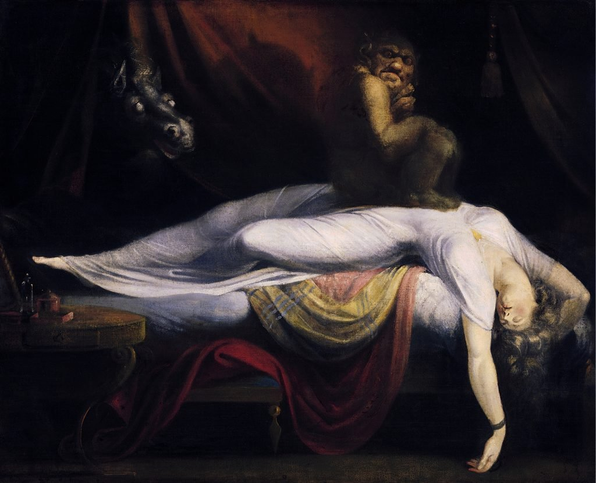

Despite my best efforts to break free, my body remained chained to the bed.

All I could muster was a muffled screech pleading to be woken.

Infinite shapes and forms of colorful figures skimmed my chest, subtly applying pressure to my muscles with every sweep.

Every move of the dark figures floating around my body was choreographed and narrated via an omnipresent loudspeaker somewhere behind me.

Flickers of my life – from childhood until adulthood – were hastily projected onto a cracked screen at the foot of my bed.

On my left was a person I did not know, wearing a Carnival mask that shed every few seconds, reconfigured into masks with sharper beaks, more powerful colors, and larger openings for the mouth. They told me time had expired. This was it.

The terror was back.

I knew full well that I was in my bed in my apartment and drifting into unconsciousness, but the feeling was too overwhelming to be calmed down. It lasted only 20 minutes, but it felt like a lifetime.

It was yet another bout of sleep paralysis.

The most famous representation of this experience is the painting by Anglo-Swiss painter Henry Fuseli, called _[The Nightmare.](https://en.wikipedia.org/wiki/The_Nightmare)_

<figure>

<figcaption>

The Nightmare by Henry Fuseli

</figcaption>

</figure>

I suffered from this disorder throughout my university days in Montréal but had only experienced it again on a handful of occasions in the last decade. I couldn’t even remember the last time.

This condition has always been fascinating but still scared the ever-living shit out of me.

I began [writing about the experience](http://yael.ca/2011/07/03/yet-another-night-of-sleep-paralysis/) in 2011, after having suffered through it again after studying abroad in Vienna for five months.

From what the sleep scientists have determined, sleep paralysis occurs between cycles of sleep, when your body has already been served with [neurotransmitters](https://www.livescience.com/21653-brain-chemicals-sleep-paralysis.html) to paralyze your body as you enter REM sleep. The goal is to ensure you don’t act out your dreams while the brain relaxes, keeping your sleeping partner safe from thrashes or punches.

Though your body has been put into atonia – muscle control – the mind has not yet entered sleep mode. That means the neurotransmitters clash with your active thoughts, sparking hallucinations, and all kinds of fabrications.

The feeling is hard to describe. You are locked into your body as the worst feelings from your life take a physical shape: guilt, shame, disappointment, and sorrow.

Some researchers [claim](https://pubmed.ncbi.nlm.nih.gov/32256437/) this is how witchcraft or alien abductions came to be, as figments of our own brain-induced imagination. In other cultures, sleep paralysis was [explained](https://www.discovermagazine.com/mind/what-explains-sleep-paralysis-and-visions-of-a-demon-on-your-chest) as an apparition of the supernatural.

**Directing the Terror into Lucid  Dreaming**

What makes the paralysis so alluring is that consciously, at least in part, you can direct parts of the nightmare.

When it is more enjoyable, it is called lucid dreaming.

When your mind is awake and fully aware that you are dreaming, you can leap tall buildings, fly over long distances, and visit all kinds of foreign lands. Hell, you can even score that kiss you always wanted or meet the celebrity you’ve long admired. Sometimes, you can reenact that terrible conversation you had with a friend and end it in a more satisfactory manner.

Years ago, I saw an improvement in directing my sleep after keeping a dream journal. Recording the moments of my dreams helped my brain decipher what was real and what wasn’t. That awareness helped.

Throughout college, I tried to redirect sleep paralysis into the more pleasurable lucid dreaming but often couldn’t control it enough to stave off the demons. They kept returning.

**Controlling It**

From the research I’ve done, the most [likely](https://www.webmd.com/sleep-disorders/sleep-paralysis) cause of sleep paralysis is just poor preparation for sleep: jet lag, staying up late, consumption of too much alcohol or nicotine, stress, or just sleeping on your back. One study [claims](https://pubmed.ncbi.nlm.nih.gov/20577906/) it is more prevalent in those who suffer from sleep apnea.

I’ll be the first to admit I won’t be winning an award for bedtime preparedness, so it could be a handful of reasons in my case.

The best I can do now since the demons have returned is to chronicle it. That’s why I’m writing this. But I’m sure it will happen again.

Last night, as I awoke and peeked over at my wife and child sleeping peacefully beside me, I recovered my breath. It was over.

I quickly jotted down what I had experienced. I could have easily filled pages of the yellow-paged dream journal tucked away in my office, but I opted for the Telegram app message to myself.

At least if the demons want to invade my smartphone, they’ll be encrypted.

_Published on [Devolution Review](https://www.devolutionreview.com/the-terror-of-sleep-paralysis/)._
