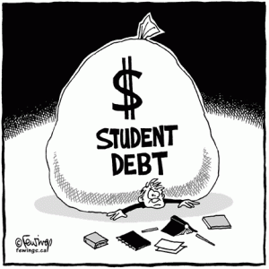

Recently, I was invited to participate in the discussion on ‘[The Stateless Man’](http://thestatelessman.com/) with radio host, economist, and all-round world citizen [Fergus Hodgson](https://twitter.com/#!/ferghodgson).

…

[READ ON LIBERTY IN EXILE](http://libertyinexile.com/2012/03/17/the-virtues-and-fallacies-of-higher-education-on-the-stateless-man/)
