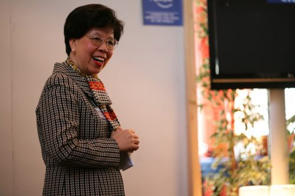

By Yaël Ossowski | [American Spectator](https://spectator.org/the-world-health-organization-is-a-mess-will-trump-fix-it/)

World leaders are putting the World Health Organization on notice if they don’t shape up. President Trump is [threatening](https://www.nytimes.com/2017/01/25/us/politics/united-nations-trump-administration.html?_r=0) [to cut 40 percent](https://www.nytimes.com/2017/01/25/us/politics/united-nations-trump-administration.html?_r=0) of U.S. funding from international organizations, while the United Kingdom [released](http://www.politico.eu/pro/uk-threatens-to-withdraw-who-funding-sets-stringent-reform-targets/) [a report](http://www.politico.eu/pro/uk-threatens-to-withdraw-who-funding-sets-stringent-reform-targets/) this week  in which they say WHO must reform quickly or it “will result in decreased U.K. funding.”

Even with public health focus on threats such as the Zika and Ebola viruses, vaccines, and mental health, critics have accused the WHO of mission creep, putting resources into too many issues and not focusing enough on the important ones.

The journal _Nature_ even took the unprecedented step of [issuing](http://www.nature.com/news/the-time-is-ripe-to-reform-the-world-health-organization-1.21394) [an editorial](http://www.nature.com/news/the-time-is-ripe-to-reform-the-world-health-organization-1.21394) demanding reform at the WHO, which they see as too bloated to tackle essential global health issues.

“Making matters worse, the agency is lumbered with a cumbersome and expensive organizational structure comprising a headquarters in Geneva, Switzerland, and six semi-autonomous regional offices,” they wrote this week. “This has resulted in a complex, bureaucratic and ineffective management structure. It is a body that is ripe for root-and-branch reform.”

Fears that nations will cut funding has already affected the race for the next director-general of the World Health Organization, now narrowed down to just three candidates from the U.K., Ethiopia and Pakistan.

“I don’t think that if we (make reforms) we will necessarily be cut off from money,” said David Nabarro, a special advisor to the UN and the British candidate to head the WHO, to [Agence](https://www.yahoo.com/news/finalists-vow-reform-amid-trump-funding-cut-fears-174711719.html) [France-Presse](https://www.yahoo.com/news/finalists-vow-reform-amid-trump-funding-cut-fears-174711719.html). He was [appointed](http://www.theverge.com/2016/10/31/13480730/haiti-cholera-united-nations-david-nabarro-interview) [as special envoy](http://www.theverge.com/2016/10/31/13480730/haiti-cholera-united-nations-david-nabarro-interview) to address the spread of cholera in Haiti by UN peacekeepers back in 2010, which led to the country’s largest epidemic.

The WHO director-general candidate from Ethiopia said they’ll find their money elsewhere.

“When you put all your eggs in one basket … that’s when the problem happens,” said former Ethiopian health and foreign minister Tedros Adhanom, vowing to “expand the donor base” to avoid such problems in the future.

The candidates, along with former Pakistani health minister Sania Nishtar, want to boost the WHO’s presence and impact across the world. All three have typical health bureaucratic backgrounds, and don’t seem to bring any particular dominating vision to the public health arm of the United Nations with an annual budget of more than $4.3 billion.

Last year, the United States was the [single](http://www.who.int/about/finances-accountability/reports/A69_INF3-en.pdf?ua=1) [largest state contributor](http://www.who.int/about/finances-accountability/reports/A69_INF3-en.pdf?ua=1) at more than $300 million. The next closest funder is the United Kingdom, at $195 million.

The biggest non-state actor contributing to the WHO is the Bill and Melinda Gates Foundation, at nearly $185 million. Their mission is “support of national efforts to reduce tobacco use and improve global nutrition,” according to the WHO’s latest budget.

Such a single large contribution from a nongovernmental organization may reveal why the issue of regulating tobacco has received such disproportionate focus at WHO.  Thus far in 2017, for example, the organization has only released [one](http://www.who.int/mediacentre/news/releases/2017/tobacco-control-lives/en/) [official press release](http://www.who.int/mediacentre/news/releases/2017/tobacco-control-lives/en/), highlighting a study on the impact of tobacco use on healthcare expenditures.

In the most recent budget, over $340 million goes to noncommunicable disease awareness and prevention, which includes tobacco. At least [$18.7](http://www.fctc.org/media-and-publications/fact-sheets/1432-fctc-budget-and-workplan-cop7) [million of that](http://www.fctc.org/media-and-publications/fact-sheets/1432-fctc-budget-and-workplan-cop7) goes directly to the Framework Convention on Tobacco Control, the treaty that provides the blanket legislation for global tobacco rules.

The recent FCTC meeting in New Delhi in November, 2016 – from which, extraordinarily,  the press was banned –  [aimed](https://panampost.com/yael-ossowski/2016/11/08/anti-transparency-steals-spotlight-at-cop7-global-anti-tobacco-conference/) [to push a worldwide ban on e-cigarettes](https://panampost.com/yael-ossowski/2016/11/08/anti-transparency-steals-spotlight-at-cop7-global-anti-tobacco-conference/), despite them being 95 percent less harmful than tobacco, [according](https://www.gov.uk/government/news/e-cigarettes-around-95-less-harmful-than-tobacco-estimates-landmark-review) [to Public Health England](https://www.gov.uk/government/news/e-cigarettes-around-95-less-harmful-than-tobacco-estimates-landmark-review). The treaty also seeks to further strengthen laws on smoking and the international influence of the tobacco industry.

Though the U.S. is not a party to the treaty, its large support of the United Nations and World Health Organization essentially subsidizes the work of the global healthy lobby.

That could change once the Trump administration sets its teeth into the international bodies.

Just hours after being sworn in as the U.S. Ambassador to the United Nations, former South Carolina Gov. Nikki Haley sounded a warning at nations who cross the United States.

“Our goal with the administration is to show value at the UN, and the way we’ll show value is to show our strength, show our voice, have the backs of our allies and make sure our allies have our back as well,” she said to a crowd of reporters at the UN headquarters in New York. “For those who don’t have our back, we’re taking names; we will make points to respond to that accordingly.”

Haley’s fierce words were enough to [send](https://www.wsj.com/articles/nikki-haley-arrives-at-u-n-vowing-to-take-names-of-opposing-nations-1485561027) [jitters though the UN](https://www.wsj.com/articles/nikki-haley-arrives-at-u-n-vowing-to-take-names-of-opposing-nations-1485561027), especially considering the U.S. [contributes](http://www.un.org/ga/search/view_doc.asp?symbol=ST/ADM/SER.B/955) [over $610 million](http://www.un.org/ga/search/view_doc.asp?symbol=ST/ADM/SER.B/955) to the world body, close to 22 percent of its total budget.

At last week’s confirmation hearing, questions as to the efficiency of the United Nations were very clear in Haley’s testimony.

“Any honest assessment also finds an institution that is often at odds with the American national interest and American taxpayers,” she proclaimed in her opening statement.

“We are a generous nation. But we must ask ourselves what good is being accomplished by this disproportionate contribution. Are we getting what we pay for?” asked former Gov. Haley.

_Yaël Ossowski is a Young Voices_ _advocate and senior development officer at Students For Liberty._
