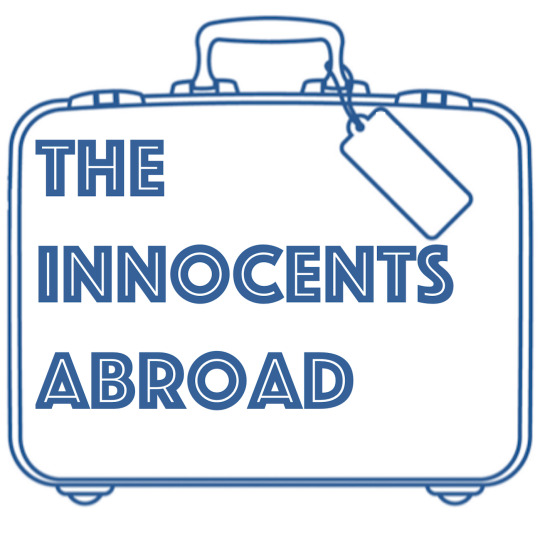

Intro to the Innocents Abroad, Mark Twain, Being an Expat, Brexit, European cultures, Language, Cigars, Poland, and more.

**SHOWNOTES:**

[The Good, the Bad, and Brexit: The United Kingdom Never Fit in the EU in the First Place](http://4liberty.eu/the-good-the-bad-and-brexit-the-united-kingdom-never-fit-in-the-eu-in-the-first-place/)  

[Nigel Farage: 20 years ago you laughed at me, you are not laughing now](https://www.youtube.com/watch?v=ayojl7Op37A)

[Christian Amanpour interviews MEP Dan Hannan](https://www.youtube.com/watch?v=Txz2Une4T9k)

Music: Shane Ó Fearghail – [Gael (Stand Up and Be Counted)](https://exit.sc/?url=http%3A%2F%2Fshaneofearghail.com%2F)
