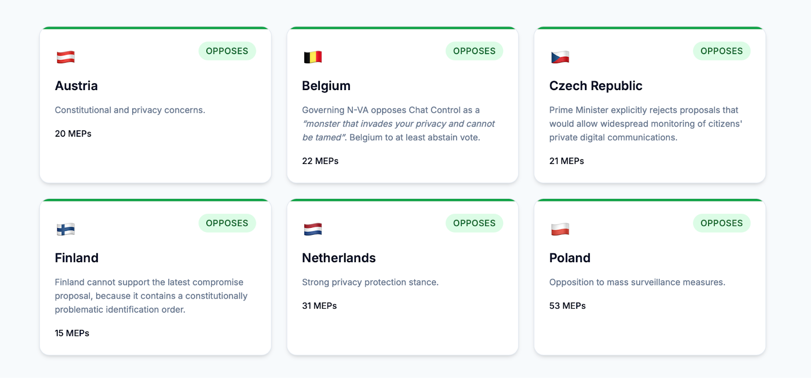
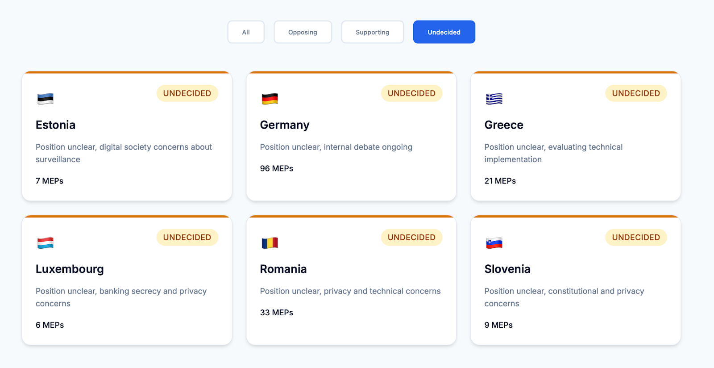
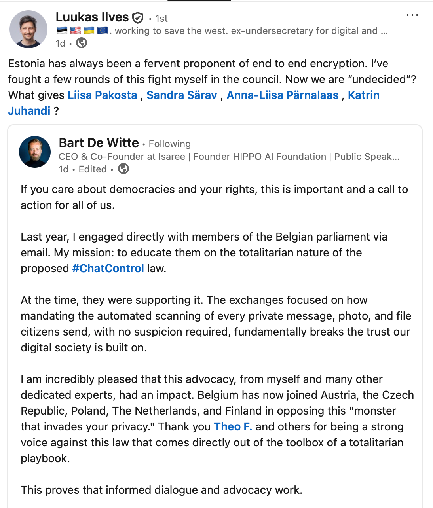
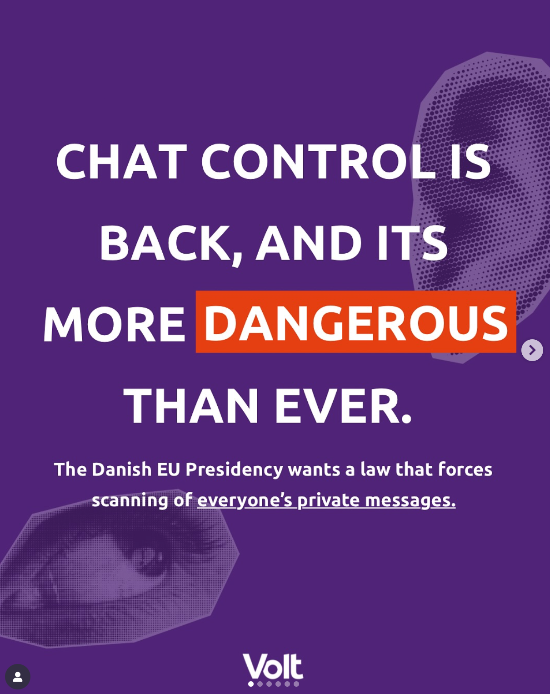
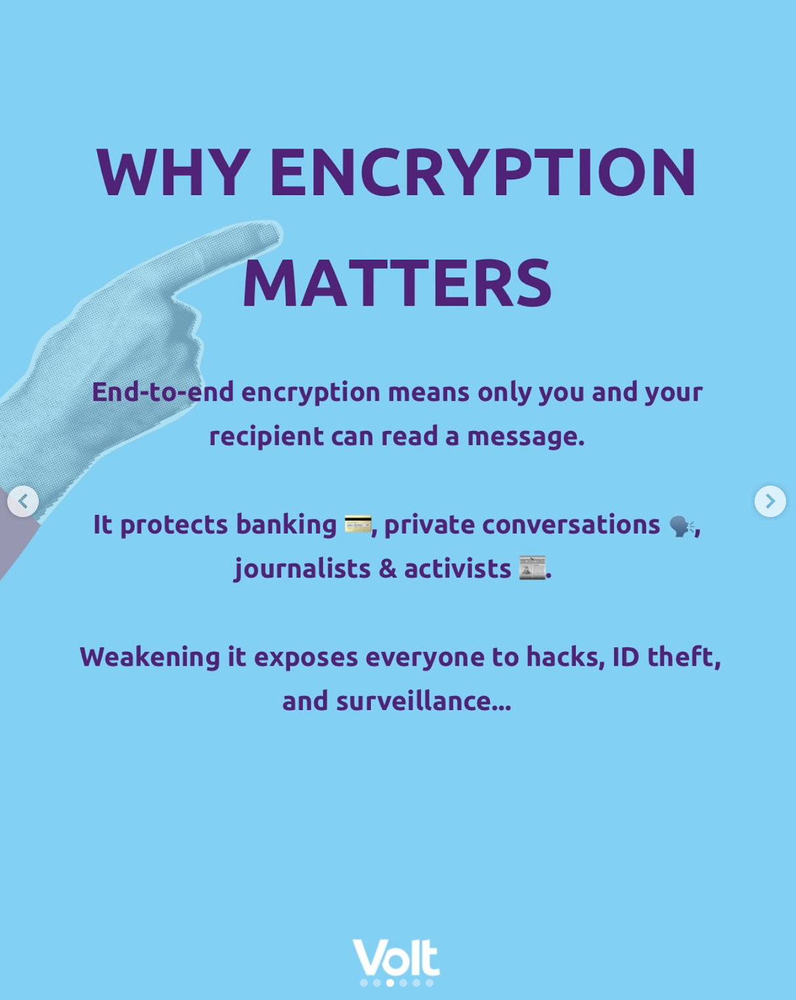

On September 12, European Member States will have to finalize their positions on the [proposed regulation](https://eur-lex.europa.eu/legal-content/EN/TXT/?uri=CELEX%3A52022PC0209&ref=eutechloop.com) to force client-side scanning of Child Sexual Abuse Material (CSAM) in messaging apps, also known as Chat Control. 

While the Danish Presidency of the Council of the EU has previously [stated](https://eutechloop.com/return-of-chat-control/) they will push for CSAM-scanning during their Presidency, the number of people and political groups articulating opposition to automatic scanning of private communications, effectively ending end-to-end encryption, is growing. 

### The opposition

According to the citizen-led initiative and website [Fightchatcontrol.eu](http://fightchatcontrol.eu/?ref=eutechloop.com), only 6 EU Member States are on the record opposing the current Chat Control proposal: Austria, Belgium, Czech Republic, Finland, the Netherlands and Poland. Poland has opposed such measures since they were introduced, and has remain consistent despite different governments taking charge.

### The undecided

Germany is a different story. While Germany was a strong opponent of chat control in the previous Social Democratic party-led government, the country now stands as “undecided” under a Merz-led conservative coalition government, along with Estonia, Greece, Luxembourg, Romania, and Slovenia. 

Estonia’s former Chief Information Officer Luukas Ilves has [openly](https://www.linkedin.com/posts/luukasilves_chatcontrol-chatcontrol-activity-7368688963378626560-T291?utm_source=share&utm_medium=member_desktop&rcm=ACoAAAK_YRIBt77prASoX_zvvnlOs3bZPbdUcE4) questioned his country's waffling stance: _“Estonia has always been a fervent proponent of end to end encryption. I’ve fought a few rounds of this fight myself in the council. Now we’re “undecided”? What gives?”_ 

### Multiparty opposition in the European Parliament brewing

In the European Parliament, the ranks of opposition include both green/social-liberal, so-called right-wing parties, and the smaller Pirate parties. 

Members of Greens/EFA VOLT have openly [spoken](https://www.instagram.com/p/DN0Z0XyWNdi/?utm_source=ig_web_copy_link&igsh=ampsZnN5MWc2eXUx) out against Chat Control recently, stating that _“protecting children online is possible without mass surveillance”._ 

This message was also echoed by members of Patriots for Europe, the right-wing parliament group that is currently the third-largest contingent in the EU Parliament. The flamboyant former race car driver and Czech MEP Filip Turek has firmly [opposed](https://www.instagram.com/reel/DOEP6FvjZip/?ref=eutechloop.com) the chat control proposal, as well as his fellow populist Přísaha [party member](https://www.instagram.com/p/DN8j8O6DHKG/?utm_source=ig_web_copy_link) Nikola Bartusek: 

> _“My official position on the vote for Chat Control is clear. I will vote AGAINST! I receive hundreds of emails on this topic every day, and I am glad that you support our position and the petition against Brussels snooping!”_

On the conservative side, Finnish MEP Aura Salla, a member of the EPP, the largest parliamentary group in Brussels, also voiced opposition to the Commission's regulation, [stating](https://www.linkedin.com/posts/aurasalla_chatcontrol-csam-csam-activity-7360575751525494784-CjzR/?ref=eutechloop.com) that it _"poses a massive risk of exposing our private communications and photos"._

With just a few days left before the Council is due to take a vote on the controversial proposal, both the public pressure and cross-party outcry may pose a unique challenge to Brussels' usual choreographed votes on long-debated legislation.

### What is Chat Control?

As a regulation, the proposal creates a new "duty" forced on private providers of encrypted software to scan for offensive and illegal child sexual abuse material. As has been noted by [many security experts](https://proton.me/blog/eu-chat-control?ref=eutechloop.com), this method of client-side scanning effectively breaks the encryption algorithms that currently protect private messages from being read or seen by anyone apart from their intended recipient.

Client-side scanning means that before content is delivered from a device to the intended recipient, it will be uploaded to another database to screen for offensive or illegal material. In a normal end-to-end encrypted conversation, each party to the message has a private and a public key. By forcing content to be filtered, this obliterates the usefulness of even having the private-public key pair that ensure content is delivered as intended.

_Published in [EU Tech Loop](https://eutechloop.com/time-is-running-chat-control/) (archive [#1](https://archive.is/4cuLq), [#2](https://archive.ph/4cuLq))_

_Syndicated in [EuroNews](https://www.euronews.com/next/2025/09/05/time-is-running-out-for-eu-member-states-to-decide-on-chat-control) (archive [#1](https://archive.ph/ZvCPB "#1"), [#2](https://web.archive.org/web/20250905054034/https://www.euronews.com/next/2025/09/05/time-is-running-out-for-eu-member-states-to-decide-on-chat-control "#2"))_
