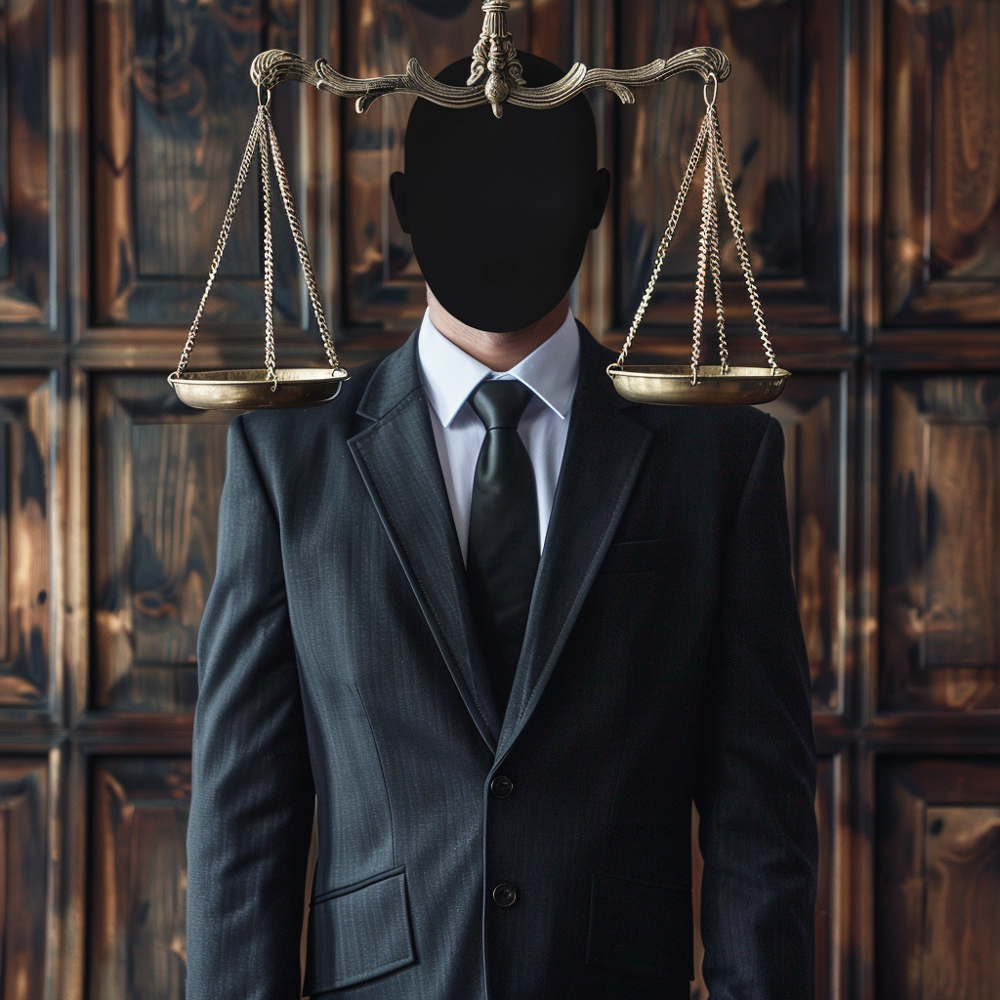

If you ask most Americans when it’s time to call a lawyer, the answer is no mystery: after a law has been broken, you’re forced to do so.

Just as we don’t ask doctors to prescribe medicine before we’re sick, most people don’t pay for lawyers and then go commit crimes. Trial lawyers, however, might be the exception. Where there is no injury, one must be invented.

Legal marketing is a [multi-billion-dollar](https://www.iadclaw.org/defensecounseljournal/in-search-of-mass-tort-plaintiffs-advertising-and-its-impact-on-the-targeted-populations-potential-jury-pools-and-our-clients/) industry to generate claims for mass tort settlements. The business model at play is deceitful, wasteful and highly lucrative. In conjunction with deep-pocketed Wall Street and Madison Avenue [backers](https://www.iamagazine.com/news/third-party-litigation-funding-scrutinized-in-house-oversight-committee), trial lawyers galvanize hundreds, if not thousands, of meritless claims through slick advertisements. Claims are directed at specific companies or industries and then bundled into mass tort litigation, leveraging the defendant for all they’re worth.

This rigmarole is very costly for consumers, as companies are forced to beef up legal departments and pass their higher costs to customers.

The peculiar world of law advertising for tort cases is so ubiquitous that most of us likely don’t even recognize it anymore. Car accident? Lawn care products? You may be entitled to compensation!

[A recent report](https://www.dri.org/docs/default-source/dri-white-papers-and-reports/social-inflation.pdf) estimated that trial lawyers spent more than $971.6 million on 15 million local TV ads targeted toward potential plaintiffs in 2021.

A 1977 Supreme Court case ruling declared restrictions on legal service advertisements a violation of free speech, leading to a surge in mass tort litigation. Whatever we think of this opinion, spending on trial lawyer ads on television hit [$1.2 billion](https://www.cnn.com/2022/12/25/business/personal-injury-lawyers-advertising-ctpr/index.html) by November of that year.

Of course, one might argue that in America, businesses are free to market as they wish, and most would agree. But we’d be negligent if we didn’t recognize the pernicious nature of these class-action lawsuit recruiting ads.

The American Medical Association and the American Association of Retired Persons [warn](https://www.aarp.org/about-aarp/history/aarp-fights-scams-fraud.html) that trial lawyers’ fearmongering is causing patients, especially the elderly, to halt medical care. Perception is a reality for many people, so when actors in a TV ad sternly suggest an illness may be the result of faulty medication, they listen. Evidence is not required.

Much of this marketing is built on dubious claims and questionable science and leaks into courtrooms yearly. Courtrooms are clogged with so many baseless cases that it undermines claimants’ credibility with more legitimate claims.

The tort claim tsunami is designed to stress our already burdened court system, and defendants often settle rather than endure what can be years-long legal battles. In doing so, they avoid costly battles that will sink their company’s stock price and reputation, even if they’ve done nothing wrong.

On top of all this, it’s well-known that tort legal firms often are the [biggest](https://legalnewsline.com/stories/513240708-private-lawyers-stand-to-make-90-million-as-judge-hits-johnson-johnson-with-572m-opioid-ruling#:~:text=Private%20lawyers%20stand%20to%20make%20$90%20million%20as%20judge%20hits,with%20$572M%20opioid%20ruling) beneficiaries of larger settlements. It gives them ample motive for exaggerating claims while getting as many people into class action lawsuits as possible. And that’s no matter how silly the case.

The Federal Trade Commission was established to police deceptive and unfair business practices and has been unusually visible under Chair Lina Khan, whose tenure has been defined by suing almost every major American tech company based on questionable legal theories. Instead, the FTC should focus on a slam-dunk case examining the junk science that marketing firms push to the media as “evidence” in their litigation.

If federal action is not forthcoming, a defense should be mounted by capable state regulators.

A few states — including Tennessee, Kansas, Texas and West Virginia — have taken the necessary steps toward better tort enforcement. With the mass tort litigation machine playbook fully exposed, there is no reason legislators everywhere should not follow their good example.

We live in a digital age where it is increasingly difficult to parse through the deluge of information coming our way. But it is not impossible, no matter how much the tort lawyers wish it were so.

_Originally published in [DC Journal/Inside Sources](https://dcjournal.com/trial-lawyer-marketing-machine-needs-a-reboot/) (archive link [#1](https://archive.ph/AHZpy), [#2](https://web.archive.org/web/20240701120228/https://dcjournal.com/trial-lawyer-marketing-machine-needs-a-reboot/))_

_Syndicated in the [Kearny Hub](https://kearneyhub.com/opinion/ossowski-column-reboot-lawyer-marketing/article_536b6660-37d9-11ef-960f-fbd6116167e8.html) (archive [#1](https://archive.ph/HXoGg), [#2](https://web.archive.org/web/20240702104313/https://kearneyhub.com/opinion/ossowski-column-reboot-lawyer-marketing/article_536b6660-37d9-11ef-960f-fbd6116167e8.html))_, _[Las Vegas Review Journal](https://www.reviewjournal.com/opinion/commentary-trial-lawyer-marketing-machine-needs-a-reboot-3080677/) (archive [#1](https://archive.ph/De5te), [#2](https://web.archive.org/web/20240705083731/https://www.reviewjournal.com/opinion/commentary-trial-lawyer-marketing-machine-needs-a-reboot-3080677/))_
