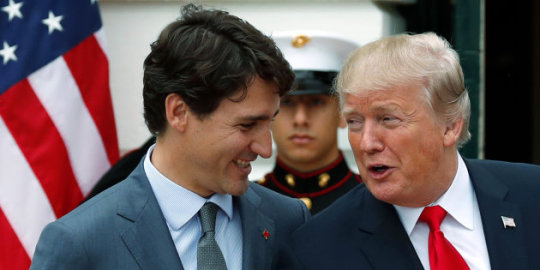

By Yaël Ossowski | [Huffington Post](http://www.huffingtonpost.ca/yael-ossowski/trudeau-should-see-nafta-renegotiation-as-his-biggest-priority_a_23254401/)

**Trump needs to be shown that protectionism south of the border hurts American and Canadian consumers as much as it helps hand-picked American producers.**

At this point in the Donald Trump presidency, it’s become clear that protectionism is become the ruling mantra.

Whether it’s tariffs [slapped on Bombardier jets](http://www.huffingtonpost.ca/yael-ossowski/consumers-lose-no-matter-who-wins-the-u-s-canada-jet-subsidy-war_a_23224472/) or the [threats against](https://www.washingtonpost.com/news/monkey-cage/wp/2017/09/25/president-trump-wants-protectionist-measures-against-chinese-solar-power-thats-going-to-hurt-u-s-firms/?utm_term=.d522c1027d81) Chinese solar panels, the new administration is willing to use any means necessary to build preferential paths for American products.

Next up on the Trump docket is a renegotiation of NAFTA, the two-decade-old free trade treaty between the three nations of North America, the U.S., Canada, and Mexico. Trump’s approach will be “America First.” Canada can’t afford that distinction.

If Canada wants to still make itself relevant, it must defend free trade and be the champion of an open and efficient trading bloc.

Prime Minister Justin Trudeau should see this as his biggest priority, much more than deficit spending, raising taxes on the one per cent, or antics on the world stage to boost Canada’s image. So much thus far has focused on Canada’s social progress rather than its economic potential. A humanitarian policy on refugees is important and signals a lot, but a failure to secure a top trade pact with the world’s largest economy to ensure prosperity for Canadians would prove devastating.

> Now it’s up to Trudeau to prove that Canada can be just as strong in its economic policy as its social policy. Because it’s 2017.

NAFTA advisory council member Rona Ambrose, former interim Conservative Party leader, said this week the Americans’ NAFTA demands are “[completely unreasonable](https://www.youtube.com/watch?v=110oVUXmSNY)” for Mexicans and Canadians.

“People are extremely nervous about where this is going,” she said in an interview with CTV on Monday.

It is true that Canada’s [$1.53-trillion economy](https://data.worldbank.org/country/canada) is peanuts compared to the [U.S.’s US$18.57 trillion](https://data.worldbank.org/country/united-states), but Canada still has leverage to pull in these negotiations.

The long and arduous process of a trade treaty with the 28-member bloc of the European Union proved that Canada’s lite Nordic charm isn’t enough to assuage fears from protectionist forces in faraway capitals. But after all was said and done, it pulled through.

Therefore, Trudeau and his negotiators, including Foreign Affairs Minister Chrystia Freeland and others, will have to be sure to champion Canada’s comparative advantage on the world stage all the while reiterating its vital importance to the economy down south.

Such a compromise may be difficult for the pro-Green faction within the Liberal Party. A hope for Canadian leverage could mean green-lighting more pipelines or opening markets up for shale gas exploration. That’s something the federal Liberals will have to impart to their provincial colleagues in Quebec and Alberta.

More robust economic policies to facilitate growth and line more Canadians’ pockets with tax cuts would go a long way as well.

That the Liberal Trudeau government would be the ones negotiating free trade agreements is an irony not lost on anyone. During the years of Stephen Harper’s Conservative government, the Liberal Party and New Democratic Party [united in force](http://www.ctvnews.ca/politics/election/main-party-leaders-stake-positions-on-tpp-trade-deal-1.2595513) to denounce the [multitude](http://www.cbc.ca/news/politics/canada-election-2015-free-trade-conservatives-tpp-1.3255305) of free trade agreements the Conservatives struck around the world. Former Prime Minister Harper oversaw [nine major free trade agreements](https://en.wikipedia.org/wiki/Free-trade_agreements_of_Canada) during his time on Parliament Hill.

Now it’s up to Trudeau to prove that Canada can be just as strong in its economic policy as its social policy. Because it’s 2017.

Trump needs to be shown that protectionism south of the border hurts American and Canadian consumers as much as it helps hand-picked American producers. That favouritism and corporate welfare is unfair and wrong, something we know a good deal about here. Canadians should use their goodwill and reputation for open markets and free trade to communicate that to the American people as much as the Canadian people.

Let’s be clear: due to our geographic location, our similar institutions, and vast energy resources, Canada needs free trade with the United States. This trading relationship is worth half of Canada’s economy and it is of vital importance to both our democracy and their republic. Billions of dollars and millions of jobs hang in the balance.

Giving companies and individuals clear rules and guidelines, good incentives, and open access to markets and goods will make the populations of both countries better off in the end. Canada must defend a robust free trade in a renewed NAFTA, and do so loudly. It’s something consumers need, and what citizens deserve.
