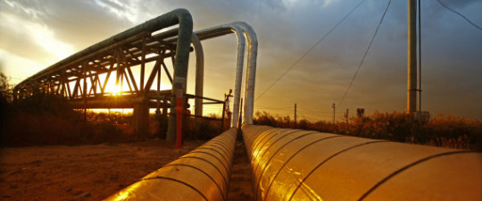

Consumed by news from south of the border, Canadians have been fixated on the ascendency of a Trump presidency. But it could spell much more benefit for Canadians than they’re willing to admit.

True, president-elect Donald Trump’s plan to renegotiate NAFTA will be a tough pill for Canada to swallow, especially with the likelihood of Prime Minister Justin Trudeau being caught flat-footed by the unexpected loss of a partner in a Democratic president in the White House.

But if all the signs are correct, Trump is willing to sign off on the 1,900-kilometre Keystone XL pipeline, which will bring Alberta’s rich crude oil to Gulf Coast refineries in the United States. “I would absolutely approve it, 100 per cent, but I would want a better deal,” [said Trump during the campaign](http://business.financialpost.com/news/energy/donald-trump-says-he-would-approve-keystone-xl-but-for-significant-piece-of-profits). He’ll likely push for a share of the profits.

TransCanada first proposed the pipeline nearly a decade ago, but has been stymied by environmental reviews and a final hard veto by President Barack Obama in 2015.

The reasons for not approving were both economic and environmental, according to Obama, owing to the effect on climate change and the paltry estimate of 2,000 new construction jobs.

But the math has never been that simple. A multibillion-dollar project, Keystone XL would benefit Canadian steelworkers, oil industry workers, construction and service jobs in both Canada and the U.S.

And that’s according to the Brookings Institution’s Ted Gayer. He says it’s a $7-billion stimulus [with no tax dollars involved](http://www.brookings.edu/research/expert-qa/2012/01/20-gayer-keystonexl) and would employ nearly 20,000 people. Other estimates have that [figure even higher](http://www.forbes.com/sites/robertbradley/2015/02/25/keystone-xl-pipeline-an-economic-no-brainer-despite-the-veto/#1867310840fb).

As for the impact on climate change, the numbers vary depending on the agenda. Some have suggested a carbon tax could offset potential environmental costs, but others point to pipelines as a much safer, economic and environmental mode of transport when compared with trucks or rail. Residents of Lac-Mégantic, Quebec [surely understand that last point](https://www.leadnow.ca/lac-megantic/).

In Canada, consensus exists that a pipeline needs to be built, but the Trudeau administration seems reluctant to say so, preferring to endorse a “low-carbon” economy and flashing its environmental creds to its base.

NDP Albertan Premier Rachel Notley, at least, [supports extension of pipelines](http://calgaryherald.com/business/energy/premier-rachel-notley-says-pipelines-in-canada-trump-keystone-xl), but only within Canada.

One of the most fervent supporters of pipelines in Canada is Conservative leadership candidate Maxime Bernier, an MP from Quebec, who says Canadians should prefer the private to the public sector.

“When you build a pipeline, it’s a $15-billion investment coming from the private sector,” said Bernier [in an interview with CTV in Regina last week](http://regina.ctvnews.ca/video?clipId=991570&binId=1.1165847&playlistPageNum=1). “It is better than the stimulus that the federal government is giving right now. All the money the federal government is spending won’t create any jobs or wealth in this country.”

And all of this underscores the sheer importance of the oil and gas industry to the Canadian economy. In 2015 alone, $48 billion was invested into the Canadian economy by the oil and gas sector. Over 440,000 Canadian jobs can be directly tied to the industry, likely millions more indirectly.

It’s Canada’s comparative advantage, especially against the United States, with an economy nearly eight times its size.

By approving Keystone XL’s construction throughout the U.S., President Trump would ensure prosperity for millions of ordinary Canadians. If that fever catches on, the Energy East pipeline and other pipelines through British Columbia could also provide a boost to Canada’s prosperity.

Will prime minister Trudeau ensure Canadians a new age of wealth, or chain it to a carbonless future with no prospects for growth? Either way, there is no denying the fighting chance the oil industry could once again have in the new Age of Trump.

This article was published in [Huffington Post](https://www.huffingtonpost.ca/yael-ossowski/trump-keystone-xl_b_13004176.html).
