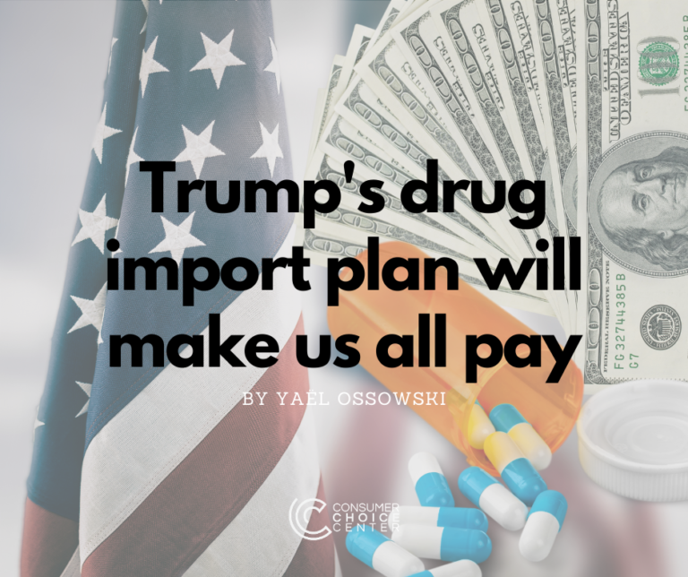

Make Canada Great Again?

Believe it or not, that’s what is at the center of President Donald Trump’s [latest](https://www.federalregister.gov/documents/2020/09/18/2020-20887/lowering-drug-prices-by-putting-america-first) executive order aimed at trying to lower the cost of prescription drugs for Americans.

Trump’s plan, dubbed the “Most-Favored-Nation-Price” model, would effectively import price controls on pharmaceuticals from other nations with single-payer, government-run health systems, including Canada.

With this order, Trump will force Medicare to pay the same negotiated rates as other countries that don’t have the same level of innovation or access to medicines as the U.S

That means that while drug prices for certain seniors will be lower in the short term, it will mean higher costs in the long-term, jeopardizing future drug development, and access. And that will be bad for every American, not to mention our retirees on Medicare.

As an example, modern drug development requires not only massive investment but also time and the ability to experiment through trial and error. Only one of every 5,000-10,000 substances synthesized will make it successfully through all stages of product development to become an approved drug. That’s a big risk and one that only pays off if these drugs can be sold and used. 

Many projects fail to bring even one drug to market. Investing in life sciences requires a healthy risk appetite, and therefore an incentive scheme that rewards those able to create value is necessary. 

By the time a medical drug reaches the regular patient, an average of 12.5 years will have elapsed since the first discovery of the new active substance. The total investment needed to get to one active substance that can be accessed by a patient is around $2 billion. And that is just for medicines we already know we need.

There are over 10,000 known diseases in the world but approved treatment for merely 500 of them. It may be easy to dictate lower prices for these medicines, but that will mean that drug developers will not have the same means to invest in research for the remaining 95% of diseases we cannot yet cure.

Added to that, the U.S. can count on access to all sorts of innovative medicines because of our innovators and inventors.

By forcing lower prescription drug prices for our elderly, Trump seems eager to harm our ability to find cures for those who still hope for the development of a cure for their untreatable diseases and future access to the medicines we need.

Such a move may [play well](https://www.tampabay.com/news/florida-politics/2020/09/19/trump-may-approve-drug-imports-from-canada-in-move-aimed-at-florida/) in voter rich Florida, with a large population of seniors anxious about drug prices, but it shatters the unique mix of both innovation and entrepreneurship that leads the U.S. to be the world’s top creator and supplier of badly-needed drugs. Half of the top pharmaceutical companies in the world are headquartered in our country, and for good reason.

Trump, for his part, claims that this will stop “free-riding” from other nations on the US’ relatively high drug prices. And that is indeed a concern that touches many of us. But such a rash plan will put a chokehold on innovation across the entire sector of our drug industry.

If Trump wants other countries to “pay their fair share” on drug prices, the best method is by trade agreements and negotiation, not by emulating anti-innovation policies from other nations.

To achieve cheaper drug prices, there are simpler and cheaper ways to tackle this.

For one, the president should be open to a reform of the Food and Drug Administration. Too much time is lost trying to get drugs approved across every industrialized country. If we recognized drug approvals from all other countries in the OECD, this would lower costs and accelerate the pace of bringing drugs to the US market.

We cannot risk our entire drug infrastructure for the hope of short-term lower costs. If the Trump administration wants our nation to remain a shining beacon of innovation and allows its patients to access state-of-the-art medicine, we should not import bad policies from abroad.

_Yaël Ossowski is deputy director at the Consumer Choice Center._

This post was originally published [here](https://consumerchoicecenter.org/trumps-drug-import-plan-will-make-us-all-pay/).
