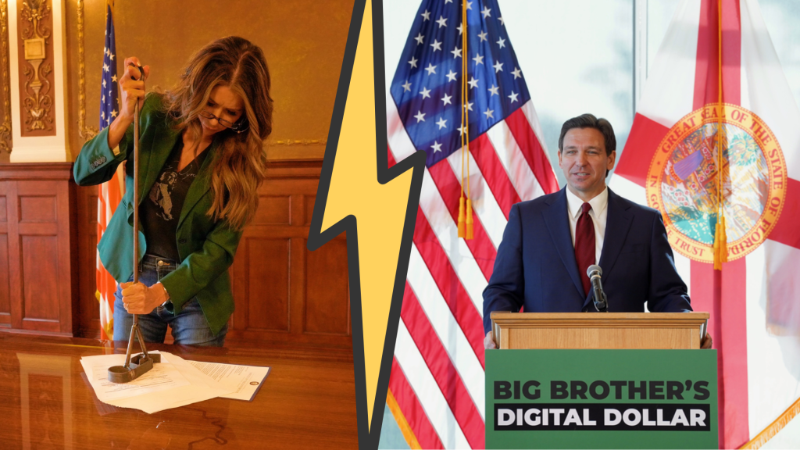

_The backlash against the UCC’s Article 12 has led to a firestorm among politicians who believe they are rejecting CBDCs. But these reforms represent a boon to Bitcoin, protecting self-custody and giving Bitcoin legal clarity in commerce and lending._

In dramatic fashion earlier this month, South Dakota Governor Kristi Noem wielded her red-hot branding iron to stamp her [veto on a bill](https://twitter.com/KristiNoem/status/1634190410284146689?s=20) that she claimed would “open the door to the risk that the federal government could adopt a Central Bank Digital Currency”.

‍Her performance was celebrated in many conservative and cryptocurrency circles — including many in Bitcoin — and it even won her a [cheeky appearance](https://www.youtube.com/watch?v=G-n4w8Alg4Y) on Tucker Carlson tonight.

‍“They want to change the definition of money so that it cannot include cryptocurrencies like Bitcoin,” she said, in addition to her fears that it would enable “total social control of Americans’ lives” by introducing a backdoor for a CBDC.

‍In Florida [this week](https://www.flgov.com/2023/03/20/governor-ron-desantis-announces-legislation-to-protect-floridians-from-a-federally-controlled-central-bank-digital-currency-and-surveillance-state/), Gov. Ron DeSantis went one step further by proclaiming his administration would outright ban CBDCs — foreign or domestic — in order to thwart a “weaponization of the financial sector”.

‍While we should never discount a sitting governor fighting for economic freedom (or mentioning Bitcoin), there are questions to ask about what these bills could mean for Satoshi’s innovation, and the looming presence of a CBDC.

‍It needn’t be stated here, but Central Bank Digital Currencies would be indelibly harmful to economic and personal freedom, and thankfully, the Bitcoin Policy Institute has a [healthy archive](https://www.btcpolicy.org/search?query=cbdc) of articles that both examine and reiterate this reality.

‍But considering two rising GOP stars — and rumored presidential hopefuls — are using their state executive authority to presumably quash CBDCs, it’s worth examining what they’re specifically addressing.

‍In the case of South Dakota, while the governor’s rhetorical response reflects well on her political judgment, this proposed bill does not, unlike the Governor and others claim, tilt South Dakota toward a CBDC purgatory. Nor does it restrict Bitcoin’s adoption. It’s actually bullish for Bitcoin.

‍How this misunderstanding has metastasized through political discourse — from state governors to [Bitcoin-friendly Congressmen](https://twitter.com/WarrenDavidson/status/1638270631518011397?s=20) — deserves its own deconstruction, but I’ll leave that to others.

‍The bill in question — based on an update to the Uniform Commercial Code — not only expands definitions and protections for Bitcoin, but actually creates a legal mechanism for recognizing self-custody and for the protocol’s inclusion in traditional lending, insurance, and commercial transactions. 

‍In a sense, it’s an _upgrade_ to existing commercial law that would allow Bitcoin to be used as collateral for all future financial contracts. **It’s “not your keys, not your coins” in commercial law**.

‍Not only would this bill protect your Bitcoin in any commercial transaction, but it would also better define and protect ownership of your Bitcoin _in a bankruptcy scenario_ like FTX, Voyager, or BlockFi.

‍For DeSantis, his critique is more targeted, stating he’d include a provision in Florida’s Commercial Code to outright ban CBDCs. To have CBDC-bashing as the latest litmus test for conservative politicians is indeed revolutionary, and from the point of view of individual and economic freedom that Bitcoin provides, is a positive phenomenon.

‍But why is the battle being played out in rudimentary state commercial codes that have nothing to do with Central Bank Digital Currencies? That requires some background.

‍**The Uniform Commercial Code and Article 12**

‍The bill Gov. Noem vetoed, [HB1193](https://sdlegislature.gov/Session/Bill/23995), takes the bulk of its language from [Article 12](https://www.uniformlaws.org/committees/community-home?communitykey=1457c422-ddb7-40b0-8c76-39a1991651ac) of the Uniform Commercial Code, a model policy I analyzed in my [previous review](https://www.btcpolicy.org/articles/the-silent-march-of-bitcoin-policies-across-us-states) of Bitcoin policies at the state level.

‍The [Uniform Commercial Code](https://www.uniformlaws.org/acts/ucc) is a template of comprehensive laws and policies that govern commercial transactions — private trade between companies, individuals, everything in between. It does not rewrite monetary policy or define legal tender, but rather sets the rules of game for parties who want to willingly trade.

‍The code is meant to be used as a model bill for state legislatures, in order to guarantee continuity of commercial law between states. If disputes occur between companies located in two different states, similar rules should apply to offer both sides adequate protection and clarity.

‍It is [written and maintained](https://www.uniformlaws.org/acts/ucc) by the Uniform Law Commission and the American Law Institute, with input from attorneys, law professors, business associations, and other relevant stakeholders.

‍Article 12, the most recent amendment, outlines the ideal rules and policies for the new generation of digital assets like Bitcoin, which the code calls CERs (Controllable Electronic Records). The catch-all term is purposefully vague, and we’ll see why here in a second.

‍It aims to outline how to establish “ownership” or “control” of these assets (read: self-custody), and iterates that upon establishing proper ownership, such an asset can be used in a variety of financial exchanges with another party or institution:

> ‍_A virtual (non-fiat) currency would be an example of a CER. If a person owns an electronic “wallet” that contains a virtual currency, the person would have control of the virtual currency if (a) the person may benefit from the use of the virtual currency as a medium of exchange by spending the virtual currency or exchanging the virtual currency for another virtual currency, (b) the person has the exclusive power to prevent others from doing so, and (c) the person has the exclusive power to transfer control of the virtual currency to another person._
> 
> [_Article 12 — UCC_](https://www.uniformlaws.org/viewdocument/final-act-164?CommunityKey=1457c422-ddb7-40b0-8c76-39a1991651ac&tab=librarydocuments)

‍The article also explicitly mentions that only a properly self-custodied CER (read: Bitcoin) can be used in secured lending, and certain rights are conferred on that Bitcoin even if it is held in custody in an exchange or brokerage, assuming a customer purchased the right to that Bitcoin. 

The article also takes pains to precisely define what “money” is in state statutes, excluding Bitcoin and its crypto offspring. While it may not declare digital assets as money _per se_, it does recognize that these assets — again, what they abstractly call Controllable Electronic Records — do [represent a property claim](https://www.foley.com/en/insights/publications/2022/11/updating-uniform-commercial-code-digital-age), even though they are “intangible assets” in the eyes of the law. 

‍The main purpose of this article is to better define ownership of decentralized digital assets like Bitcoin, and to facilitate its inclusion in business contracts. It does not — despite everything you’ve read — introduce CBDCs, restrict citizens from holding or using Bitcoin, or try to cut Bitcoin out of the definition of money. It purely provides the legal guidelines for using Bitcoin as an asset in everyday trade.

‍The only error, in my estimation and those who actually wrote it, is that the article is too technical for most who read it (even lawmakers), and has therefore been contorted into something that it’s not. It’s not CBDC training wheels. It’s a Bitcoin launchpad.

‍In an article published [last year](https://www.coindesk.com/layer2/2022/10/28/why-crypto-needs-ucc-article-12/) on Coindesk, Andrew Hinkes, an attorney and law professor who advised on the drafting of Article 12, writes that the model language  provides “certainty around collateralized lending and certainty as to the legal meaning of transactions of digital assets”. Other attorneys who practice blockchain law and have consulted on the UCC — and who are opposed to CBDCs — [have also provided](https://twitter.com/Prof_CarlaReyes/status/1632858383006183424?s=20) the same analysis.

‍While Bitcoin can be a measure of value of some kind, it is not seen as “money” in terms of commercial transactions (which can actually be an advantage). That nuance aside, it is not difficult to see how it suddenly became a political virtue signal to reject this bill.

‍**Why Groups Oppose It**

‍The only reason to mention all this legalese and seemingly complex terminology is because its implementation into state law has now become a battle cry for many different groups, and not just Gov. Noem.

‍For ideological conservatives, this model bill represents a backdoor for a CBDC and for eventual federal government control of economic freedom. Because the article makes a more precise definition of money, excluding Bitcoin, the assumption is that only a digital dollar approved by the federal government — such as a CBDC — will qualify as money. Or, even worse, a CBDC from abroad.

‍For various commentators in cryptoland and beyond, it is seen as an impediment to broader adoption of Bitcoin and other cryptocurrencies at the state level for that same reason.

‍The truth, however, is that it may actually be a boon to Bitcoin.

‍**Why It May Not Be So Bad**

‍In August of last year, the Catawba Digital Economic Zone, a self-dubbed Web3 special economic zone enabled by laws of the Catawba Indian Nation of the Carolinas, [became](https://catawbadigital.zone/pr005-catawba-digital-economic-zone-approves-uniform-law-commissions-digital-asset-amendments-to-the-uniform-commercial-code/) the first quasi-jurisdiction to adopt Article 12 of the Uniform Commercial Code.

‍In their estimation, this bill updates definitions and conceptions around digital assets like Bitcoin, and gives them legal footing:

> ‍“Unlike previous attempts to integrate digital assets under existing law, the amendments define them directly within the UCC. This provides greater certainty, simplicity, and uniformity. The Amendments as approved on July 15th also address all the major concerns with other associated attempts, including the issues of security control, perfection, priority, and custodianship. The Amendments are forward looking, and technology neutral.
> 
> [_Catawba Digital Economic Zone Approves Uniform Law Commission’s Digital Asset Amendments to the Uniform Commercial Code_](https://catawbadigital.zone/pr005-catawba-digital-economic-zone-approves-uniform-law-commissions-digital-asset-amendments-to-the-uniform-commercial-code/)

‍If a crypto-friendly special economic zone (with its [own model policies](https://catawbadigital.zone/digital-assets/) on digital assets) was so keen to adopt Article 12, can it be reasonably be betrayed as the monstrosity it has so far in popular commentary?

‍In my own estimation, the answer is no.

‍The inclusion of Bitcoin as an asset that can be recognized as held in self-custody, included in commercial contracts, and used as collateral for lending or other transactions, is an advancement that we have not yet seen in the United States. By defining what _precise ownership_ of a unique asset like Bitcoin means allows for future commercial activity — think lending, trusts, trade, etc. — while aiming to allow specific economic rights on those who hold Bitcoin.

‍When diving into the Uniform Law Commission’s analysis on Bitcoin, there is an impressive amount of detail on the complexities of multisig arrangements, UTXO management, and the running of nodes. Bitcoin is seen as a _technological innovation_ which is an important point to remember.

‍For the definition of money, [as I mentioned in the previous article](https://www.btcpolicy.org/articles/the-silent-march-of-bitcoin-policies-across-us-states), Bitcoin’s exemption actually serves as a great benefit.

‍Not being defined as _money_ means that Bitcoin transactions are _not recognized_ as money transmission, which would otherwise require various licenses, permissions, and legal registrations. Overall, that keeps the Bitcoin protocol outside the regulatory scope of restrictive rules that apply to legal tender like the US dollar. 

‍It also means that in bankruptcy proceedings which normally split assets like cash or money held in a bank account, the allocation of Bitcoin would depend on who ultimately has “property rights” over the coins. In the case of a bankrupt firm such as FTX or Voyager, those rights would belong to the customer who purchased the Bitcoin, and could not be considered as company property.

‍It may seem counterintuitive, but by excluding Bitcoin from the definition of money, it allows expanded use of Bitcoin in all commercial transactions, and allows it special protection as an intangible asset.

‍That is a delicate nuance lost in the conversation, and likely reflects the splintering between those who view Bitcoin as a sovereign tool of finance and others who want to see it adopted as legal tender in the United States.

‍**Conclusion**

‍Despite this, in the political moment, it was likely prudent for Gov. Noem to veto this bill and I believe we all understand why she did. While her understanding of the bill was flawed, her instincts were correct. The same applies to DeSantis’ mission to snipe CBDCs before they ever reach Florida’s shores.

‍Commercial laws on debt and property obligations, as well as proper custody of digital assets, are complex and should be subject to rigorous debate. Especially in an era of an unstable financial system and collapsing banks, getting these rules right will make a world of difference for American adoption of the Bitcoin protocol. But we must engage honestly with these proposals rather than fall for semantics.

‍For state lawmakers who understand Article 12’s benefits for Bitcoin, and who desire to politically pronounce their opposition to CBDCs, they should simply include that statement within their version of the bill.

‍Pushed to this political juncture, we can’t fault governors and legislators for wanting to plant an anti-CBDC flag. We should remind them, however, that technical updates to commercial legal codes that would benefit Bitcoin are desirable and necessary. 

‍Ideally, states would adopt a more sound model policy that would help advance the cause of decentralized digital cash in the form of Bitcoin while forever keeping CBDCs off the table. But our work has only begun.

‍‍_Yaël Ossowski is a Visiting Fellow at the Bitcoin Policy Institute, deputy director at the_ [_Consumer Choice Center_](https://consumerchoicecenter.org)_, and a co-host of the_ [_Fix the Money_](https://www.fixthemoney.net/) _podcast._

_This article was originally published on the website of the [Bitcoin Policy Institute](https://www.btcpolicy.org/articles/in-attempt-to-stop-cbdcs-states-are-rejecting-ostensibly-pro-bitcoin-legislation) ([archive link](https://archive.ph/LdsHM))._
