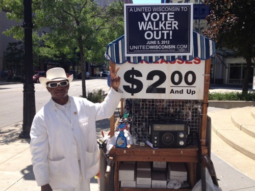

By Yaël Ossowski | Wisconsin Reporter

> MILWAUKEE — At canvassing sites across Wisconsin, union-backed coalitions are preparing their final lists of identified voters determined to recall Republican Gov. **Scott Walker**.

>  At a downtown field office, [**We Are Wisconsin**](http://www.wearewisconsin.org/), a grassroots voter education and mobilization group functioning as a political action committee, volunteers have erected large poster boards with names and addresses of people pledged to vote for Milwaukee Mayor **Tom Barrett**.

>  Stacks of papers and sticky notes with phone numbers are spread throughout the small two-room office on National Avenue, just blocks from the **Milwaukee Hilton Hotel** where Barrett will hold his election night party on June 5.

>  On large white folding tables decorated with “Recall Walker” stickers, there are sign-up forms for volunteers willing to transport immobile voters to polling stations throughout the city. 

Read more: [Wisconsin Reporter](http://www.wisconsinreporter.com/union-coalition-makes-push-in-last-day-before-election)
