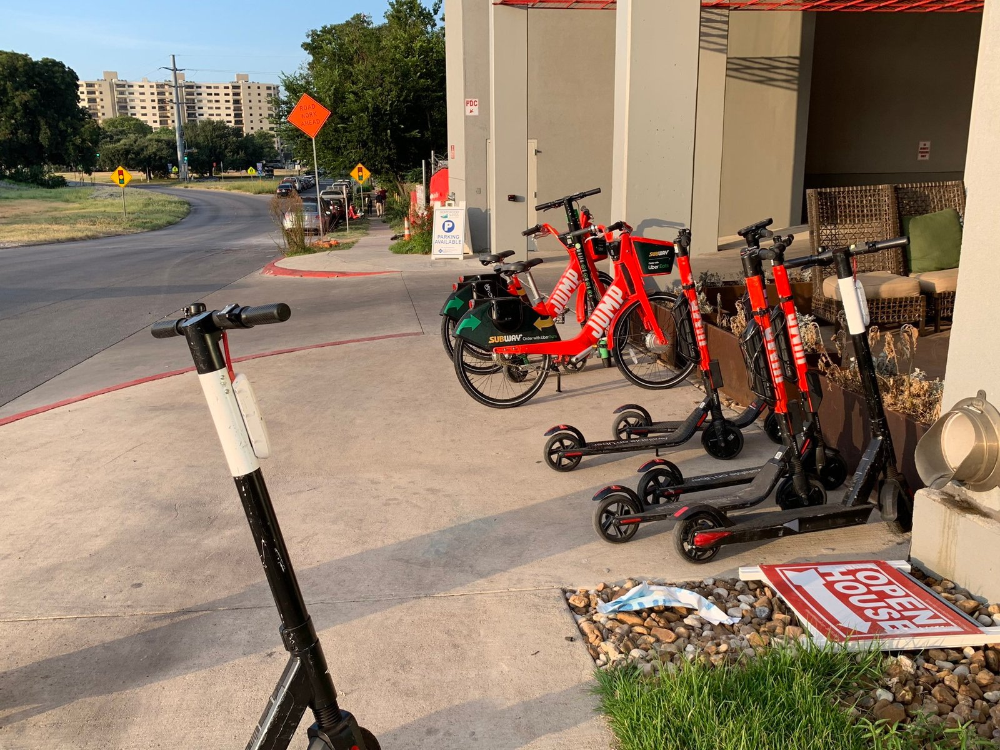

I'm a big fan of e-scooters.

I use them where I live (Vienna, Austria), and I try to use them wherever I travel for work. I've probably ridden every company available in at least 5 U.S. states and 5 countries. And I've written about what the best regulations should be.

I prefer using a scooter to using ridesharing services in some cities to cut my commute and usually beat traffic when the rides are less than 20 minutes.

Since I'm in Washington, D.C. this week, of course I set sail using the scooters around town.

But I've been totally surprised by how \*SLOW\* they are. You can barely get up to speed and you miss every single green light. This actually makes the commute longer. It seems the scooters have an imposed speed limit of 10MPH. That's ridiculous.

I've used these e-scooters in dozens of jurisdictions, some with speed limits, and none are as slow as 10MPH.

The speed governor imposed makes these scooters less efficient, less fun, and actually dangerous. You can practically walk faster. Whoever made these regulations should be ashamed. I will definitely be making public comments to the city council.

